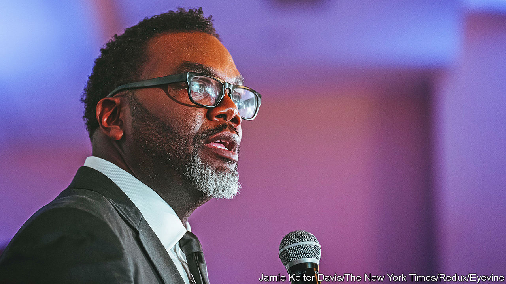

###### Let’s go Brandon

# Chicago’s new mayor has one of the trickiest jobs in politics 

##### Brandon Johnson will struggle to fulfil his grand promises 

 

> May 11th 2023 

Foodies in Chicago have no shortage of options. Yuppies flock to the West Loop, where the restaurants mostly serve “modern American” small plates. The old school head to steakhouses downtown, and the more adventurous take cabs out to Devon Avenue or 26th Street for Indian or Mexican food. Yet for visiting dignitaries, a relatively new establishment on the South Side, the Bronzeville Winery, has become a favoured location. The reason why is less what it serves, though the food and wine list are both excellent, but what it represents: a hint that Chicago’s  can be lessened.

Named after its location, the winery opened last year in the heart of a neighbourhood that was, in the 1920s, the core of black Chicago, home to Ida B. Wells, a pioneering journalist, and Louis Armstrong, a jazz musician. After 1945 racist housing policies turned Bronzeville into an overcrowded ghetto, and in the 1960s new highways and public housing separated it from much of the city. By the 1970s and 1980s the population was plummeting. 

Yet now Bronzeville is recovering. New housing is sprouting on empty lots. Newcomers are moving in. The winery’s founders, two black entrepreneurs, Eric Williams and Cecilia Cuff, say they opened the restaurant when they realised that people in the area had money to spend but had to travel to other parts of the city to do so.

On May 15th , a former public-school teacher and union organiser, will become mayor of Chicago. He is arguably the most left-wing leader the city will ever have had, and he takes over at a time when national attention will be turning to it. Next year Chicago will host the Democratic National Convention for the first time since 1996. Democrats will be hoping to show off a city  from the pandemic under their leadership. On Fox News, meanwhile, every local problem, and especially crime, is picked on as evidence of the opposite. 

Mr Johnson campaigned on a promise not just to govern well, but to “end the tale of two cities” that defines Chicago, and to redistribute resources from the wealthy core to people in poorer neighbourhoods. But that will not be easy. What is happening in places like Bronzeville hints at his best chance of success. Other cities across America will be watching closely.

For now, Mr Johnson faces a more imminent task: that of reassuring residents and business people that he takes the problem of crime seriously, while bringing a demoralised and hostile police department on board. A hint of what the summer might hold came on an unusually hot weekend in mid-April, when hundreds of teenagers turned up in the Loop, the downtown business district, and crowds attacked some visitors. Two boys were shot. Several people later alleged that the police stood by and did nothing. 

Rank-and-file police overwhelmingly backed Mr Johnson’s opponent in the election. Though the murder rate in the city has declined so far this year, it is still far higher than it was in 2019, before the pandemic. Residents even in lower-crime neighbourhoods still worry about and spontaneous shootings, notes Roseanna Ander, of the University of Chicago’s crime lab. 

Mr Johnson has sought to calm nerves. He has appointed a retired head of patrol as his interim police chief, and he has promised to create more summer jobs to get teenagers out of the way of violence, as well as to train more detectives. But the problems are deep. “At the structural level trust between the police and the community is broken,” says Arne Duncan, a former secretary of education who now runs a violence-prevention charity in the city. 

Cops think they are overworked, and do not get enough political support for the risks they take. A 24-year-old off-duty officer was murdered on May 6th. But many residents think that they are at best , and at worst, racist and violent.

Some politicians on the right argue that Mr Johnson will kick the city into a death spiral, as wealthy residents leave in response to tax increases and crime. “When the last business leaves Chicago, turn off the lights,” tweeted Scott Walker, a Republican former governor of neighbouring Wisconsin, in response to his election. In fact, the pattern of the past few decades has been of the city adding graduates from big Midwestern universities, who get jobs in a booming professional-services sector, while losing older working-class residents (particularly black ones), who often used to have jobs in factories. Data from the state of Illinois show that in March 2022 there were 14,000 more private-sector jobs in Chicago’s central business district than there were in March 2019.

Yet Mr Johnson, who was elected with the enthusiastic support and money of the teacher’s union, still faces a big fiscal challenge. Public services are creaking. The trains and buses run far less reliably than they used to, because of staff shortages. Teachers are spread thinly across too many schools. The city’s pension contributions are to ramp up, while federal support linked to covid-19 is already winding down. And the new mayor’s revenue-raising ideas look unrealistic. Dick Simpson, at the University of Illinois, Chicago, says that Mr Johnson may succeed in imposing a transfer tax on the sales of expensive properties. But other plans, such as a new head tax on downtown employees or a new tax on financial services, will be blocked either by the city council or by the state.

Chicago’s politics have long been colourful. On May 2nd residents got a hint of how things used to work when a jury found four people—two lobbyists and two former executives of the local electricity firm, ComEd—guilty of, in essence, arranging political bribes for Mike Madigan, a former speaker of the Illinois House. Things are blander now. In policy terms at least, in the end, Mr Johnson’s mayoralty may not differ that much from that of his immediate predecessor, . 

South Side story

Part of the reason the district of Bronzeville is growing again is its proximity to downtown, and its appeal in particular to incoming black graduates. But another reason is the work of Ms Lightfoot, whose signature programme, INVEST South/West, tried to use city money as a lever to bring private investment into neglected neighbourhoods. To undo entrenched racial inequality, attempting to crowd in private investment is one of the few ideas that the city’s government can afford. That is true not only of Chicago but of most of America’s most racially divided cities. ■


