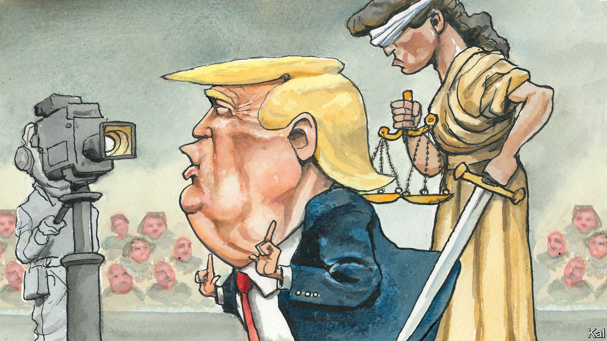

###### Lexington

# Donald Trump has become more dangerous 

##### As awful as it was, CNN’s town hall did the country a service by revealing the threat he presents 

 

> May 11th 2023 

And so American politics came to this: the day after a jury concluded in a  that Donald Trump had committed sexual abuse and then defamed his victim, he preened on national television as the front-runner for the presidential nomination of the party of family values and law and order, of American greatness and American pride. Mr Trump’s gall should not surprise anyone, of course, not after his success for seven years in defining Republican values down. Yet what a degrading spectacle it was. 

When Mr Trump attacked his accuser all over again, calling her a “whack job”, members of the audience of Republicans and independents, convened on May 10th by CNN for a town hall in the early primary state of New Hampshire, laughed and applauded. They laughed again when he insisted that “crazy Nancy Pelosi”, not he, was responsible for the mayhem during the  of January 6th 2021 at the Capitol. He called that “a beautiful day” and said that he was inclined to pardon many of the convicted rioters, who had “love in their heart”.

Armoured in his shamelessness, Mr Trump lied again and again, as CNN’s moderator, Kaitlan Collins, valiantly cut him off and tried to fact-check him in real time. “You’re a nasty person,” Mr Trump eventually told her, to further whoops and laughter. 

Mr Trump did emit one truth, flashing a light into the depths of his cynicism. After he demanded that Republican legislators refuse to raise the  without “massive cuts” to the budget from President Joe Biden, Ms Collins noted Mr Trump once said the debt ceiling should not be a negotiating tool. 

“That’s when I was president,” Mr Trump said.

“So why is it different now?” Ms Collins asked.

“Because now I’m not president,” he replied with a smirk. That brought down the house. How hilarious that he would baldly proclaim he would wreck America’s credit purely for politics.

Even as the town hall was under way, CNN came in for a hail of criticism on Twitter and elsewhere for permitting Mr Trump its platform, particularly with a friendly studio audience. Mr Trump probably did help himself with primary voters. In appearing on CNN for the first time since 2016—for years he has attacked it as “fake news”—he was taking the fight to his fans’ enemies and showing up rivals like  of Florida, who play it safe with friendly journalists. Ms Collins challenged Mr Trump about his lies about election fraud as forcefully as any journalist to date. But the perverse rules of polarisation, including that of the media, meant her tenacity probably earned him support. 

Yet CNN did the country a favour by showing Americans just how dangerous Mr Trump remains. Until now he has been running an effective campaign, one suggesting a disturbing capacity to learn from past mistakes. While battering Mr DeSantis before he has even announced his candidacy, Mr Trump has been methodically posting three-minute videos in which he describes his own policy positions. The online publication Politico recently reported that Mr Trump has been courting party leaders in states such as Louisiana who are likely to be delegates at the 2024 convention. 

And he has been pitching his message to a general-election audience as well as a primary one. A new Trump advertisement, released on May 10th, deploys video of Mr Biden, who is 80, stumbling on the steps of  and falling off a bicycle. A -ABC News poll published on May 7th showed Mr Trump beating Mr Biden in a head-to-head matchup. 

But, unfiltered by his aides, Mr Trump damaged himself in the town hall for purposes of a general-election campaign. Mr Biden was fundraising off the event as it ended (“Do you want four more years of that?” he asked on Twitter) and within half an hour his team released an ad interleaving Mr Trump’s musings about the beauty of January 6th with images of violence that day. Should Mr Trump win the nomination, his boasts about overturning abortion rights would haunt him, along with many other remarks, some of which may also enhance his growing legal jeopardy. 

The jury verdict on the eve of the town hall came in a civil case, in federal court in New York, brought by E. Jean Carroll, a writer. She accused Mr Trump of raping her in the 1990s, and then of defaming her after she made her accusations in 2019, while he was president. By a preponderance of the evidence—the standard for a civil case—the jury found that Ms Carroll did not prove rape, but did prove the other accusations. It ordered Mr Trump to pay her $5m. He said he would appeal.

The primary imperative

Mr Trump declined to appear in his defence, but in a videotaped deposition he confirmed he believed what he said in the “Access Hollywood” video released in 2016, that stars could get away with grabbing women by their genitals. He called that statement “largely true, unfortunately or fortunately”. That last adverb, like the jury’s ruling, will not help Mr Trump win back the suburban women he lost to Mr Biden by 19 points. “Fortunately or unfortunately for her,” he said in the town hall, by way of awful clarification.

Mr Trump was twice impeached, and in April he was indicted in New York on 34 felony counts of falsifying business records. Potentially more serious state and federal charges may lie ahead. So far, such censure has solidified his Republican support. That is because so few Republican leaders stand up to him. Most of his current and likely opponents for the nomination, including Mr DeSantis, repeated that mistake after the jury delivered its decision for Ms Carroll, ducking questions about it.

But after the town hall, the political action committee backing Mr DeSantis called it “an hour of nonsense that proved Trump is stuck in the past”. That is more like it. Mr Trump’s opponents will not beat him by waiting for someone else to do the job. They should show some respect for the country, their party and themselves by standing up for the rule of law, and simple decency. ■


