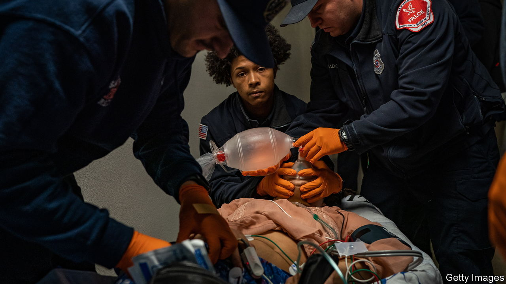
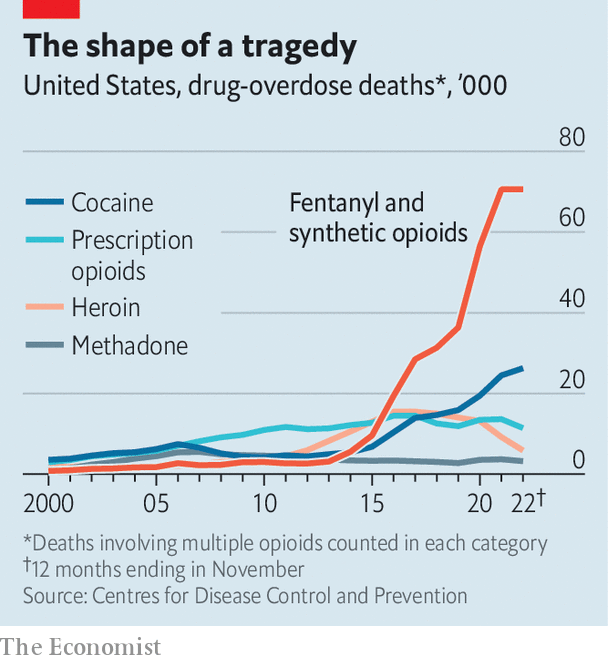

###### Supply-side epidemic

# Fentanyl trafficking tests America’s foreign policy 

##### Yet even without help from Mexico or China there are ways to reduce overdose deaths 

 

> May 11th 2023 

AT THE FAR south-west corner of America lies the busiest border crossing in the western hemisphere. People and goods constantly cruise through the port of San Ysidro, which connects Tijuana in Mexico with San Diego in California. But more nefarious things cross too. Nearly half of the fentanyl, a potent synthetic opioid, seized by Customs and Border Patrol agents since 2020 has been captured near San Diego. “I’m ground zero,” says Todd Gloria, the mayor of the city.

 


America’s 20-year  has been shaped by changes in supply. First pharmaceutical companies blanketed the country in legal painkillers. Doctors expanded the use of opioids against chronic pain, such as backache, in the false belief that the risks of addiction were extremely low. By the time OxyContin was reformulated in 2010 to make it harder to abuse, Mexican traffickers were peddling cheap heroin sent to addicts’ doorsteps. Around 2014, more Americans started  on fentanyl, 50 times more potent than heroin, which traffickers had mixed in with heroin or cocaine. Overdose deaths rocketed (see chart).

Fentanyl is the deadliest drug threat America has faced. It killed nearly 108,000 people in the 12 months to August 2022, more than the number of Americans who died fighting wars in Vietnam, Korea, Iraq and Afghanistan combined. Ever more seems to be entering the country. Nearly 14,000 pounds of fentanyl was seized between October and March, almost as much as the total for fiscal-year 2022. Most of the people convicted of  between 2018 and 2021 were American citizens, not Mexicans or asylum-seekers.

The epidemic is mutating again. Fentanyl is being mixed with xylazine, or tranq, an animal tranquilliser that can amplify its effects. According to the Drug Enforcement Administration (DEA), 23% of fentanyl powder and 7% of pills seized in 2022 contained xylazine. Because tranq is not an opioid, an overdose cannot be reversed with naloxone, a live-saving antidote. Officials in California are worried about addicts shifting from ingesting pills to smoking fentanyl powder. Modelling from the Stanford-Lancet Commission on the North American Opioid Epidemic suggests that 1.2m more people could die by 2029. 

Last month American prosecutors indicted 28 people involved in the fentanyl trade, including the “Chapitos”, the sons of Joaquín “El Chapo” Guzmán, the former leader of Mexico’s Sinaloa cartel who is serving a life sentence in a Colorado prison. The charges provide a rare glimpse into the cartel, which prosecutors suggest is the biggest trafficker of fentanyl into America. The Chapitos deny the indictments’ allegations. 

The documents support some things already widely suspected: that Mexican cartels order the precursor chemicals for fentanyl from China. The chemicals are flown or shipped to Mexico, sometimes via countries such as Germany or Guatemala, then cooked into fentanyl in clandestine laboratories in the mountains of Sinaloa. The finished product is transported by land, sea, air and even tunnels to safe houses in Los Angeles, Phoenix and El Paso, to be distributed across America. 

But some details shed new light on just the fentanyl trade can be. The DEA reckons the cartel can make a fentanyl pill for ten cents. The charges suggest that the Chapitos can then sell pills wholesale for 50 cents in America, which dealers will hawk for several dollars on the street. The documents allege that just one cartel operative in Los Angeles managed to launder $24m in roughly two years. 

Fentanyl is testing America’s relations with Mexico and China. Andrés Manuel López Obrador, Mexico’s president, often known as AMLO, has denied that fentanyl is made in his country, and suggested that the epidemic reflected a “lack of love” within American families.

Lower-level Mexican and American officials continue to collaborate, though not as closely as they did during the presidency of Felipe Calderón, who launched Mexico’s war on organised crime in 2006. This month Mexico’s Congress approved a strict new law mandating ten- to 15-year prison sentences for those convicted of producing fentanyl or providing precursor chemicals.

AMLO’s defensiveness is in response to calls by some Republican politicians to designate Mexican cartels as terrorist organisations, and to send American forces to fight them—with or without Mexico’s permission. Some Mexicans worry that the issue may become a litmus test for Republican presidential hopefuls. “It’s going to become a political piñata,” warns Arturo Sarukhan, who was Mexico’s ambassador to America from 2007 to 2013. “They’re going to try and out-Trump Trump to see who is the hardliner on what to do with Mexico.” 

War, what is it good for?

Increased attention to the epidemic is welcome. Drug overdoses have claimed 1m American lives since 1999, and the policy response has been sluggish and disorganised. But Republicans may have a second, more cynical, reason for their bellicose rhetoric. It is good politics. 

In 1972, a year after declaring the war on drugs and weeks before an election, Richard Nixon said heroin-dealers “must be hunted to the end of the Earth”. In 2016 Donald Trump touted his border wall as a way to stop not just migrants but drugs, too. President Joe Biden seems alert to the political threat. As well as the indictments of the Chapitos, and new sanctions on their suppliers, his administration is splashing out on more border-patrol agents and high-tech scanners at border crossings. 

The epidemic has proved deadly south of the border, too: the cartels’ turf wars have led to horrific violence. Mexican officials warn America that its inability to crack down on gun-smuggling means it is arming the cartels. America’s Bureau of Alcohol, Tobacco and Firearms found that 70% of guns recovered in Mexico between 2014 and 2018 came from the United States. Mexico has sued gunmakers in America for $10bn in damages. Some small progress is being made. The gun-control law Congress passed in 2022 made it a federal crime to purchase a gun for criminals, and increased arms-trafficking sentences. 

The DEA is focused on taking out the Sinaloa cartel and the Jalisco New Generation cartel (CJNG), the other big player in the fentanyl trade. “Tackling these two cartels is job one for the American people today,” says Anne Milgram, the DEA’s boss.

What about China? The Trump administration successfully lobbied Xi Jinping in 2019 to ban the illicit production and sale of fentanyl. Sales of the drug from China to America all but stopped, but shipments were routed through Mexico instead. As tensions rose between China and America, Chinese officials saw no reason to co-operate on drugs. China ended any remaining counter-narcotics collaboration after Nancy Pelosi, then speaker of the House of Representatives,  in 2022.

A report from America’s Treasury Department suggests criminal groups from China launder cash for the cartels by selling the drug dollars to rich Chinese who want to evade China’s capital controls. Joni Ernst, a Republican senator from Iowa, recently said she thinks China is “intentionally poisoning” Americans. The Biden administration seems to suspect gross negligence rather than asymmetric warfare.

American officials are struggling with how to disrupt trafficking while also recognising the failures of the war on drugs, not least the harm done to African-Americans, who were disproportionately imprisoned for low-level and non-violent drug crimes. The DEA wants to rebrand the effort. “We talk about this as not a war on drugs but a fight to save lives,” says Ms Milgram. 

The trouble is that trying to disrupt drug-trafficking is akin to battling a Hydra. In Greek mythology, when Hercules severed one of the serpent’s heads, two more grew in its place. If China stops exporting precursor chemicals, more will come from India. If the DEA destroys the Sinaloa cartel, the CJNG may become public enemy number one. If San Diego’s border crossings become impassable, Tucson in Arizona may take over as the channel—indeed, that may be happening already. “We are not making progress,” says David Trone, a Democratic congressman from Maryland who co-chaired a bipartisan commission on synthetic-opioid trafficking. 

But there are things that lawmakers can do, even without help from Mexico or China, to reduce deaths. States could legalise fentanyl-test strips, which are considered drug paraphernalia, so people can know if they are consuming the deadly drug. Congress could expand access to buprenorphine and methadone, drugs that help treat opioid addiction. The Biden administration recently made naloxone available over the counter.

“Keep people alive,” says Mr Trone, who lost his nephew in 2016 to a fentanyl overdose. “That’s the answer.” With more than 100,000 dead each year, even marginal gains may save thousands of lives. ■


