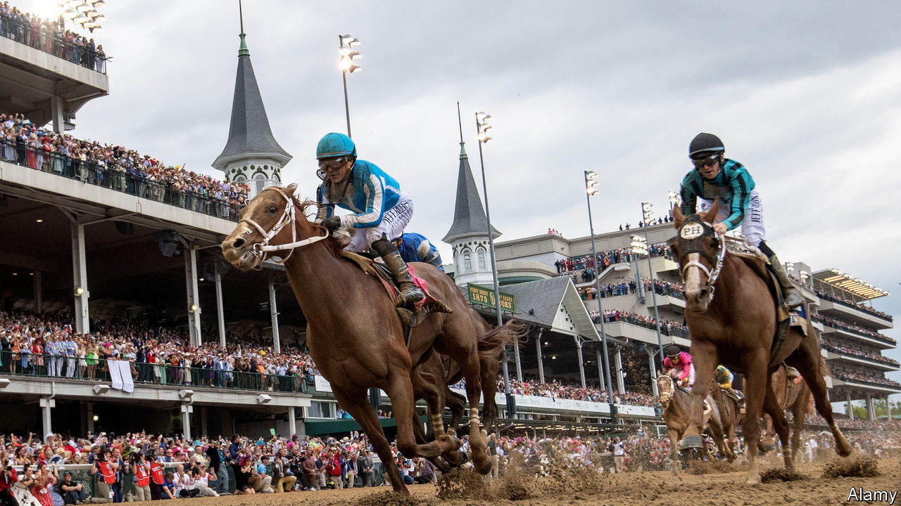

###### Beyond Derby day

# Horse-racing in America needs to improve its odds 

##### A struggle for survival is under way for horses and courses 

 

> May 11th 2023 

At Churchill Downs on May 6th Mage, a 15-1 shot, came from behind to win the Kentucky Derby, America’s pre-eminent horse race. The Derby, with its popularity, pageantry and mint juleps, is not typical. “The greatest two minutes in sports” is the only two minutes of horse-racing many Americans watch.

The  has been waning for decades. Attendance at racetracks is abysmal. New York’s Aqueduct, which opened in 1894, will soon close, like dozens of tracks since 2000. In 1989, there were 74,071 races; last year, just 33,453. Only 17,300 thoroughbred foals were registered last year, according to the Jockey Club. In 1990 it was 40,333.

Gambling on horses was once the only legal form of betting in many parts of the country. Now  are more convenient than a trek to the track. Growth in  gambling have also siphoned away potential new fans. Apart from the jockeys, it is unusual to see anyone under 50 at the track. 

Scandals on safety and doping have not helped. Medina Spirit, the winner of the Kentucky Derby in 2021, failed a post-race drug test and was disqualified last year. His trainer, Bob Baffert, who has denied any wrongdoing, was banned from the Derby for two years. In the 2018-19 season, 49 horses died at Santa Anita track in California. 

In 2020 Congress intervened, passing legislation on equine-safety standards. The Horseracing Integrity and Safety Authority began enforcing them last July. The industry is already seeing the results. In 2022 the Equine Injury Database reported a record-low rate of 1.25 fatalities per 1,000 starts. Its drug-control programme begins this month. 

But the going is still rough. Some tracks have become “racinos”, with slot machines. Several have poker tables. The parent company of the Churchill Downs track has created its own online-gambling site and is investing in historical racing machines, a sort of slot machine. 

Owners can make more money from siring than from racing. Kathy Guillermo, a lawyer with PETA, an animal-rights group, points out that horses are no longer bred to race, they are raced to breed. The top horses run a handful of races, retire at three or four and are sired out. Owners worry that if they keep racing them the horses will break a leg and they will lose out on stud money. 

Some are calling for an end to racing. Seven horses died at Churchill Downs before the Derby. Four were euthanised after catastrophic leg injuries and one after a neck fracture. Racing’s survival in America is far from a safe bet. 


