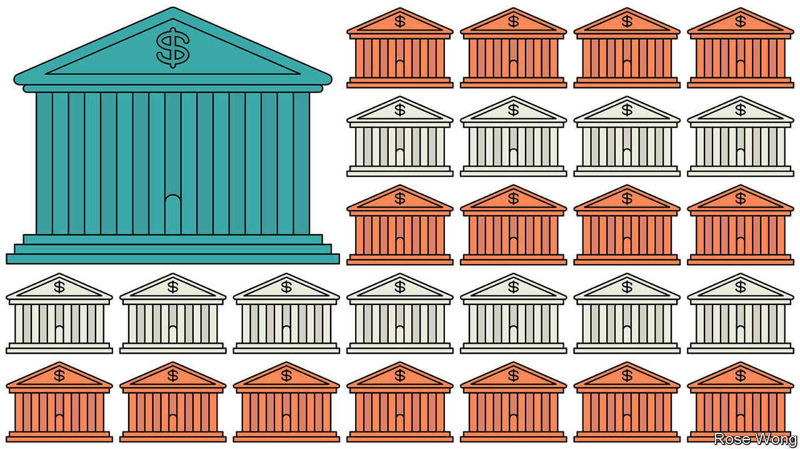

###### Community banks

# What America’s tiny banks do that big ones don’t 

##### The advantages of boots on the ground 

 

> May 7th 2023 

CANANDAIGUA AND Manhattan’s Chinatown are about as different from each other as two places in the same state can be. One is a small town in the bucolic Finger Lakes region, where almost everyone is a white English-speaker. Chinatown packs nearly ten times as many residents, many of them foreign-born and Chinese-speaking, into a much smaller space. What links them, and many other small towns and neighbourhoods across America, is financial services: both host community banks that cater to local needs. 

Some see such institutions, generally defined as having less than $10bn in assets, as inefficient historical relics. They account for as much as 97% of the total number of America’s , but less than 14% of assets and deposits. Some may wonder about their future, if more banks get caught up in the crisis that began with Silicon Valley Bank. For many small businesses and farms, however, these banks are a vital source of credit.

Their detractors get one thing right: the large number of American banks—over 4,100 at the end of last year, compared with 325 in Britain and some 80 in Canada—is an artefact of history. Early Americans’ suspicion of federalism translated into suspicion of big banks and a national banking system. Alexander Hamilton established a sort of central bank in 1791; it lasted just 20 years, as did its successor, which closed in 1836. The 19th century was awash with banking crises. As many as 1,600 banks issued their own banknotes.

The government tried to stabilise America’s financial system with the Federal Reserve Act of 1914, which gave America its first central bank in almost a century. But banks tended to be small and local. Not until 1994 were they allowed to open branches outside the state in which they were chartered or had their main office.

Having so many banks makes America an outlier, but by historical standards the current number is low: in 1921 America had over 30,000 banks, and in 1984 it still had almost 15,000. Mergers and bank failures, especially from the savings-and-loan debacle of the 1980s and the 2007-09 financial crisis, have since reduced the tally. 

Many of the banks that have survived serve small towns and rural communities. Canandaigua National Bank &amp; Trust (CNB), for instance, has 25 branches across a 65-mile strip of upstate New York. It offers most of the services—mortgages, business loans, wealth management—that a bigger bank provides, but with a stronger focus on the community it serves. 

Charles Vita, the bank’s chief lending officer, says he or someone from his team visits the site of every business loan they make. Karen Serinis, who heads CNB’s retail-banking operations, notes that the lending committee meets twice a week, in person, and that loans “aren’t just a piece of paper going to Buffalo or New York where they just look at the numbers. We go talk to the owner…Our customers have a shot to sell their character and their dream, because the decision-maker hears it.”

Knowing their customers

This approach is not unique to CNB. According to a report from the Federal Deposit Insurance Corporation, a regulator, community banks account for 36% of all small-business loans, and 31% of farm-sector debt. They tend to rely more heavily than larger commercial banks on interest for their revenue (rather than revenue from investment banking, wealth management and service fees). That has tended to mean less earnings volatility, and greater pressure when rates fall: the opposite problem faced by midsized regional lenders today. 

Other community banks serve specific populations. Thomas Sung, an immigration lawyer who came to New York from Shanghai, started Abacus Bank in 1984 to make residential and commercial property loans to new immigrants. It has branches in Chinese neighbourhoods in Manhattan, Brooklyn and Queens, as well as one each in New Jersey and Philadelphia.

Mr Sung’s daughter Jill now runs the bank. Community banks are often family-run. CNB has had just five presidents since its founding in 1887; Frank Hamlin, who currently fills the role, is the founder’s great-great-great grandson.

At Abacus, Jill Sung says that many customers prefer old-fashioned banking services, such as safe-deposit boxes, that big banks either downplay or no longer reliably provide. Many new immigrants buy multifamily homes as an investment; bigger banks often see these as higher-risk, but, says Ms Sung, “we don’t price it up for our customers because that’s what people want to buy here.” Such discernment is labour-intensive, explains Mr Sung, but it is part of their mission: “We spend so much time subsidising banking operations in ways that a normal bank that’s just cash-oriented would not consider doing.”

CNB and Abacus both say that fallout from the failures of  and Signature Bank has not materially affected them. Mr Hamlin says his customers were much more anxious during the pandemic: one wanted to come in and take $2m out of his account in cash; Mr Hamlin negotiated him down to $500,000 and a home delivery by Brinks truck. Of the billions that have moved from smaller banks to the behemoths, it is unclear how much has come from true community banks. A larger risk may be the outsize share of commercial-property loans on their books, though whether rural areas and small towns are as imperilled by the shift to remote work as are offices in big cities is also unclear. 

Should any one community bank fail, it would be too small to pose a systemic risk. But research suggests that when a larger bank acquires a smaller one, small-business loans in the area served by the target decrease. Trouble in the sector would make things tough for homeowners, farmers and small businesses across America. ■


