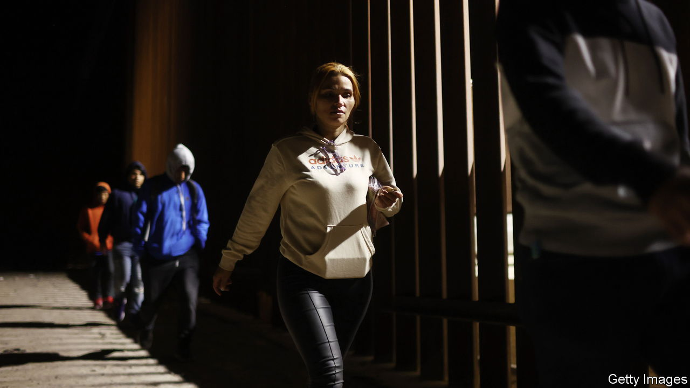

###### The end of Title 42

# Why chaos looms at the US-Mexico border 

##### As a measure to limit migration expires, several cities have already declared a state of emergency 

 

> May 10th 2023 

Since March 2020 migrants trying to cross America’s south-west border have been expelled nearly 2.8m times using Title 42, a pandemic-inspired measure. Little wonder that President Joe Biden is prepared for chaotic scenes when the policy ends on May 11th. He has ordered 1,500 troops to the border to back up Customs and Border Protection (CBP) agents. Several border cities in Texas, including El Paso and Laredo, facing a surge of migrants for processing, have already declared a state of emergency. The result will be tough for migrants—and, assuming their numbers stay high,  for Mr Biden.

Title 42 allowed CBP to rapidly process and expel migrants on public-health grounds, either to their own country or, in some cases, to Mexico, which had agreed to take back some nationalities as well as its own. Mr Biden first tried to end Title 42 in April 2022, but wrangling in the courts by Republican-led states, which have stressed border security, kept it alive until now. The regime that will replace it is an expansion of a stick-and-carrot approach that America has been trialling since late last year: expanding legal pathways while clamping down on those who do not use them. 

America will continue a policy, which dates to January, of letting in up to 30,000 asylum-seekers a month in total from Cuba, Haiti, Nicaragua and Venezuela if they apply through CBP One, an app, rather than crossing illegally (this is a tiny fraction of those hoping to enter). It will also take a total of up to 100,000 people from El Salvador, Guatemala and Honduras through a family-reunification process. Title 8, the normal immigration law, will take the place of Title 42. It is a bigger stick. Anyone trying to enter America illegally will be banned from applying for entry for five years. Under Title 42 migrants could try to cross multiple times; now they could face felony charges for trying to re-enter. 

America’s plan relies on Mexico’s willingness to take back migrants from some countries with which America’s diplomatic relations are so bad that there are no deportation flights. This is a “vulnerability”, notes Theresa Cardinal Brown of the Bipartisan Policy Centre, a think-tank in Washington, DC. Relations with Mexico have not been helped by bellicose comments from the Drug Enforcement Administration and some Republicans, who blame Mexico for America’s opioid crisis because Mexican gangs traffic fentanyl across the border. 

The friction has seeped into . The political cost of being seen to do America’s dirty work is rising, says a Mexican official. President Andrés Manuel López Obrador is thinking twice since the head of Mexico’s immigration agency, a close ally, was charged in April with negligence over a fire in a migrant detention centre in northern Mexico, in which 40 people died. On the ground, few Mexican agents want to find themselves in the same position, so many are simply waving through migrants on their way north rather than detaining them. Only on May 2nd, nine days before Title 42 ended, did Mexico agree to continue to take back under Title 8 the same nationalities it had agreed to under Title 42. 

Migration-policy experts praise Mr Biden’s package as the best for years. But sheer numbers are likely to engulf it. A record number of people are trying to migrate. Border apprehensions have risen six-fold since 2018, to 2.4m last year. The combination of legal pathways and harsh penalties has so far failed to be as strong a deterrent as the administration hoped. The number of Venezuelans caught trying to cross the border illegally plummeted between October last year, when the legal pathway was opened to them, and February 2023, but has since crept up again.

Even where migrant encounters have dropped, it is not because people have stayed home; rather, they are in limbo elsewhere in the region. Thousands are waiting in northern Mexico to try their luck once Title 42 goes. The Biden administration estimates that up to 13,000 people a day will seek asylum.

With an eye to this, the United States is also trying to  closer to the source. It plans to open regional processing centres, starting in Guatemala and Colombia, to identify vulnerable people and lay out their options. In April the administration announced a 60-day plan to tackle people-smuggling through the Darién Gap, a treacherous stretch of jungle between Colombia and Panama that migrants must cross as they head north. (More than 87,000 people, including Chinese and Indians, crossed there in the first three months of this year, up from fewer than 14,000 in the same period last year.) But the plans are vague. And tackling root causes in Central America, such as a lack of jobs, will take years to pay off, if they do at all. ■


