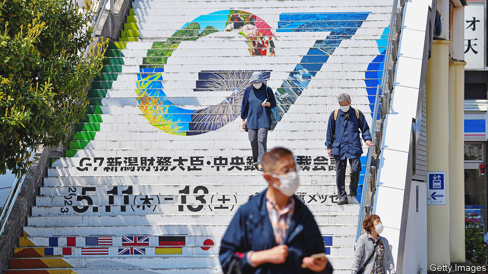
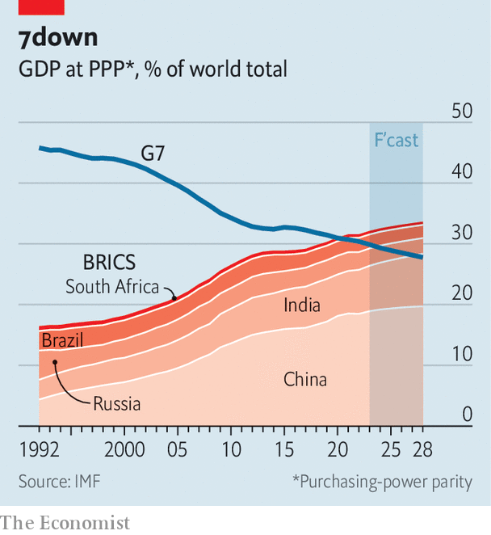

###### Global summitry

# Can the West win over the rest of the world? 

##### The G7 wants to build a broader alliance to resist Chinese and Russian coercion 

 

> May 16th 2023 

THE GROUP OF SEVEN (G7) began gathering after the first oil shock of the 1970s. In the ensuing decades the club of the world’s largest rich democracies led the way on global economic policy. But its relevance faded as its share of the global economy declined. In 2009 Barack Obama, then America’s president, declared that the G20, a broader grouping that includes China and other big developing countries, would become the pre-eminent forum; Donald Trump, his successor, went further, calling the G7 “outdated”. In the past year, however, the G7 has found a new sense of purpose amid another crisis, emerging as a forum for co-ordinating assistance to Ukraine and sanctions against Russia. 

Those tasks will top the agenda at the next leaders’ summit, to be held on May 19th-21st in Hiroshima, the hometown of Japan’s prime minister, Kishida Fumio. Combating Russian sanction-busting is a priority. Japan, whose laws bar it from supplying lethal military aid, will also take up the mantle of post-war reconstruction in Ukraine, drawing on its experience in rebuilding after natural disasters. In a city emblematic of the horror of atomic destruction, Ukraine would like to see the G7 send Russia a “clear message on nuclear threats”, says Sergiy Korsunsky, Ukraine’s ambassador to Japan. “It’s important for the big guys to say no and draw a clear line.” 

Yet the G7’s support for Ukraine has also shown up the distance between the rich and developing world on the war. Even if disturbed by Vladimir Putin’s invasion, many poorer countries hesitate to condemn it forcefully and mainly grumble about its impact on food and energy markets. That discordance worries Japan, the G7’s chair (and only Asian member). 

Japanese officials have therefore been on a listening tour ahead of the gathering in Hiroshima. In the past two months, Mr Kishida has visited Egypt, Ghana, , Kenya, Mozambique and Singapore; his foreign minister, Hayashi Yoshimasa, toured Latin America. “In the midst of Russia’s invasion of Ukraine, some global-south countries are facing great difficulties…there is also a movement to try to divide the world by taking advantage of such situations,” says Mr Kishida in an interview with  and other outlets, using characteristically careful language.

 


In private, Japanese officials and diplomats are blunter: the West is losing to China when it comes to outreach to the global south. The G7’s relative economic strength has been declining, and with it the pull of the international order it represents: the club-members’ share of global GDP in nominal terms peaked at nearly 70% in the late 1980s, but dipped to under 45% in 2021. In purchasing-power parity terms, the BRICS grouping, of Brazil, Russia, India, China and South Africa, has surpassed the G7’s share (see chart). Japanese envoys reckon that the West is failing to convince many poorer countries of the benefits of the current order. They report hearing a litany of complaints about America from leaders elsewhere: concerning the tumult in American domestic politics; a lack of economic offerings in American trade policies; a lack of respect in American diplomacy. They fret that ruling elites in many developing countries are starting to prefer dealing with China, which offers more stability, more roads and bridges, and fewer lectures. In Japan’s estimation, American preaching about democracy has been especially ineffective. “Liberal democracy has proved a poor rallying cry,” says one Japanese official.

Japan hopes to tamp down the talk (favoured by President Joe Biden) of a battle between democracy and autocracy in favour of strong G7 support for the rule of law. Japanese officials reckon that standing for the inviolability of borders, rather than more nebulous values, will appeal to a wider range of potential partners and make clearer the benefits of an international system based on rules rather than raw power. It also avoids forcing countries into a binary choice, between liberal and illiberal powers, another Japanese official suggests: “We don’t support creating new blocs.”

Mr Kishida articulated that thinking in March in India, which is chairing the G20 this year and sees itself as the global south’s leader. India is one of eight guests invited to observe the summit in Hiroshima, along with Indonesia, the current ASEAN chair; the Comoros, the African Union’s chair; the Cook Islands, the Pacific Islands Forum chair; and Australia, Brazil, South Korea and Vietnam. Japan is trying to “expand whom we talk to, and how we talk to them,” says Rahm Emanuel, America’s ambassador to Japan. “The United States is 100% behind it in support of that.”

Japan also hopes to use this year’s summit to connect the security concerns of the largely Euro-Atlantic G7 and the Indo-Pacific region. The meeting is “both a response to the war and a reminder of how to deter a future one,” says Mr Emanuel. Mr Kishida has linked the fighting in Ukraine to China’s threats against Taiwan. “The use of force to change the status quo must not be tolerated in any region, be it Europe or Asia.” When the G7’s foreign ministers met last month, they sought to project unified support for Taiwan in the wake of Emmanuel Macron’s visit to Beijing, a trip that dismayed Japanese officials. The leaders’ meeting in Hiroshima may produce a follow-up statement on a common approach to “economic coercion”, or China’s practice of using trade and finance to punish others for geopolitical defiance. 

The summit thus reflects the —consensus-building and strategic—that Japan sees itself playing in a changing world. “Japan needs to bridge,” says Jimbo Ken of Keio University in Tokyo. Japanese diplomacy is well suited to it, especially in the Indo-Pacific. Japan understands the region “much better than any other G7 member,” says Bilahari Kausikan, a former senior Singaporean diplomat. It can help by “tempering the wilder flights of fancy” of other Western G7 members. 

Yet Japan’s measured approach has some downsides. Its officials talk about the rule of law “internationally but not internally”, notes Sahashi Ryo of the University of Tokyo. Keeping quiet on rights abuses or democratic backsliding for the sake of coalition-building risks letting future problems fester. As Mr Putin has demonstrated, dictators unconstrained by pesky checks and balances at home find it easier to launch illegal attacks on their neighbours. And as Ukrainians have shown, standing up to those attacks is easier when there are clearly articulated and prized values, as well as territory, to fight for. ■

