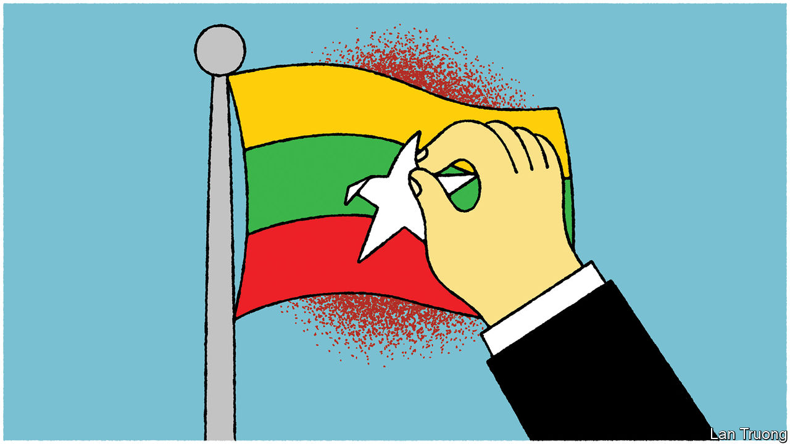

###### Banyan

# Myanmar’s conflict is dividing South-East Asia 

##### The region’s leaders disagree on what to do about the conflagration. China is not helping 

 

> May 18th 2023 

AHEAD OF THE Buddhist new year in Myanmar last month, a few hundred locals congregated one morning in Pa Zi Gyi village in Sagaing region, in the country’s Buddhist heartland. It was supposed to be a happy event to mark the opening of a new office of the dissident national unity government, which opposes the military junta that seized power in early 2021. The new administrative centre promised to bring a semblance of normality to the war-torn country: taxes would be processed and town meetings held. Then a fighter jet screamed overhead, dropping bombs. A helicopter fired rockets. At least 100 people were killed, including 40 children. Another day’s work by the vicious junta of General Min Aung Hlaing.

Since the Tatmadaw, as Myanmar’s armed forces are known, ousted its elected government, more than 1.3m Burmese people have been displaced and over 30,000 killed in fighting between the army and its opponents. Nearly half of Myanmar’s 54m people live below the poverty line, more than double the number before the conflict began. Just this week the Tatmadaw took advantage of the devastation wrought by a cyclone, which killed dozens, to launch yet more attacks on its enemies.

Such atrocities demand a regional response. Yet Myanmar’s neighbours are paralysed over what to do about the conflict. This was illustrated at a summit of the ten-country Association of South-East Asian Nations (ASEAN) in Labuan Bajo, Indonesia, on May 10th. For the second year running, Myanmar’s generals were not invited to the gathering of ASEAN leaders. The conflict was nonetheless prominently in mind; a few days earlier, a convoy carrying aid to displaced Burmese villagers, and also Indonesian and Singaporean diplomats, was attacked. Yet Indonesia’s president, Joko Widodo, who is chairing ASEAN, declared that no progress had been made on asean’s draft peace plan for Myanmar. Its conflict has become the regional bloc’s gravest crisis since its founding in 1967.

ASEAN’s members appear utterly divided over the issue. The more democratic countries of Indonesia, Malaysia, the Philippines and Singapore are more critical of Myanmar’s junta than the authoritarian rest. A memo leaked after ASEAN’s latest discussions confirmed that some countries want to invite the junta back to the club’s meetings because “the time for isolation has served its purpose”.

Thailand’s ruling ex-generals, who also seized power in a coup, have coddled their Burmese counterparts. Thailand, which shares a 2,400km-long border with Myanmar, thus started separate negotiations with the junta late last year. Cambodia and Laos have done the same, straining unity around ASEAN’s diplomatic boycott. China and India, Myanmar’s giant neighbours, have also pursued their interests by engaging with the ruling thugs, thereby compounding the mess.

China has moved closest to the junta. Earlier this month Qin Gang, China’s new foreign minister, became the highest-ranking Chinese official to visit Myanmar since the coup—it was his only South-East Asian pit-stop in an itinerary that also included India and Pakistan. These countries, notes Yun Sun of the Stimson Centre, a think-tank in Washington, are all strategic priorities for China. In Myanmar it aims to protect its investments and seek new ones.

Economic advantage, says Jason Tower of the United States Institute of Peace, is more important to China than ending conflict. So is strategic advantage. Myanmar affords China access to the Bay of Bengal, the Indian Ocean and an alternative to the choke-point of the Malacca Strait, the main route through which most of China’s ship-bound energy and trade has flowed. China has poured over $21bn into a China-Myanmar Economic Corridor involving roads, railways, pipelines and a port.

Beyond promoting China’s economic projects in Myanmar, Mr Qin used his visit to advertise a Xi Jinping-era foreign-policy mantra—“community with a shared future for mankind”—that puts economic development above individual rights (not that the junta cares about either). The Chinese foreign minister also rattled off other slogans to promote a world in which like-minded big powers such as China and Russia determine the security arrangements of their neighbours while rallying countries against the West. As China’s influence grows and ASEAN’s fragments, the interests of ordinary Burmese who want to attend town-hall meetings slide ever further down the ladder of regional priorities.■


