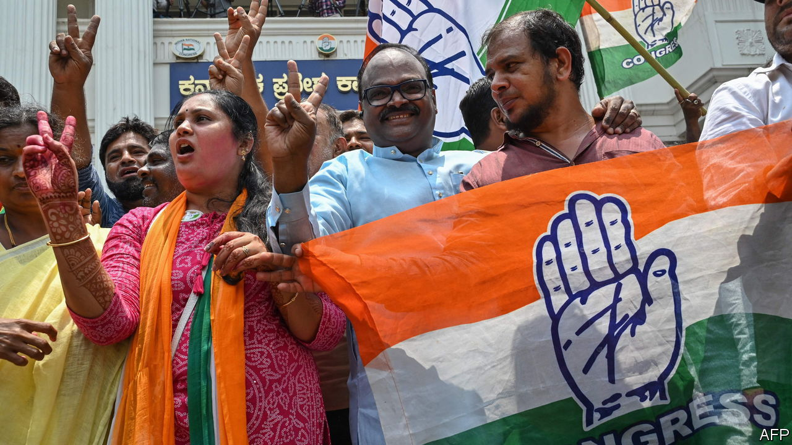

###### Southern approaches

# Narendra Modi’s party takes a beating in Karnataka 

##### South Indians are unimpressed by the prime minister’s charisma and his party’s divisiveness 

 

> May 14th 2023 

Narendra Modi was anxious to retain power in Karnataka. In the week before the affluent southern state’s assembly election on May 10th, India’s prime minister addressed 19 public rallies and six road shows across it. Keeping a “double engine” of  (BJP) government, at the state and centre, he argued, was the best way to preserve Karnataka’s booming economy—which has seen average annual growth of nearly 8% over the past decade.

Yet Mr Modi’s party was crushed. It won only 66 of Karnataka’s 224 seats. The opposition  won an absolute majority, with 135 seats, having secured the highest vote share of any party in the state for 34 years. As Congress activists celebrated, after a decade of almost relentless losses to the bjp, Mr Modi’s Hindu-nationalist supporters licked their wounds.

With a general election due in May 2024, the result is a big blow to Mr Modi and his party. Karnataka, which has 68m people, was the only southern state under bjp control. Beyond its status as India’s fifth-biggest state economy, Mr Modi’s party had looked on Karnataka as a potential launch-pad for a southern expansion that would justify the bjp’s claim to be a genuinely national force.

Richer and less populous than the Hindi-speaking north, India’s southern states are home to its technology sector and much of its manufacturing. The fact that they have proved averse to the bjp is therefore painful for the ruling party. It undermines not only its national aspirations, but also its claim to be the party of economic growth, as well as Hindu pride.

By exploiting a toehold in Karnataka’s growing Hindi-speaking population—especially in the fast-expanding tech capital of Bangalore—Mr Modi had hoped to overcome that weakness. Faced with local concerns in Karnataka about corruption, unemployment and poor infrastructure, the bjp resorted to its usual Muslim-baiting. Its state government imposed a ban on Muslim students wearing the hijab in school. It floated a possible ban on halal meat. It scrapped a quota of state positions reserved for economically disadvantaged Muslims and proposed handing them to members of two influential Hindu castes.

Karnataka’s voters were underwhelmed. Their state, like the south generally, has seen less communal conflict than north India, despite some Hindu-Muslim tensions on Karnataka’s coast. So the bjp’s divisiveness appears to have struck many as a northern imposition they could do without. This failure leaves the bjp without a toehold in the south. Despite its dominance of national politics, it controls only half of India’s 28 state governments.

The result is a corresponding fillip for Congress. After a long decline, India’s former party of government and its allies now control only seven states. Yet this victory will suggest to its bruised activists that Mr Modi is not unbeatable. Indeed, given the prime minister’s energetic campaigning, his personal aura of invincibility—a feature of his personality cult—has taken a particular knock. Congress’s campaign strategy in Karnataka, which involved attacking the bjp’s governing record and largely ignoring its Muslim-baiting, also looks like its best hope of advancing elsewhere. At the least, its success in Karnataka may burnish the party’s credibility as a force to unify the national opposition.

Even so, there is little reason to expect a national turn against Mr Modi and his party. Karnataka’s voters have a strong tradition of anti-incumbency: they have not re-elected a government in four decades. Given that record, the bjp’s vote share held up remarkably well. Most of Congress’s increased tally came at the expense of a third party, Janata Dal (Secular), which will play no significant role in next year’s general election. And despite retreating in some parts of the state, the bjp appears to have made gains in Bangalore and southern Karnataka. There is nothing here to augur defeat for Mr Modi and his party in next year’s election. To the contrary, his prospects of winning a third consecutive term look almost assured.■

