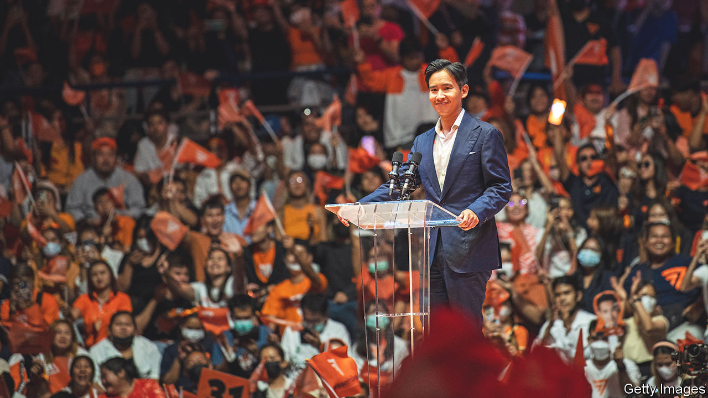

###### Moving Forward

# Thailand’s pro-democracy parties trounce the military establishment 

##### But forming a government won’t be easy 

 

> May 15th 2023 

Politics in Thailand has for years been defined by a battle between ardent royalists (known as “yellow shirts”) and the red-shirted supporters of Thaksin Shinawatra, a tycoon turned populist-leader, now living in exile. The general election held on May 14th appears to have dramatically reshaped that struggle.

The big winner was a third force, Move Forward, a party of young liberal activists that campaigned on a promise to reform the monarchy and the armed forces, two institutions that have long dominated Thailand. Together with Mr Thaksin’s Pheu Thai party, the other main pro-democracy outfit, Move Forward won 293 seats in the 500-seat assembly. The two main pro-military parties—including the United Thai Nation Party of the prime minister, Prayuth Chan-ocha, who seized power in a coup in 2014—won 76 seats. This promises to redefine Thai politics—as a fight between a growing majority, who want a fully democratic country, where the power of the monarchy and army is restrained, and a dwindling royalist minority.

Move Forward’s leader, a 42-year-old Harvard graduate called Pita Limjaroenrat, has proposed forming a coalition government of eight parties, including Pheu Thai, which ran a close second. It had been expected to win the election: parties linked to Mr Thaksin, who was elected prime minister in 2001 before being ousted in a military coup, won every Thai poll between 2001 and 2019. Yet Pheu Thai’s leader, Paetongtarn Shinawatra, who is Mr Thaksin’s daughter, said she would be willing to join the coalition that Mr Pita proposed. It would exclude any party that supported the military government, and would control 313 seats in all. 

Even so, forming a government won’t be easy. Thailand’s military establishment has rigged the system in its favour. Under the constitution that the ruling junta forced through in 2016, the senate has an outsized role in appointing the prime minister. To get around that, Mr Pita, a former executive at Grab, South-East Asia’s answer to Uber, would need at least 376 seats in the lower house. Making matters harder for Thailand’s pro-democracy camp, the country’s constitutional court, electoral commission and anti-corruption commission are stacked with army loyalists. 

Instead of blocking Mr Pita in the senate, the establishment might try to unseat him by more underhand means. This has happened before. Move Forward was founded in 2018 (under the name “Future Forward”) by young, progressive Thais and promptly won the third-largest number of seats in an election the following year. Horrified by the party’s proposals to shrink the size of the army, the Thai establishment banned its then leader from politics, charged him with lèse-majesté and disbanded the party. Last week saw possible groundwork for a similar ploy. A pro-military candidate filed a complaint with Thailand’s electoral and anti-corruption commissions alleging that Mr Pita had failed to adequately declare his ownership of a particular stock. The Move Forward leader denies any wrongdoing. 

The military government has earned its rebuke from Thailand’s 52m voters. In almost a decade of its rule, the country’s economy has failed to keep pace with its neighbours, including Indonesia and Vietnam. Thailand has also forfeited its erstwhile reputation for regional leadership; the junta has ignored a proposed regional peace plan for war-torn Myanmar. Move Forward has some admirable ideas, beyond constitutional and defence reform, to tackle these problems. The party wants to dismantle monopolies in many industries, from alcohol to agriculture. It also wants to establish a humanitarian corridor along Thailand’s 2,400km border with Myanmar and supports the regional peace plan.

The army establishment, backed by the monarchy, will not concede its defeat easily. It may take weeks before a new government is declared. It may take even longer for Thais to obtain the vibrant democracy they voted for. But this election looks like a turning-point. For the first time in a long time, Thais have reason to feel more hopeful about their country’s future. ■

