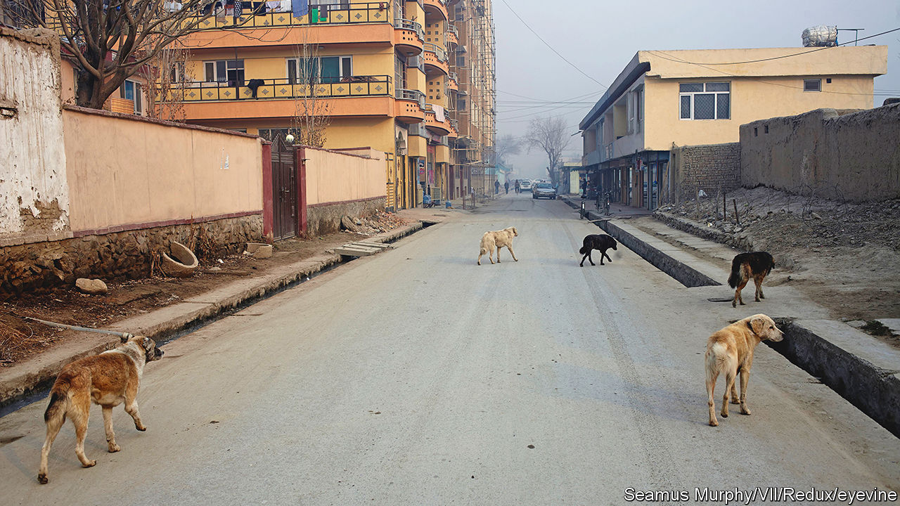

###### Pooches of the Panjshir

# The Taliban go big on animal welfare 

##### The Islamist fanatics also castrate dogs 

 

> May 18th 2023 

ANIMAL WELFARE was not considered a big priority for the Taliban when they rolled back into Kabul in August 2021. A Kabul-based animal-rescue charity called Nowzad, run by a former British soldier, created such a fuss in the British press that Boris Johnson, the then prime minister, permitted it to load 94 stray dogs and 68 cats onto one of the last flights out of the country. They were the lucky ones. Kabul’s street-dog population ballooned as Afghans abandoned their pooches before fleeing the country.

“We found lots of well-trained, rare breeds in the early days,” says Mohammed Ismail, a vet with another British animal charity, called Mayhew. When Kabul fell, Mayhew told its Afghan staff to stay at home. As a British organisation, it feared reprisals. It also assumed the Taliban hated dogs, which pious Muslims consider impure. But it was not long before Mayhew was asked by the Taliban to get back to work.

Every day at dawn, the charity sends its vets out with dog-catchers from Kabul’s Taliban-controlled administration. Armed with giant nets, most days they nab about 60 strays, which they neuter and inoculate against rabies. After a few days’ recuperation at the charity’s facilities, the curs are returned to the streets. The Taliban mayor of Kabul is said to be delighted with this work. His administration recently chalked up Mayhew’s vaccination of around 30,000 stray dogs as one of its successes.

Nowzad has also now returned to Kabul, where its activities include running a small-animal clinic. The Taliban have permitted the NGO to “continue with our mission objectives”, says Nowzad’s founder, Pen Farthing, a former Royal Marine. During his five recent visits to Kabul, he found the Taliban amenable and “always polite and friendly”. He thinks the international community should stop shunning them. “They are back in power because we put them back in power,” he suggests, a tad cynically.

Mayhew says it fully complies with the Taliban’s rules, including an order banning NGOs from employing women. “It’s awful,” says Caroline Yates of Mayhew. “But we are first and foremost an animal-welfare organisation.”■

