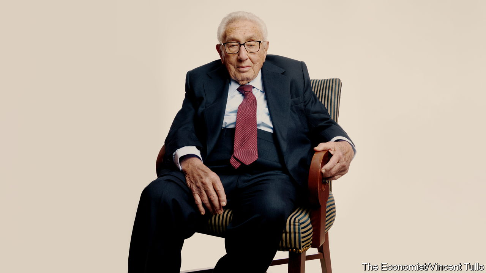
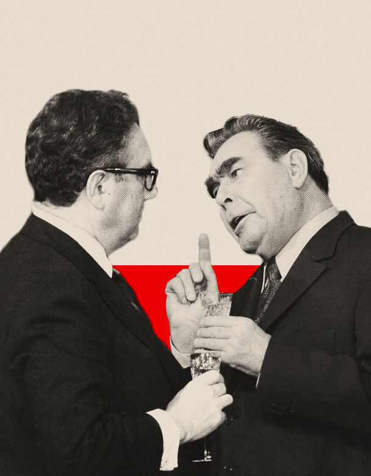
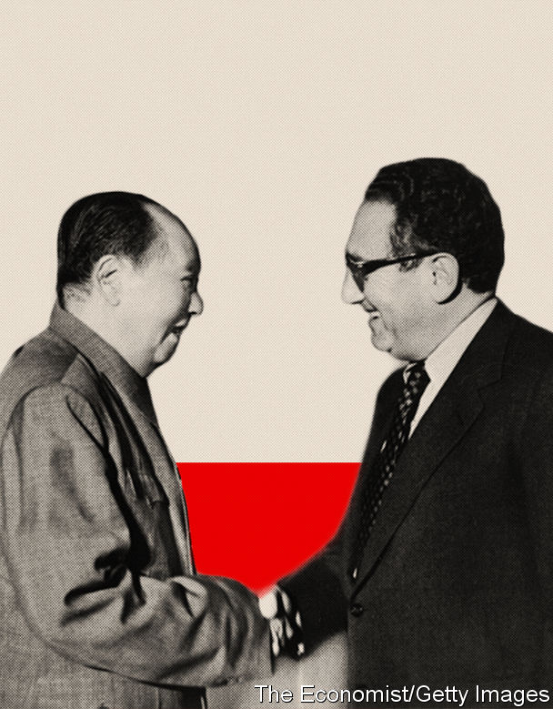
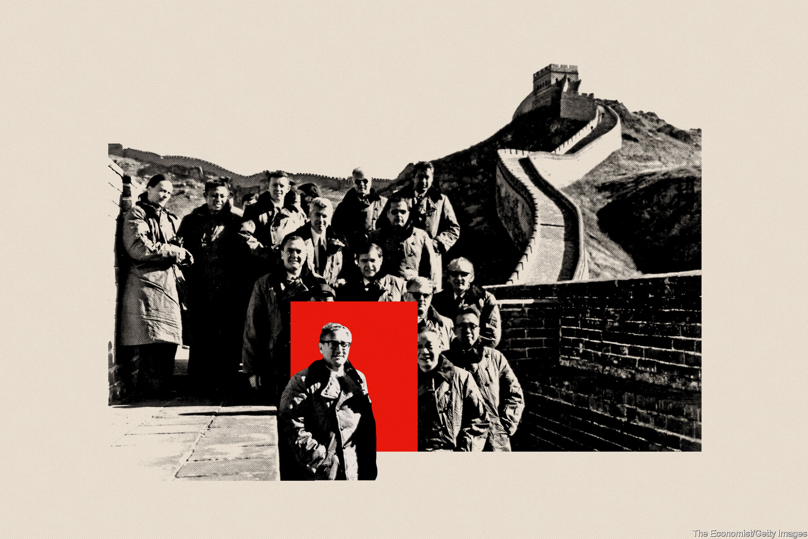

###### One hundred years of inquietude

# Henry Kissinger explains how to avoid world war three 

##### America and China must learn to live together. They have less than ten years 

 

> May 17th 2023 

IN BEIJING THEY have concluded that America will do anything to keep China down. In Washington they are adamant that China is scheming to supplant the United States as the world’s leading power. For a sobering analysis of this growing antagonism—and a plan to prevent it causing a superpower war—visit the 33rd floor of an Art Deco building in midtown Manhattan, the office of Henry Kissinger. 

On May 27th Mr Kissinger will turn 100. Nobody alive has more experience of international affairs, first as a scholar of 19th-century diplomacy, later as America’s national security adviser and secretary of state, and for the past 46 years as a consultant and emissary to monarchs, presidents and prime ministers. Mr Kissinger is worried. “Both sides have convinced themselves that the other represents a strategic danger,” he says. “We are on the path to great-power confrontation.”

At the end of April  spoke to Mr Kissinger for over eight hours about how to prevent the contest between China and America from descending into war. These days he is stooped and walks with difficulty, but his mind is needle-sharp. As he contemplates his next two books, on artificial intelligence (AI) and the nature of alliances, he remains more interested in looking forward than raking over the past. 

Mr Kissinger is alarmed by China’s and America’s intensifying competition for technological and economic pre-eminence. Even as Russia tumbles into China’s orbit and war overshadows Europe’s eastern flank, he fears that AI is about to supercharge the Sino-American rivalry. Around the world, the balance of power and the technological basis of warfare are shifting so fast and in so many ways that countries lack any settled principle on which they can establish order. If they cannot find one, they may resort to force. “We’re in the classic pre-world war one situation,” he says, “where neither side has much margin of political concession and in which any disturbance of the equilibrium can lead to catastrophic consequences.” 

Study war some more 

Mr Kissinger is reviled by many as a warmonger for his part in the Vietnam war, but he considers the avoidance of conflict between great powers as the focus of his life’s work. After witnessing the carnage caused by Nazi Germany and suffering the murder of 13 close relatives in the Holocaust, he became convinced that the only way to prevent ruinous conflict is hard-headed diplomacy, ideally fortified by shared values. “This is the problem that has to be solved,” he says. “And I believe I’ve spent my life trying to deal with it.” In his view, the fate of humanity depends on whether America and China can get along. He believes the rapid progress of AI, in particular, leaves them only five-to-ten years to find a way.


Mr Kissinger has some opening advice to aspiring leaders: “Identify where you are. Pitilessly.” In that spirit, the starting-point for avoiding war is to analyse China’s growing restlessness. Despite a reputation for being conciliatory towards the government in Beijing, he acknowledges that many Chinese thinkers believe America is on a downward slope and that, “therefore, as a result of an historic evolution, they will eventually supplant us.”

He believes that China’s leadership resents Western policymakers’ talk of a global rules-based order, when what they really mean is America’s rules and America’s order. China’s rulers are insulted by what they see as the condescending bargain offered by the West, of granting China privileges if it behaves (they surely think the privileges should be theirs by right, as a rising power). Indeed, some in China suspect that America will never treat it as an equal and that it’s foolish to imagine it might.

However, Mr Kissinger also warns against misinterpreting China’s ambitions. In Washington, “They say China wants world domination…The answer is that they [in China] want to be powerful,” he says. “They’re not heading for world domination in a Hitlerian sense,” he says. “That is not how they think or have ever thought of world order.” 

In Nazi Germany war was inevitable because Adolf Hitler needed it, Mr Kissinger says, but China is different. He has met many Chinese leaders, starting with Mao Zedong. He did not doubt their ideological commitment, but this has always been welded onto a keen sense of their country’s interests and capabilities. 

Mr Kissinger sees the Chinese system as more Confucian than Marxist. That teaches Chinese leaders to attain the maximum strength of which their country is capable and to seek to be respected for their accomplishments. Chinese leaders want to be recognised as the international system’s final judges of their own interests. “If they achieved superiority that can genuinely be used, would they drive it to the point of imposing Chinese culture?” he asks. “I don’t know. My instinct is No…[But] I believe it is in our capacity to prevent that situation from arising by a combination of diplomacy and force.” 

One natural American response to the challenge of China’s ambition is to probe it, as a way to identify how to sustain the equilibrium between the two powers. Another is to establish a permanent dialogue between China and America. China “is trying to play a global role. We have to assess at each point if the conceptions of a strategic role are compatible.” If they are not, then the question of force will arise. “Is it possible for China and the United States to coexist without the threat of all-out war with each other? I thought and still think that it [is].” But he acknowledges success is not guaranteed. “It may fail,” he says. “And therefore, we have to be militarily strong enough to sustain the failure.”

 


The urgent test is how China and America behave over Taiwan. Mr Kissinger recalls how, on Richard Nixon’s first visit to China in 1972, only Mao had the authority to negotiate over the island. “Whenever Nixon raised a concrete subject, Mao said, ‘I’m a philosopher. I don’t deal with these subjects. Let Zhou [Enlai] and Kissinger discuss this.’…But when it came to Taiwan, he was very explicit. He said, ‘They are a bunch of counter-revolutionaries. We don’t need them now. We can wait 100 years. Someday we will ask for them. But it’s a long distance away.’”


Mr Kissinger believes that the understanding forged between Nixon and Mao was overturned after only 50 of those 100 years by Donald Trump. He wanted to inflate his tough image by wringing concessions out of China over trade. In policy the Biden administration has followed Mr Trump’s lead, but with liberal rhetoric. 

Mr Kissinger would not have chosen this path with respect to Taiwan, because a Ukrainian-style war there would destroy the island and devastate the world economy. War could also set back China domestically, and its leaders’ greatest fear remains upheaval at home. 


The fear of war creates grounds for hope. The trouble is that neither side has much room to make concessions. Every Chinese leader has asserted his country’s connection to Taiwan. At the same time, however, “the way things have evolved now, it is not a simple matter for the United States to abandon Taiwan without undermining its position elsewhere.”

Mr Kissinger’s way out of this impasse draws on his experience in office. He would start by lowering the temperature, and then gradually build confidence and a working relationship. Rather than listing all their grievances, the American president would say to his Chinese counterpart, “Mr President, the two greatest dangers to peace right now are us two. In the sense that we have the capacity to destroy humanity.” China and America, without formally announcing anything, would aim to practise restraint.

Never a fan of policymaking bureaucracies, Mr Kissinger would like to see a small group of advisers, with easy access to each other, working together tacitly. Neither side would fundamentally change its position on Taiwan, but America would take care over how it deploys its forces and try not to feed the suspicion that it supports the island’s independence. 

Mr Kissinger’s second piece of advice to aspiring leaders is: “Define objectives that can enlist people. Find means, describable means, of achieving these objectives.” Taiwan would be just the first of several areas where the superpowers could find common ground and so foster global stability. 

In a recent speech Janet Yellen, America’s treasury secretary, suggested that these should include climate change and the economy. Mr Kissinger is sceptical about both. Although he is “all for” action on the climate, he doubts it can do much to create confidence or help establish a balance between the two superpowers. On the economy, the danger is that the trade agenda is hijacked by hawks who are unwilling to give China any room to develop at all.

That all-or-nothing attitude is a threat to the broader search for detente. If America wants to find a way to live with China, it should not be aiming for regime change. Mr Kissinger draws on a theme present in his thought from the very beginning. “In any diplomacy of stability, there has to be some element of the 19th-century world,” he says. “And the 19th-century world was based on the proposition that the existence of the states contesting it was not at issue.” 

Some Americans believe that a defeated China would become democratic and peaceful. Yet, however much Mr Kissinger would prefer China to be a democracy, he sees no precedent for that outcome. More likely, a collapse of the communist regime would lead to a civil war that hardened into ideological conflict and only added to global instability. “It’s not in our interest to drive China to dissolution,” he says. 

Rather than digging in, America will have to acknowledge China has interests. A good example is Ukraine. 

China’s president, Xi Jinping, only recently contacted Volodymyr Zelensky, his Ukrainian counterpart, for the first time since Russia invaded Ukraine in February last year. Many observers have dismissed Mr Xi’s call as an empty gesture designed to placate Europeans, who complain that China is too close to Russia. By contrast, Mr Kissinger sees it as a declaration of serious intent that will complicate the diplomacy surrounding the war, but which may also create precisely the sort of opportunity to build the superpowers’ mutual trust.


Mr Kissinger begins his analysis by condemning Russia’s president, Vladimir Putin. “It was certainly a catastrophic mistake of judgment by Putin at the end,” he says. But the West is not without blame. “I thought that the decision to…leave open the membership of Ukraine in NATO was very wrong.” That was destabilising, because dangling the promise of NATO protection without a plan to bring it about left Ukraine poorly defended even as it was guaranteed to enrage not only Mr Putin, but also many of his compatriots. 

The task now is to bring the war to an end, without setting the stage for the next round of conflict. Mr Kissinger says that he wants Russia to give up as much as possible of the territory that it conquered in 2014, but the reality is that in any ceasefire Russia is likely to keep Sevastopol (the biggest city in Crimea and Russia’s main naval base on the Black Sea), at the very least. Such a settlement, in which Russia loses some gains but retains others, could leave both a dissatisfied Russia and a dissatisfied Ukraine. 

 


In his view, that is a recipe for future confrontation. “What the Europeans are now saying is, in my view, madly dangerous,” he says. “Because the Europeans are saying: ‘We don’t want them in NATO, because they’re too risky. And therefore, we’ll arm the hell out of them and give them the most advanced weapons.’” His conclusion is stark: “We have now armed Ukraine to a point where it will be the best-armed country and with the least strategically experienced leadership in Europe.”

To establish a lasting peace in Europe requires the West to take two leaps of imagination. The first is for Ukraine to join NATO, as a means of restraining it, as well as protecting it. The second is for Europe to engineer a rapprochement with Russia, as a way to create a stable eastern border. 


Plenty of Western countries would understandably balk at one or other of those aims. With China involved, as an ally of Russia’s and an opponent of NATO, the task will become even harder. China has an overriding interest to see Russia emerge intact from the war in Ukraine. Not only does Mr Xi have a “no-limits” partnership with Mr Putin to honour, but a collapse in Moscow would trouble China by creating a power vacuum in Central Asia that risks being filled by a “Syrian-type civil war”.

Following Mr Xi’s call to Mr Zelensky, Mr Kissinger believes that China may be positioning itself to mediate between Russia and Ukraine. As one of the architects of the policy that pitted America and China against the Soviet Union, he doubts that China and Russia can work together well. True, they share a suspicion of the United States, but he also believes that they have an instinctive distrust of one another. “I have never met a Russian leader who said anything good about China,” he says. “And I’ve never met a Chinese leader who said anything good about Russia.” They are not natural allies. 


The Chinese have entered diplomacy over Ukraine as an expression of their national interest, Mr Kissinger says. Although they refuse to countenance the destruction of Russia, they do recognise that Ukraine should remain an independent country and they have cautioned against the use of nuclear weapons. They may even accept Ukraine’s desire to join NATO. “China does this, in part, because they do not want to clash with the United States,” he says. “They are creating their own world order, in so far as they can.”

The second area where China and America need to talk is AI. “We are at the very beginning of a capability where machines could impose global pestilence or other pandemics,” he says, “not just nuclear but any field of human destruction.”

He acknowledges that even experts in AI do not know what its powers will be (going by the evidence of our discussions, transcribing a thick, gravelly German accent is still beyond its capabilities). But Mr Kissinger believes that AI will become a key factor in security within five years. He compares its disruptive potential to the invention of printing, which spread ideas that played a part in causing the devastating wars of the 16th and 17th centuries. 


“[We live] in a world of unprecedented destructiveness,” Mr Kissinger warns. Despite the doctrine that a human should be in the loop, automatic and unstoppable weapons may be created. “If you look at military history, you can say, it has never been possible to destroy all your opponents, because of limitations of geography and of accuracy. [Now] there are no limitations. Every adversary is 100% vulnerable.”

AI cannot be abolished. China and America will therefore need to harness its power militarily to a degree, as a deterrent. But they can also limit the threat it poses, in the way that arms-control talks limited the threat of nuclear weapons. “I think we have to begin exchanges on the impact of technology on each other,” he says. “We have to take baby steps towards arms control, in which each side presents the other with controllable material about capabilities.” Indeed, he believes that the negotiations themselves could help build mutual trust and the confidence that enables the superpowers to practise restraint. The secret is leaders strong and wise enough to understand that AI must not be pushed to its limits. “And if you then rely entirely on what you can achieve through power, you’re likely to destroy the world.” 

Mr Kissinger’s third piece of advice for aspiring leaders is to “link all of these to your domestic objectives, whatever they are.” For America, that involves learning how to be more pragmatic, focusing on the qualities of leadership and, most of all, renewing the country’s political culture.

Mr Kissinger’s model for pragmatic thinking is India. He recalls a function at which a former senior Indian administrator explained that foreign policy should be based on non-permanent alliances geared to the issues, rather than tying up a country in big multilateral structures. 

Such a transactional approach will not come naturally to America. The theme running through Mr Kissinger’s epic history of international relations, “Diplomacy”, is that the United States insists on depicting all its main foreign interventions as expressions of its manifest destiny to remake the world in its own image as a free, democratic, capitalist society. 

The problem for Mr Kissinger is the corollary, which is that moral principles too often override interests—even when they will not produce desirable change. He acknowledges that human rights matter, but disagrees with putting them at the heart of your policy. The difference is between imposing them, or saying that it will affect relations, but the decision is theirs. 

 


“We tried [imposing them] in Sudan,” he notes. “Look at Sudan now.” Indeed, the knee-jerk insistence on doing the right thing can become an excuse for failing to think through the consequences of policy, he says. The people who want to use power to change the world, Mr Kissinger argues, are often idealists, even though realists are more typically seen as willing to use force.

India is an essential counterweight to China’s growing power. Yet it also has a worsening record of religious intolerance, judicial bias and a muzzled press. One implication—though Mr Kissinger did not directly comment—is that India will therefore be a test of whether America can be pragmatic. Japan will be another. Relations will be fraught if, as Mr Kissinger predicts, Japan takes moves to secure nuclear weapons within five years. With one eye on the diplomatic manoeuvres that more or less kept the peace in the 19th century, he looks to Britain and France to help the United States think strategically about the balance of power in Asia.

Big-shoe-fillers wanted

Leadership will matter, too. Mr Kissinger has long been a believer in the power of individuals. Franklin D. Roosevelt was far-sighted enough to prepare an isolationist America for what he saw as an inevitable war against the Axis powers. Charles de Gaulle gave France a belief in the future. John F. Kennedy inspired a generation. Otto von Bismarck engineered German unification, and governed with dexterity and restraint—only for his country to succumb to war-fever after he was ousted. 

Mr Kissinger acknowledges that 24-hour news and social media make his style of diplomacy harder. “I don’t think a president today could send an envoy with the powers that I had,” he says. But he argues that to agonise about whether a way ahead is even possible would be a mistake. “If you look at the leaders whom I’ve respected, they didn’t ask that question. They asked, ‘Is it necessary?’”

He recalls the example of Winston Lord, a member of his staff in the Nixon administration. “When we intervened in Cambodia, he wanted to quit. And I told him, ‘You can quit and march around this place carrying a placard. Or you can help us solve the Vietnam war.’ And he decided to stay… What we need [is] people who make that decision—that they’re living in this time, and they want to do something about it, other than feel sorry for themselves.”

Leadership reflects a country’s political culture. Mr Kissinger, like many Republicans, worries that American education dwells on America’s darkest moments. “In order to get a strategic view you need faith in your country,” he says. The shared perception of America’s worth has been lost.

He also complains that the media lack a sense of proportion and judgment. When he was in office the press were hostile, but he still had a dialogue with them. “They drove me nuts,” he says. “But that was part of the game…they weren’t unfair.” Today, in contrast, he says that the media have no incentive to be reflective. “My theme is the need for balance and moderation. Institutionalise that. That’s the aim.”

Worst of all, though, is politics itself. When Mr Kissinger came to Washington, politicians from the two parties would routinely dine together. He was on friendly terms with George McGovern, a Democratic presidential candidate. For a national security adviser from the other side that would be unlikely today, he believes. Gerald Ford, who took over after Nixon resigned, was the sort of person whose opponents could rely on him to act decently. Today, any means are considered acceptable. 

“I think Trump and now Biden have driven [animosity] over the top,” Mr Kissinger says. He fears that a situation like Watergate could lead to violence and that America lacks leadership. “I don’t think Biden can supply the inspiration and…I’m hoping that Republicans can come up with somebody better,” he says. “It’s not a great moment in history,” he laments, “but the alternative is total abdication.” 

America desperately needs long-term strategic thinking, he believes. “That’s our big challenge which we must solve. If we don’t, the predictions of failure will be proved true.”

If time is short and leadership lacking, where does that leave the prospects for China and the United States finding a way to live together in peace?

“We all have to admit we’re in a new world,” Mr Kissinger says, “for whatever we do can go wrong. And there is no guaranteed course.” Even so he professes to feel hope. “Look, my life has been difficult, but it gives ground for optimism. And difficulty—it’s also a challenge. It shouldn’t always be an obstacle.” 


He stresses that humanity has taken enormous strides. True, that progress has often occurred in the aftermath of terrible conflict—after the Thirty Years War, the Napoleonic wars and the second world war, for example, but the rivalry between China and America could be different. History suggests that, when two powers of this type encounter each other, the normal outcome is military conflict. “But this is not a normal circumstance,” Mr Kissinger argues, “because of mutually assured destruction and artificial intelligence.”

“I think it’s possible that you can create a world order on the basis of rules that Europe, China and India could join, and that’s already a good slice of humanity. So if you look at the practicality of it, it can end well—or at least it can end without catastrophe and we can make progress.”

That is the task for the leaders of today’s superpowers. “Immanuel Kant said peace would either occur through human understanding or some disaster,” Mr Kissinger explains. “He thought that it would occur through reason, but he could not guarantee it. That is more or less what I think.”

World leaders therefore bear a heavy responsibility. They require the realism to face up to the dangers ahead, the vision to see that a solution lies in achieving a balance between their countries’ forces, and the restraint to refrain from using their offensive powers to the maximum. “It is an unprecedented challenge and great opportunity,” Mr Kissinger says.

The future of humanity depends on getting it right. Well into the fourth hour of the day’s conversation, and just weeks before his birthday celebrations, Mr Kissinger adds with a characteristic twinkle, “I won’t be around to see it either way.” ■

