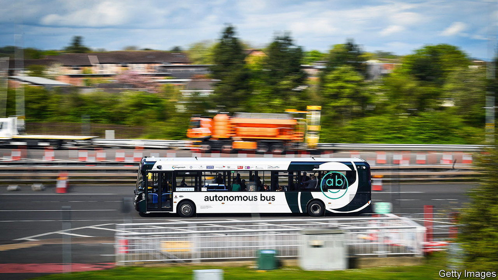

###### Autonomous vehicles

# Aboard Britain’s first commercial self-driving bus 

##### The technology accelerates; the lawmakers apply the brakes 

 

> May 18th 2023 

The AB1 bus service to Edinburgh seems much like any other. It leaves Ferrytoll Park and Ride, on the north bank of the River Forth, and crosses onto the M90 motorway, reaching a top speed of 50mph and encountering a smattering of junctions, roundabouts and traffic lights on its 25-minute journey into the city. None of this would be at all remarkable—but for the fact that it does so without any input from a human driver.

This is Britain’s first commercial self-driving bus and one of the most advanced automated-vehicle (AV) schemes in the world. The trial, run by Stagecoach, a bus firm, began operating on May 15th and will continue until at least 2025. Jim Hutchinson, the chief executive of Fusion Processing, which designed the technology involved, hopes it will become permanent.

Artificial intelligence (AI) is in the driver’s seat. Each of the five buses on the route is controlled by computer processors, housed in a black box roughly the size of a briefcase. They are programmed to follow a set route. Some 18 sensors on the outside of the vehicle provide a 360-degree view of its surroundings, and send data to the computer many times a second. An AI model, trained on over 1m miles of similar data, drives the bus. Current regulations mean that there must be a human driver in the cab—but Mr Hutchinson hopes that the government will allow the buses to be driven from a control room later in the trial.

 is moving along. Britain’s Centre for Connected and Autonomous Vehicles co-funds over 90 projects. Fusion Processing is working with Asda, a supermarket, on a self-driving lorry that it hopes to test on public roads next year. In April the government approved software developed by Ford that allows hands-free driving in passenger cars on motorways. Small, slow-moving autonomous pods have been tried out on footpaths. Promoters say AVs could make transport cheaper, safer and greener. The government reckons the market could be worth £42bn ($52.4bn) by 2035.

That vision is still a long way from being realised. Neil Greig of IAM RoadSmart, a safety charity, says optimism about the sector should be tempered. “Computer programmers think they can cope with anything, but there are always unexpected things on the road,” he warns. And if driverless vehicles are to become widespread and useful, pockets of experimentation will not be enough. 

British transport law has not kept pace with the technology. America’s federal government published its first legal framework for self-driving vehicles in 2012; by mid-2022 40 states had passed laws regulating AVs. Gulf countries are increasingly nimble: the UAE’s licensing scheme for AVs comes into force in July. Britain has “transport laws from the 1800s that make reference to horses and carts”, says Ben Gardner of Pinsent Masons, a law firm. “Some of these countries only have three or four decades of legislation on the books.”

The British government did pass a broad-brush law on AVs in 2018: that created a register for self-driving vehicles, which is currently empty. But it did not set out in detail how AVs should be defined, approved, insured and operated; how driving tests might change; or how to protect computers on wheels from being hacked. 

Much of the groundwork for further legislation has been done. In January 2022 the Law Commission issued recommendations on those questions and a host of others, preparing the way for one of the most comprehensive legal frameworks for AVs in the world. The government has said its transport bill will turn the proposals into law—but that was delayed in October 2022 and there is no timetable for its introduction. It has yet to be drafted.

AV developers could take their products elsewhere, says Ashley Feldman of techUK, an industry group. “There is a real risk…that if we do not see legislation emerging, innovative companies investing here could basically start to atrophy,” he told a parliamentary transport committee in November. Buses, lorries and cars of the future may be self-driving. But legislation still needs to be piloted by humans. ■


