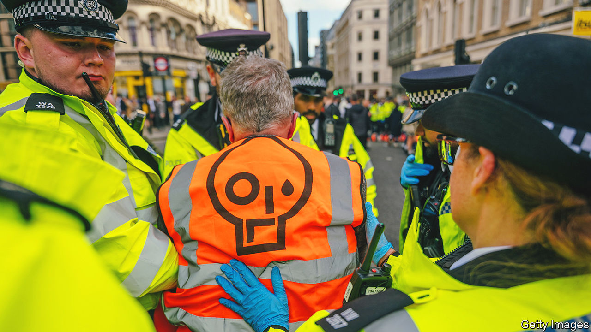

###### Out of order

# Britain’s Public Order Act goes too far 

##### The right to protest has long had limits. But a new law draws them too tightly 

 

> May 18th 2023 

Over the past year British environmental protesters have pulled off some spectacular—and spectacularly aggravating—feats. At the National Gallery they upended a can of tomato soup over van Gogh’s “Sunflowers” before gluing themselves to the wall. On the M25 they climbed the gantries, forcing the motorway to close for hours. They have tunnelled beneath railway lines and chained themselves to bridges, halting construction and traffic. 

On May 2nd, in an attempt to curb this sort of behaviour, the government implemented the Public Order Act, which makes it a criminal offence to obstruct major transport works and interfere with “key national infrastructure”. It also makes it an offence to “lock on” to “another person, to an object or to land” in a way that could cause “serious disruption” to two or more individuals or an organisation. More significantly, it criminalises the mere act of carrying locking-on equipment “with the intention” to use it for this purpose.

Civil-rights groups describe the law, which also gives the police new powers to stop and search, as draconian. Volker Türk, the UN High Commissioner for Human Rights, said it imposed “serious and undue restrictions” on freedom of expression. Both it and another law passed in April 2022, that gave police powers to restrict public assemblies, have fuelled fears about the erosion of civil liberties in Britain. Planned legislation—from a minimum-service-level law, that would curtail the ability to strike, to an , which could limit freedom of expression—show that the government is “inherently censorious”, says Mark Johnson of Big Brother Watch, a civil-liberties group. 

The first (recorded) use of the Public Order Act was seized upon by critics. On the morning of May 6th, the day of , the Metropolitan Police used the law to arrest six members of Republic, an anti-monarchy group. It judged, it said, that “items” found among the group’s “Not my King” placards, might have been intended for some sort of locking-on offence. It released the protesters without charge 16 hours later.

It is not uncommon for the police to make arrests that are not followed by charges. They may be more likely to do so at large public gatherings. Policing protests is tough and doing so at big, globally televised events especially so. Had the Met allowed protesters to block the king’s procession route, say, it would have been savaged. Sir Mark Rowley, the Met’s commissioner, has said intelligence led it to fear widespread disruption was planned. 

And although the right to protest is a fundamental part of a liberal democracy, the law has long placed limits upon it. The Human Rights Act 1998 both upholds that right and talks about “lawful restrictions” necessary to protect “national security or public safety”, “the rights and freedoms of others” and to prevent “disorder or crime”. On the day of the coronation dozens of people were also arrested for breaking older laws, including the Public Order Act 1986, which stops people causing “harassment, alarm and distress”, and for breaching the peace (the 1936 version). 

Yet the new Public Order Act goes too far. By giving police power to arrest people for carrying locking-on equipment, which could cover anything from bike locks to glue, it risks criminalising peaceful protest to a degree that many lawyers say is unacceptable. “Everyday items could potentially be relied upon by police as a reason to arrest,” says Kirsty Brimelow, a barrister and chair of the Criminal Bar Association. The vague yet broad wording of this part of the Public Order Act exacerbates the risk, she says. “Laws need to be clear.”

Further indicators of the Home Office’s authoritarian tendencies have emerged in the days following the coronation. On May 11th the House of Lords said that the government department had tried to reintroduce as secondary legislation (a process which allows the government to modify laws with less scrutiny) parts of the Public Order Act that Parliament’s upper chamber had rejected in February. 

These elements include reducing the threshold for “serious” disruption, thus allowing the police to intervene in more circumstances. Lord Thomas of Cwmgiedd, a previous lord chief justice, said that this appeared to be the first time a government had tried to change the law through secondary legislation “even though those same changes had been rejected by Parliament when introduced a short while before in primary legislation”.

None of this may matter much to most voters. A YouGov poll published on May 11th found that only three in ten Britons thought the police were too harsh on the day of the coronation. That may help explain why Sir Keir Starmer, the Labour leader, has said he won’t repeal the Public Order Act. Sir Keir, anxious to sidestep Tory claims he is soft on crime, has said the law needs time to “settle in”. 

Richard Ekins, a law professor at Oxford and head of the judicial power project at Policy Exchange, a centre-right think-tank, says the law’s inclusion of a “reasonable excuse” defence means it will often be “difficult for police to know whether an arrest will be lawful and, especially, whether a prosecution is likely to succeed”. Far from being authoritarian, he argues, the law is a “feeble” attempt at reform.

A law does not need to put people in prison to cause damage, however. This one risks further eroding trust in the police. Following a serious of dreadful , Sir Mark has said he wants to restore “policing by consent”. Increasing the police’s powers with a badly written law seems unlikely to achieve that.

More worrying, perhaps, the law seems likely to deter some people from protesting at all. Some activists, who reckon that getting arrested, ideally on film, is part of the point, may step up their actions. Others, fearful that joining a march or waving placards may leave them with a criminal record, may decide to stay at home. ■


