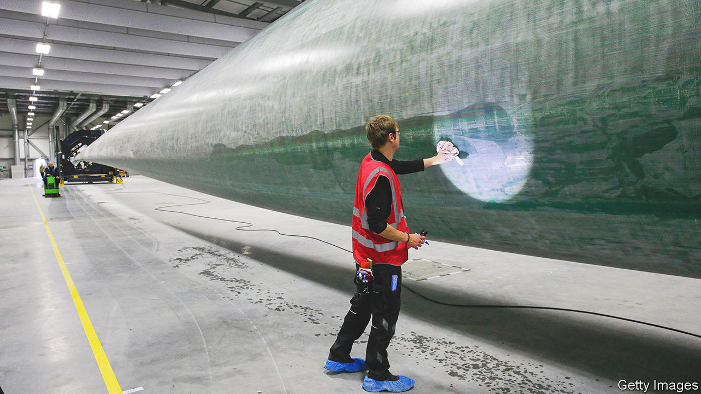

###### Green with envy

# The Inflation Reduction Act is turning heads among British businesses 

##### Cash is only one part of the answer 

 

> May 16th 2023 

The phone hasn’t stopped ringing for Asher Bennett, the founder of Tevva, a manufacturer of hydrogen- and battery-powered trucks near Tilbury, a run-down port town in Essex. For months he has been fielding calls from officials across America competing to lure clean-energy businesses across the Atlantic. Armed with hundreds of billions in subsidies and tax breaks courtesy of Joe Biden’s Inflation Reduction Act (IRA), many states are wooing entrepreneurs over lunches or arranging visits to potential sites. By next year, Mr Bennett hopes to start production of Tevva’s zero-emission trucks in America as well. 

He is not alone. Manufacturers of everything from electric-car batteries to wind turbines are lining up for cash handouts available under the IRA. Goodies are also , where countries are using the bloc’s loosened state-aid rules to lure investment in green tech. For each truck it builds, Tevva says it could receive up to £90,000 ($113,000) more in subsidies in Germany than in Britain. Andy Palmer, the chairman of InoBat, a Slovakian battery firm, says it is deciding between Britain and Spain for its next plant. Europe’s counter to Mr Biden’s green push makes it harder to justify a move to Britain, he adds. 

This subsidy war is putting a strain on several cornerstones of Britain’s green economy. Energy is one. Ørsted, a Danish energy company hoping to build the world’s largest wind farm off Britain’s coast, says it might place some plans on hold without more government support. Johnson Matthey, an industrial group which manufactures hydrogen fuel-cell components, has said it may shift more investment to America. Drax, a power company which is planning to build the world’s biggest carbon-capture power station in Yorkshire, has been issuing warnings that the project is at risk because of incentives on offer across the Atlantic.

 


Britain’s  is another pressure-point. Britain is home to just one large battery plant, or gigafactory, a facility in Sunderland run by China’s Envision. There are more than 100 planned gigafactories in China and around 40 either already running or in the works in Europe. In America, which is offering subsidies worth up to half of a battery plant’s operating expenses, investment into electric-vehicle and battery plants surged to more than $73bn in 2022 alone, up from $6.2bn in 2019 (see chart). Tata Motors, the owner of Jaguar Land Rover (JLR), a luxury carmaker, is demanding more than £500m of government support for a new battery factory in Britain. AMTE Power, one of Britain’s few surviving battery-makers, is considering shifting manufacturing to America. 

 is also under strain. The government has offered Tata Steel, an Indian producer behind Britain’s biggest steelworks at Port Talbot in Wales, and British Steel, another industry giant, about £300m each to shift to cleaner technologies. But Tata Steel estimates it needs up to £3bn; it says the absence of government funding could force it to shut its plant. Nearly eight out of ten bosses believe that Britain should do more to subsidise green industries, according to a poll of executives by the Institute of Directors, a lobby group. 

So far, Britain’s response has been muted. The country’s experience of nationalisations and industrial subsidies has not been a happy one; the government says it wants to steer clear of protectionism. It is being dragged into the arms race anyway, according to Raoul Ruparel of Boston Consulting Group, a consultancy. “The landscape has shifted,” he says. 

If Britain is forced to spray more cash around, it will have to do so in a targeted way: it cannot compete with the deep pockets of the world’s largest economic powers. That means it will have to rely on non-financial attractions, too. According to a poll by MakeUK, a trade group, seven in ten manufacturers are in favour of an industrial strategy that focuses on skills; over half want the government to focus on boosting research and development. 

There are other, simpler fixes. More continuity in Whitehall would help. The department in charge of industrial policy has been reorganised five times in the past 15 years. In that time, more than a dozen different secretaries of state responsible for business and industrial strategy have taken the mantle. 

Regulatory clarity is another way to encourage investment. Mr Ruparel reckons extra detail on policies such as a proposed ban on the sale of internal-combustion-engine cars by 2030 would jump-start private-sector activity. There are too many unanswered questions—about the timings, about which charging technologies will be the gold standard for electric vehicles and who will pay for the infrastructure. The upheavals of Brexit add to uncertainty: Stellantis, a carmaker, this week warned that it would close its Ellesmere Port plant unless tougher rules-of-origin requirements in the EU withdrawal deal are delayed.

Removing permit bottlenecks is another good idea. It takes far longer to approve a wind farm than to build it. Fast-tracking renewable-energy projects, or automatically approving permit applications if planning authorities take too long to reach a decision, could drastically speed up projects, according to the Energy Transition Commission, a think-tank.

Even then, the incentive of hard cash is pretty hard to beat. Tevva’s 7.5-tonne electric lorry is eligible for the British government’s plug-in truck grant, which removes up to £16,000 from the vehicle’s purchase price. But under Mr Biden’s green bonanza, heavy-duty trucks like Tevva’s qualify for tax credits of up to $40,000 (£31,928) per vehicle if they are made locally. The IRA is a game-changer, says Mr Bennett. “It means that [America] is going to be the world leader in these technologies.” ■


