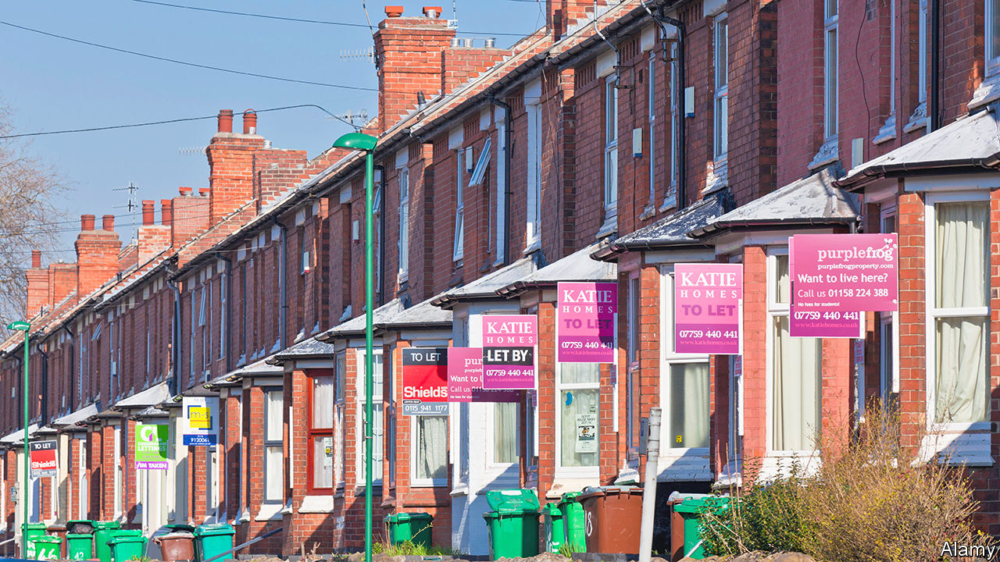
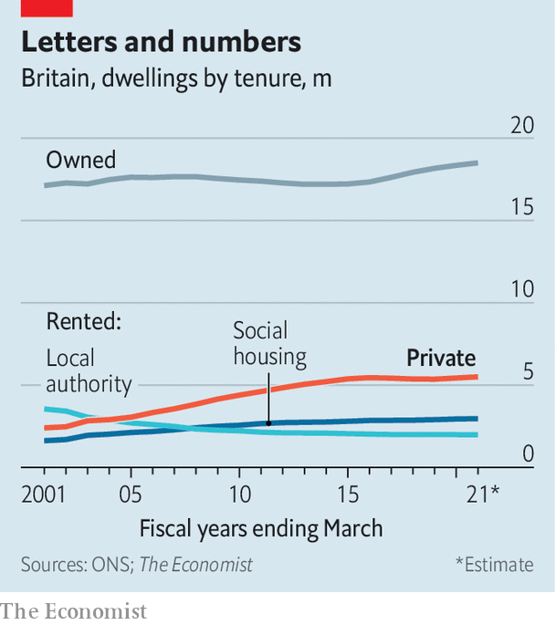

###### Fault lines

# The missing ingredient in Britain’s new law on tenants’ rights 

##### Inadequate enforcement bedevils housing law 

 

> May 18th 2023 

On May 17th the government introduced to Parliament its Renters’ (Reform) Bill, a law designed to clarify the rights of Britain’s rising number of tenants (see chart). Among other things, the bill creates an ombudsman to resolve disputes between landlords and renters, and makes good on a Tory manifesto promise from 2019—to ban “no fault” evictions that allow owners to turf tenants out at short notice without a reason. 

 


Critics fret that it amounts to a “war on landlords”, potentially reducing the supply of rental properties. Proponents argue that it will give good tenants more rights while making evictions of anti-social ones easier for owners. But debates over the drafting overlook another problem. Swathes of existing housing law are poorly enforced. This may end up being another example.

Evictions can still be illegal today—when tenants are kicked out without a court order, for example. But conviction rates are extremely low. Charities recorded cases of 7,778 illegal evictions in 2021; in the 12 months up to June 2021, there were just 17 convictions.

It is no secret how things ended up this way. Tenancy Relations Officers (TROs) are council officials whose responsibilities include taking criminal landlords to court. When councils were cutting their cloth to cope with reduced central-government funding between 2010 and 2020, TROs were some of the first positions to go. In London as many as half of the city’s boroughs don’t employ any TROs at all. Across 2019 and 2020 the government provided councils with an average of just £37,222 ($46,545) in special funding to cover the cost of housing-law enforcement. One council team in Sheffield was responsible for bringing about a third of all convictions in England and Wales in 2018-19.

Even when there are staff, cases are hard to pursue. A lack of transparency in the sector—including the prevalence of “rent-to-rent” set-ups, where a chain of landlords exists between the tenant and the actual property owner—means that just identifying a landlord can be a struggle. One recent parliamentary report warned that backlogs mean that courts are “already struggling to process housing cases quickly enough”. And the penalties faced by offenders are minimal—often less than for pirating copyrighted music, according to Roz Spencer of Safer Renting, a housing charity.

Inadequate enforcement is a problem in other areas of housing. Over 2m British homes suffer from disrepair so bad it poses a risk to health; the costs to the National Health Service from the poor state of privately rented housing are estimated by the BRE Trust, a charity, at £290m a year. Although proposals like Awaab’s Law (named for a toddler whose death in 2020 was caused by mould and damp in his home) will require social-housing landlords to fix health hazards within a specific time frame, it is unclear whether more funding will be available to police it. Passing laws sends a signal, which will deter some landlords from misbehaving. But without proper enforcement, that signal is badly muted.■


