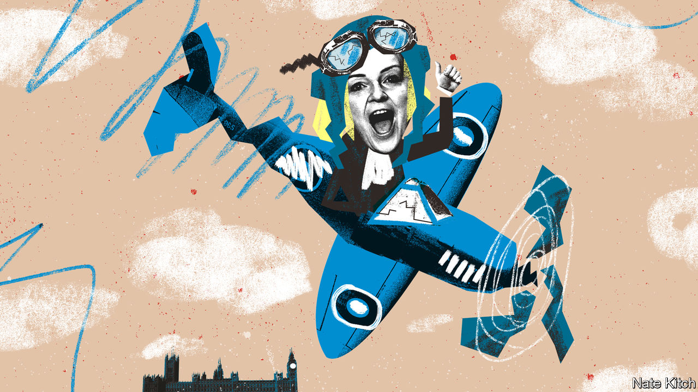

###### Bagehot

# Truss Tour: 2023 

##### The Conservatives, and Britain, would rather forget about Liz Truss. She won’t let them 

 

> May 17th 2023 

Every former prime minister receives protection for the rest of their life. When Sir John Major (prime minister, 1990-1997) heads for fish and chips in Cromer he is accompanied by two bored men in Barbour jackets, who have to check in case someone malevolent lurks in Norfolk. Theresa May (prime minister, 2016-2019) is accompanied by a small phalanx as she marches through Parliament or hosts a constituency surgery in leafy Maidenhead. 

 (prime minister, September 6th to October 25th 2022) is afforded the same privilege, although her bodyguards are being kept altogether busier. Ms Truss is on tour. From Copenhagen to Taipei, the former prime minister has embarked on a trip round the globe to chide the enemies of freedom and to call on Western leaders to stand up to China. She does so with the glee of someone writing cheques that others have to cash. 

Being a former prime minister comes with perks beyond having two trained killers trail your steps. Invites flood in. A former G7 leader is a former G7 leader, after all. At the Copenhagen Democracy Summit on May 15th, Ms Truss called for Western countries to form an “economic NATO” to face up to China. Two days later she rocked up in Taiwan, where she was a guest of the government, to warn that the West was already in a “cold war” with China.

Given her record, it may seem surprising that people listen to her. But such forums are scrupulously polite. Ms Truss may be the least successful prime minister in British history but few of the assembled lanyard-ocrats in Denmark mention it. Her biography in the agenda for the event in Copenhagen was mercifully brief on the  that caused her speedy downfall last autumn: “Regrettably these reforms did not command sufficient political and economic support.” The tone is similar to that of the Japanese emperor who declared that “the war situation has developed not necessarily to Japan’s advantage” after America dropped two nuclear bombs on the country. 

It helps that foreign-policy hawks are evangelists, with anyone who expresses the faith being welcome. Anders Fogh Rasmussen, the former NATO general secretary who invited her to Copenhagen, said that her record as a sabre-rattling foreign secretary justified her presence. Ms Truss, however, was also having fun. “I’m enjoying freedom at the moment, being able to do things I wasn’t able to do when I was in government,” said Ms Truss. “I would have loved to visit Taiwan; I wasn’t able to because of our policy.” She is experiencing the politician’s equivalent of the Make-A-Wish foundation. Much as the terminally ill are granted an audience with The Rock or allowed to score a goal at Wembley, Ms Truss can now fly to Taiwan and tell Xi Jinping to shove it. 

Ms Truss may be having a whale of a time, but others should be perturbed. She is emblematic of deeper problems. For starters, her complaints about having no control in government is a common one among Tory ministers. An epidemic of learned helplessness dogs the cabinet. Rather than solve problems or change policies, Conservative ministers moan. Ms Truss complained about having little say on foreign policy even while technically in charge of it. Michael Gove, the minister responsible for housing, bemoans the fact that there is too little housing. Suella Braverman, the home secretary, froths that as many as 1m people migrated to Britain last year, without mentioning that she is responsible for immigration policy. Ms Truss was the apogee of politics without policy—an approach still too common in the party. 

Nor is Ms Truss a maverick, who can be easily dismissed. Ms Truss is a problem for the Conservative Party not because she is the exception but because she is the rule. It is her vision of low taxes at all costs that still enthralls a certain wing of the party. Her hawkishness may cause those in government to wince but make those on the backbenches cheer. She was the party’s first choice for prime minister last summer, before the financial markets intervened. Ms Truss may be gone, but her ideas do still live on. 

That is not just a problem for the Conservatives but for the country at large. For the Foreign Office, Ms Truss is a private citizen. Anyone is free to fly to Taiwan and say what they like. But few do so with armed bodyguards paid for by the British state. Ms Truss is the first former prime minister to have visited Taiwan since Margaret Thatcher in the 1990s (and Thatcher had a far more doveish approach). She is a dangerous Rorschach test: one Chinese viewer may see an irrelevant politician, another may see a stateswoman speaking on behalf of a nation. One is harmless; the other potentially very harmful indeed. 

A minibus of back-seat drivers

Britain is represented by its former leaders—for good or ill, whether they served in Downing Street for years or just a month. After recent political ructions, there is now a glut of ex-prime ministers hovering over British public life, often with decades to live. Each provides a blueprint on how to handle it: some good, some bad. Sir Tony Blair only became truly unpopular once he had left office, thanks in part to high-profile and well-paid work with some unsavoury regimes. By contrast, Gordon Brown’s reputation has improved, largely because he has kept his head down apart from issuing the occasional worthy report on suitably sturdy topics such as constitutional reform. 

On the Conservative side of the house, Theresa May has played an admirable role on the backbenches, emerging like a submarine to try to torpedo bad ideas such as deporting asylum-seekers to Rwanda. Boris Johnson has chosen another route: he intervenes only if he thinks it will benefit his slim chances of returning to power. Ms Truss still has the opportunity to salvage something of her reputation. There is room for someone to advocate for a smaller state or the supply-side reforms that Britain needs. Even a more hawkish foreign policy has its place. But perhaps not in Taiwan. For the sake of her jet-lagged bodyguards, at the very least.■


