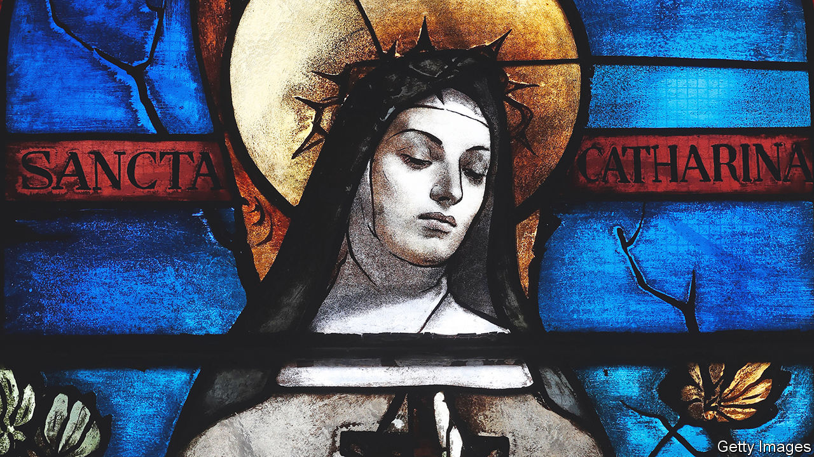

###### Spiritually testing

# Want to be a nun? You need to pass these tests 

##### The Catholic church is using psychometric tests to screen applicants 

 

> May 18th 2023 

Saint Catherine of Siena might have struggled with psychometric tests. The 14th-century saint and mystic had many virtues: she could pray for hours, fast for days and devoted herself to God for years. Some of the statements found on a typical psychometric form, such as “136. I cannot keep my mind on one thing”, would have held no fear for Saint Catherine.

But she might have had more difficulty with others. For she was also tormented by pornographic visions in which she saw “shameless crowds dancing”. She believed she had been married to Christ in a secret ceremony, and that she wore his invisible foreskin on her finger in lieu of a wedding ring. Having to respond to statements such as number 257 (“I have strange and peculiar thoughts”) might have tripped her up.

None of this mattered to Catherine’s career in the medieval era: she was canonised after her death and is  as a saint to this day. But it would have been more problematic in the modern one, because since 2005 the Catholic church in Britain has been using stringent psychometric tests to screen applicants to religious and to holy orders. Those who feel called by an invisible, intangible God to become a monk, nun or priest now have to commit not only to poverty, chastity and obedience but also to three days’ worth of psychiatric interviews and tests (among them, the double-edged “139. I often hear voices without knowing where they come from.”)

The church started such tests for many reasons. One obvious one was an attempt to screen out potential abusers—but the decision “was not only focused on ‘We have to rule out paedophiles’,” says Rev Dr Gerard Fieldhouse-Byrne, who runs the British testing centre, St Luke’s, in Manchester. The idea stemmed instead from a “broader” vision—to select people who could cope with the demands of a life of service and celibacy. “What we want are healthy priests.”

The Catholic church has long recognised that a life of celibate solitude and prayer can test even the sturdiest mental constitutions. Father Gerard enjoys his career but admits that “there are times…when I feel the loneliness”. Since the fourth century the church has produced monastic “Rules”—self-help guides governing every hour of a monk’s day and night with precision and, at times, great wisdom. Read such guides and they will tell you to intersperse the rigours of intellectual work with hearty exercise; to make sure to toady to the boss (“Let no one dare to dispute insolently with his abbot”); and to avoid boozing in the workplace since “wine makes even the wise to fall away”. 

Like all rules, they hint at their own inefficacy. Read them closely and you catch glimpses of behaviour that, after decades of solitude spent behind monastic walls, has started to stray from social norms. One unexpected but unarguable rule states that if anyone wishes to “defecate into a pot or a jar or any other vessel…they shall ask the Male Eldest”. 

There “can be a fine line” between extreme religiosity and psychopathology, says Thomas Plante, a professor of psychology at Santa Clara University in California who administers similar tests in America. William James, a pioneering Victorian psychologist, was one of the first to suggest that immortal visions might be affected by the psychology of the mortal mind that was experiencing them. James recorded the case of a man who, whenever he was high on laughing gas, believed he knew the secret of the universe, but forgot it when he sobered up. Finally, with great effort, he managed to write it down while still intoxicated, and once sober, rushed to see what he had written. There he read: “A smell of petroleum prevails throughout.”

Eccentricity is not unique to religion, says Father Timothy Radcliffe, a Dominican friar and fellow of Blackfriars Hall in Oxford. “Would you think any artist would be completely normal?” Instead of normality, he suggests joy as a measure of the religious life. Partly since those who enjoy it have “discovered the deepest happiness”. And also since if “you want to give yourself to this crazy life”, then “probably you’re not going to be completely normal”. ■


