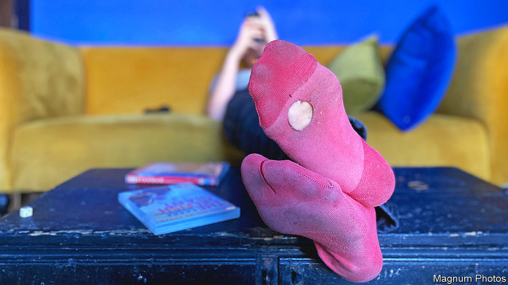
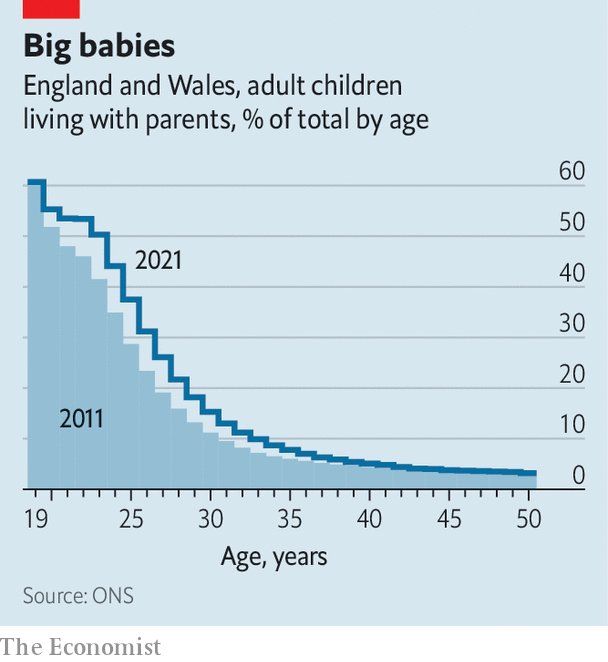

###### Home, still home

# Why are more British adults still living with their parents? 

##### It’s not just to get their laundry done 

 

> May 15th 2023 

TWENTY-THREE YEARS ago, a man in his 30s greeted the millennium “in despair. I’m a single parent, I live with my mother…I need a Life Plan.” Adrian Mole was fictitious: his bestselling comic diaries were a vessel for Sue Townsend’s anger at the inequalities and hypocrisies of late 20th- and early 21st-century Britain. But real Adrians are becoming more common.

 


The Office for National Statistics (ONS) says the census of England and Wales in March 2021 found 4.9m adult children living with their parents, up from 4.2m in the 2011 survey. Most people in their early 20s, and more than one in ten of those in their early 30s, have yet to fly the nest (see chart). And that does not even count the Adrians: the tally includes only childless, single adults. Multi-family households (containing couples or lone parents under a shared roof) made up 1.4% of all households in 2021, up from 1.2% in 2011.

Granted, in some other countries grown-up children are even more reluctant to move out: two-thirds of young  live at home. But why are young Britons staying longer than they used to?


There are many reasons why adults live with their parents: they are likelier to be unemployed, or to be students or carers, than those with places of their own. You might suppose that the covid-19 pandemic had caused more youngsters to stay or return home. Perhaps, but the ONS says that around 90% of adults living with their parents had done so for at least a year, the same as in 2011. Nor does ethnicity seem to explain the shift. The share of multi-generational Asian households, the highest among any ethnic group, fell. 

The likeliest explanation is that many young adults cannot afford to buy or rent their own homes. In the first 20 years of the century, according to ’s house-price index, British property prices almost doubled. According to Halifax, a lender, the average age of first-time buyers is now 32. Not surprisingly London, which has the priciest housing, also had the highest proportion of households with grown-up children: 26.8%. In the borough of Brent, in the north-west of the city, the share was almost one in three. 

The squeeze on housing costs and living space is tightest in poor households. Not only are rents high, says Molly Broome of the Resolution Foundation, a think-tank, but for many years the provision of social housing—for which many young people on low incomes would have been eligible in the past—has failed to keep pace with demand. Local Housing Allowance (a rent subsidy), which was increased at the start of the pandemic in 2020, has been frozen since then.

Lone parents were likelier than couples to have adult children at home. In London, more than half did. Homes with grown-up children are more likely to be classed as overcrowded—meaning, for example, that adults not in a couple, or more than two teenagers of the same sex, share a bedroom. In London almost one in four families with adult children was overcrowded, against one in 15 in north-east England.

Since the census was taken, double-digit inflation, and especially rising rents and mortgage rates, have added to young people’s incentive to stay in the parental home while they save. They may—or may not—find comfort in what became of Adrian Mole. Townsend’s diarist did eventually find a home of his own: a converted pigsty. His parents lived in another, next door. ■


