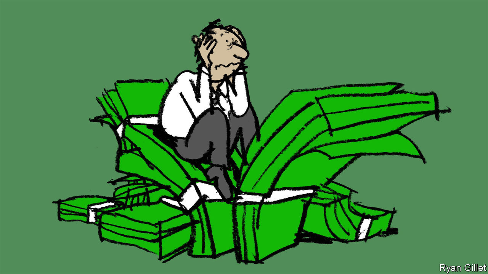
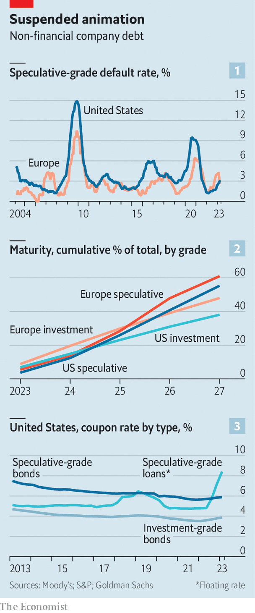
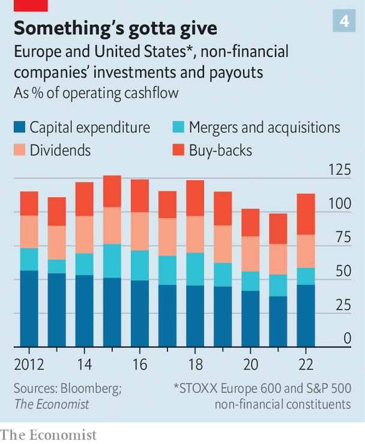

###### After the binge

# Businesses are in for a mighty debt hangover 

##### It will be painful both for investors and the economy 

 

> May 16th 2023 

It has been a jittery few months for the economies of the West. First came the nerve-rattling crisis in the banking sector. Then came the as-yet-unresolved prospect of a  on its supposedly risk-free debt. Many now fret over what other hidden dangers lie in wait.

An understandable area of concern is the hefty debts racked up by non-financial companies in recent decades, courtesy of historically low interest rates. Since 2000 non-financial corporate debt across America and Europe has grown from $12.7trn to $38.1trn, rising from 68% to 90% of their combined GDP. The good news is that hardy profits and fixed-rate debts mean the prospect of a corporate-debt-fuelled cataclysm in the West remains, for now, mercifully slim. The bad news is that businesses will soon find themselves waking up to a painful  that will constrain their choices in the years ahead.

 


The West’s corporate-debt pile has so far proven less wobbly than many feared. On both sides of the Atlantic roughly one-third of debt covered by credit-rating agencies is deemed to be speculative grade, less charitably known as junk, with iffy prospects of repayment. The default rate for those debts remains at a comfortable 3% in both America and Europe (see chart 1). A pandemic-era spike in downgrades from the more reassuring investment grade down to speculative has also since been largely reversed.

The explanation for the resilience is two-fold. First is better-than-expected corporate profits. According to ’s calculations, earnings before interest, tax, depreciation and amortisation of listed non-financial firms in America and Europe were 32% higher in the final quarter of 2022 than in the same period in 2019. Some of that is thanks to bumper profits in the energy industry, but not all. Companies from McDonald’s, a fast-food chain, to Ford, a carmaker, handily outperformed analysts’ expectations on earnings in the first quarter of this year. Procter &amp; Gamble, a consumer-goods giant, and others have successfully protected profits in the face of cost inflation by jacking up prices and cutting expenditure. That has left plenty of money to continue paying interest bills.

The second factor is the structure of corporate debt. In the years after the financial crisis of 2007-09, many firms began opting for long-term fixed-rate debts, notes Savita Subramanian of Bank of America. Today three-quarters of non-financial corporate debt in America and Europe is on fixed rates, according to S&amp;p Global, a rating agency. 

Rock-bottom interest rates at the height of the pandemic created an opportunity to lock in cheap debt for many years. Only a quarter of the combined debt pile of American and European companies will mature in the next three years (see chart 2). The average coupon rate that issuers actually pay on American investment-grade corporate bonds is currently 3.9%, well below the yield of 5.3% that the market is pricing in at the moment. For high-yield speculative bonds, the average coupon rate is a manageable 5.9%, compared with a market yield of 8.4%.

Comforting stuff. Yet businesses and their investors would be wise not to take too much solace. GDP growth in America and Europe continues to slow. Analyst estimates suggest that aggregate quarterly earnings declined in the first quarter of this year for listed non-financial firms in both America and Europe. The Federal Reserve and its European counterparts are still raising interest rates. In March Multi-Color Corporation, an American label-maker, issued $300m of bonds at a hefty 9.5% coupon rate. Firms like Carnival, a cruise-operator, are drawing on cash buffers built up during the pandemic to delay refinancing at higher rates. Such nest-eggs are steadily dwindling.

The morning after

The strain will begin at the flakiest end of the debt spectrum. Less than half of speculative-grade debt in America and Europe is on fixed rates, according to S&amp;P Global, compared with five-sixths for investment-grade debt. Goldman Sachs, a bank, reckons that the average coupon rate on speculative-grade floating-rate loans in America has already soared to 8.4%, up from 4.8% a year ago (see chart 3). 

Floating-rate debt is common among the most indebted firms, and particularly in businesses backed by debt-hungry private equity (PE). Although some PE funds hedge against higher interest rates, the squeeze is already beginning. Bankruptcies of PE-owned businesses in America are on track to double from last year, according to S&amp;p Global. On May 14th Envision Healthcare, a provider of doctors to hospitals, declared bankruptcy. KKR, a PE giant, paid $10bn for the business in 2018, including debt. It is expected to lose its $3.5bn equity investment.

That will make for an uncomfortable ride for the pension funds, insurers and charitable endowments that have entrusted money to the PE barons—not to mention for the financiers themselves. Fortunately, for the economy more broadly the effect seems likely to be contained. PE-backed businesses employed around 12m workers last year in America, according to EY, a professional-services firm. Listed companies employed 41m.

 


Indeed, it is the effect of rising interest rates on large listed corporations, whose debts are mostly investment-grade, that may be the most consequential both for investors and the economy. The S&amp;P 500 index of large American firms accounts for 70% of employment, 76% of capital investment and 83% of market capitalisation of all listed companies in the country. The equivalent STOXX 600 index in Europe carries similar weight in its region.

In the years leading up to the pandemic the non-financial companies in these indices consistently splashed more cash on capital investments and shareholder payouts than they generated from their operations, with the gap plugged by debt (see chart 4). But if they wish to avoid a sustained drag on profitability from higher interest rates, they will soon need to start paying down those obligations. At current debt levels, every percentage-point rise in interest rates will wipe out roughly 4% of the combined earnings of these firms, according to our estimates. 

Many businesses will have no choice but to cut back on dividends and on share buy-backs, which will squeeze investor returns. This is bound to prove especially painful in the spiritual heartland of shareholder capitalism. High payout rates in America—equivalent to 63% of operating cashflow, compared with 41% in Europe—have helped push American share prices relative to earnings well above those in most other markets. Borrowing money in order to fork it out to shareholders suddenly makes far less sense in a world of higher interest rates, argues Lotfi Karoui of Goldman Sachs.

Plenty of companies will also find themselves forced to scale back their investment ambitions. Semiconductor firms swimming in overcapacity have already cut back on spending plans. Disney, a media titan with hefty debts, is cutting investments in its streaming services and theme parks. From  to automation and artificial intelligence, businesses face an expensive to-do list in the decade ahead. They may find their grand ambitions in such areas derailed by the indulgences of yesteryear. That would be bad news for more than just their investors. ■


