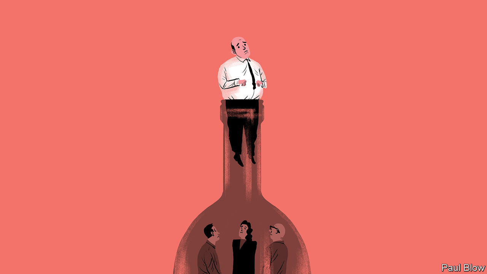

###### Bartleby

# Businesses’ bottleneck bane 

##### “The Goal” is a 40-year-old book with a topical message 

 

> May 18th 2023 

“The Goal” is a notable business book for two reasons. The first is its unusual genre. First published in 1984, it is a management tome dressed up in the clothes of a thriller. The book, written by Eliyahu Goldratt and Jeff Cox, tells the story of Alex Rogo, a plant manager who has to overhaul his factory within three months or face closure. 

To the objection that this is not thrilling at all, consider that it could have been a lot worse (“Alan Key must format a slide deck by midnight or he won’t get enough sleep to function properly the next day”). And Rogo’s efforts to reduce excess inventory and win over Bill Peach, his hard-driving boss, are weirdly entertaining. In any case readers lapped it up. “The Goal” sold millions. It has been reprinted several times. It even got turned into a graphic novel.

Its second contribution was to popularise thinking about bottlenecks. The novel was written to get across Goldratt’s “theory of constraints”, a method for identifying those resources whose capacity does not match the demands placed on them. (This definition comes from one of the book’s protagonists—Jonah, a brilliant, globe-trotting business adviser whose resemblance to a real person seems unlikely to be coincidental.) 

Bottlenecks are often thought of as physical constraints. In Rogo’s factory, for example, the bottlenecks are two particular machines whose through-put must be increased in order to ship orders faster. In recent years the pandemic has increased awareness of such bottlenecks in the wider supply chain, whether because of the impact of semiconductor shortages or the effect of backlogs at congested ports. 

Policies can be bottlenecks, too. The pandemic also forced vaccine manufacturers to ditch normal patterns of working. In “Vaxxers”, a book about their work to develop the Oxford-AstraZeneca covid-19 jab, Sarah Gilbert and Catherine Green describe how they did more “at risk” work, doing things in parallel that would usually have been done sequentially. That would have meant wasted work if they had hit a problem, but also that scientists got stuff done much faster than usual. Bill Peach would have approved. 

People are also bottlenecks. Within organisations, managers themselves are frequently the points at which things get bunged up. That might be because executives simply have too much to do. Estimates vary on how many direct reports a manager should ideally have. But if they don’t all fit in a lift, you almost certainly have too many. 

It might be their own fault—if they are micromanagers, say, offering up helpful opinions on everything from font sizes to office furniture. It might be because no one is comfortable making a decision for fear of being hauled over the coals later by their own boss. It might be because there is jockeying and confusion over who has the right to make a call (an “upward status disagreement”, if you like jargon; a “pissing contest”, if you don’t). 

Bottlenecks can stem from good behaviour as well as bad. Collaboration is normally celebrated, but it can easily result in more delays if people’s time is being soaked up on non-essential tasks. Similarly, the person who responds to every message quickly and clears their inbox every night looks like the very opposite of a bottleneck, but that depends on two things: on what work they are not doing while they manically check their email, and on whether those messages are about trivial things. If people are responding at great speed on matters of zero importance—especially if they are high up the ladder and colleagues are therefore likely to respond to them in turn—they are probably creating trouble of some sort. 

Whatever the causes of congestion, the costs can be material. Daniel Ek, the boss of Spotify, attributed a recent restructuring at the music-streaming company to the need to make faster decisions. Consultants at McKinsey have estimated that about 530,000 days of managers’ time each year may be wasted on broken decision-making processes at a typical Fortune 500 company. 

“The Goal” is not the greatest thriller ever. No one dies. The only real violence done is to the English language (“It’s not until I’m busy with my delicious veal parmesan that my thoughts start to crystallise”). But it is a lot more readable than most business books, and it makes you think about a subject that is relevant not only to supply-chain managers and operations managers but to bosses everywhere. Bottlenecks abound. They just need to be found. ■


