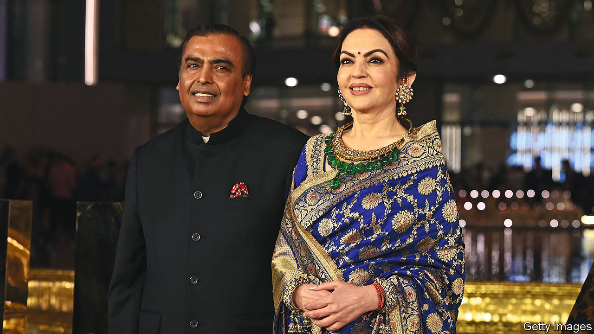
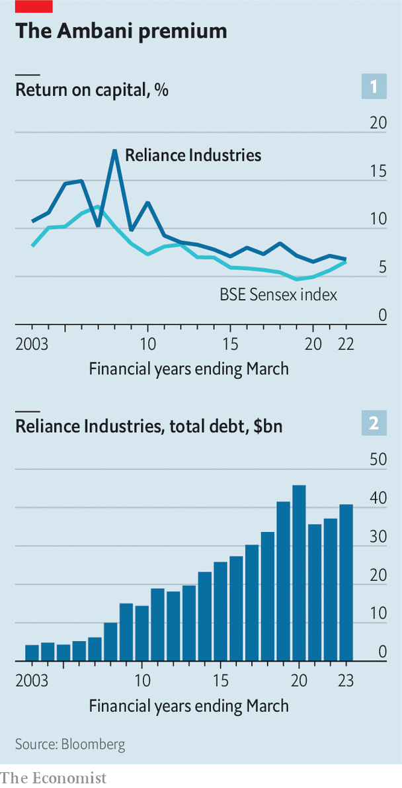

###### Not over Reliance

# Mukesh Ambani returns to the spotlight 

##### India’s richest man and his business empire are again the talk of India Inc 

 

> May 18th 2023 

It had all the hallmarks of a coming-out party—or, more accurately, a coming-out-again one. After being uncharacteristically absent from public view for a few years, Mukesh Ambani re-emerged at the end of March for the opening of the Nita Mukesh Ambani Cultural Centre in Mumbai’s new business district. It houses three theatres, a conference hall for trade shows, as well as a small museum. Plans are afoot to build an adjoining apartment complex and shopping mall. The precise cost of the project is veiled in secrecy, though the figure of $1bn has been rumoured. A single lift, said to be the world’s largest, with a capacity of 100 people, is thought to have set the tycoon back $45m. 

The sprawling and opaque endeavour is an apt metaphor for Reliance Group, the business empire that has made Mr Ambani Asia’s richest man. The conglomerate reported record profits in the fiscal year to March, stealing the limelight from a rival tycoon, Gautam Adani, whose businesses are on the defensive after an attack in January by a short-seller. Last year its listed flagship, Reliance Industries, accounted for 21% of the collective revenue of the 30 Indian blue-chip firms in Mumbai’s Sensex index, and 13% of their net profits. With the beleaguered Mr Adani reining in investments, Mr Ambani remains a rare Indian industrialist who is keen to build. Reliance Industries’ capital spending grew from $10bn in fiscal 2021 to $14bn a year later. Last year it spent $18bn, equivalent to 45% of the Sensex total.

In the sectors where Reliance operates, it is dominant. Its Jio telephony unit went from nothing to 439m mobile customers, or 37% of India’s total, in seven years. It gained 1m users in February even as Vodafone, the erstwhile market leader, lost double that number. Reliance’s retailing arm has 18,000 stores, up from 12,000 two years ago, a digital marketplace and a logistics network. It sells everything from gadgets and groceries to garments (many coming straight from numerous fashion brands that Reliance has been acquiring). Its renewable-energy arm has grand ambitions in solar power, green hydrogen and other climate-friendly businesses. On May 2nd the group spun out Jio Financial Services, which could fast become a force in payments and consumer lending thanks to troves of data on Jio’s mobile customers. 

 


Then there is Reliance’s core business: petrochemicals. It is less sexy than the much-trumpeted new-economy ventures, but more lucrative. Last year the group’s refining operations produced 56% of its total revenues and 59% of earnings before interest and taxes. Reliance is believed to be the single biggest beneficiary from India’s abrupt transformation into a huge importer of sanction-hit Russian oil and a leading exporter of refined products. Mr Ambani’s business benefits from both ends of this equation, buying cut-price Russian crude and selling the refined stuff into global markets, where prices remain elevated. According to Jefferies, an investment bank, this adds up to $5 of gross margin to every barrel of Reliance’s refined oil. The company says that “As part of overall crude sourcing strategy, Reliance is always in the market to source arbitrage barrels.” 

Yet Reliance’s ambitions have a flipside. It makes relatively little money from its operations. Though its return on capital is higher than for the Sensex as a whole, it has not exceeded 10% since 2007 (see chart 1). Last year it was 5%. Year-on-year revenue growth slowed in each of the past three quarters. Debts are up (see chart 2), having dropped in 2021 after capital injections from foreign tech giants such as Alphabet and Meta, and sovereign-wealth funds, which all saw teaming up with a local titan as a way to partake in India’s rise. Net debt trebled in the last financial year, relative to the one before.

In the 12 months to March Reliance Industries’ market value fell by 18% in dollar terms, or $43bn. Among big Indian firms, only Mr Adani’s battered businesses and two IT giants caught up in the global tech crunch, Infosys and TCS, did worse. Reliance has since clawed back some of that. But it will take more than a snazzy cultural centre to impress investors. ■


