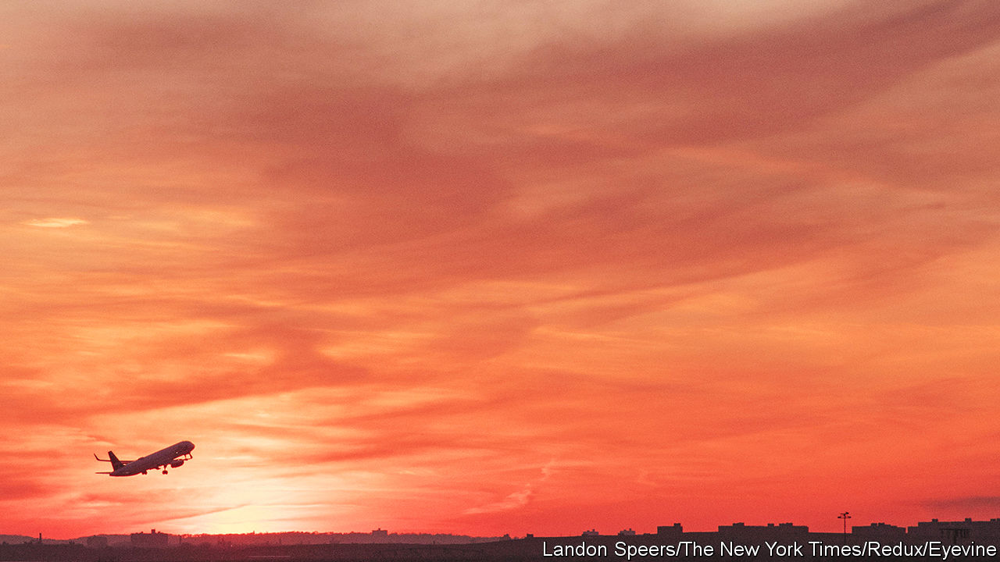
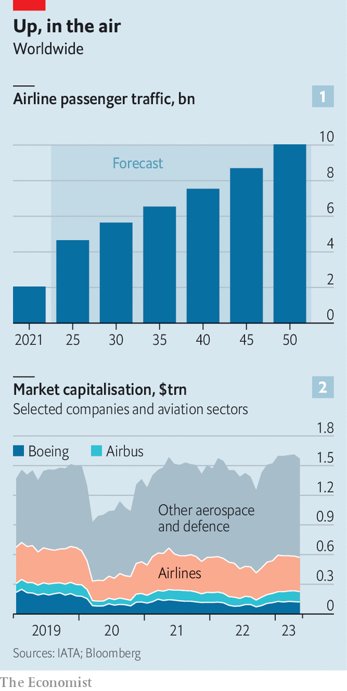
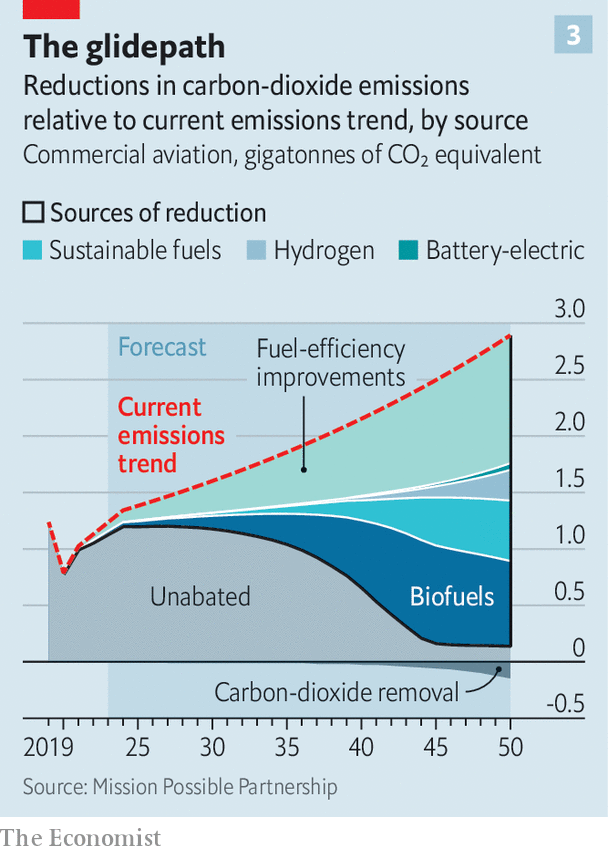

###### Green-sky thinking

# The aviation industry wants to be net zero—but not yet 

##### The technology and economics of planemaking make decarbonisation incredibly hard 

 

> May 14th 2023 

FLYING IS A dirty business. Airliners account for more than 2% of the annual global emissions from the burning of fossil fuels, many times commercial aviation’s contribution to world GDP. Two forces will push this figure up in the years to come. 

 


First, people love to fly. IATA, the airline industry’s trade body, predicts that 4bn passengers will take to the skies next year, as many as did in 2019, before covid-19 temporarily grounded the sector. Airlines could be hauling around 10bn passengers by mid-century (see chart 1). Boeing, an American planemaker, estimates that this will require the global fleet to roughly double from around 26,000 in 2019 to 47,000 by 2040. After a pandemic blip, investors are more bullish again about the sector’s prospects (see chart 2). Showing its confidence, on May 9th Ryanair, a giant of low-cost air travel, placed an order worth $40bn for 300 new Boeings.

Second, as other carbon-belching industries, from electricity generation and road transport to steel- and cement-making, go green, air travel is proving harder to decarbonise. If the aviation business is to reach  of net-zero emissions by 2050, tomorrow’s fleet will need to be much cleaner than today’s. Mission Possible, an industry consortium, reckons this could only be done by doubling historical fuel-efficiency gains, putting aircraft powered by novel technologies in the air by the mid-2030s and rapidly rolling out  (plus carbon-capture technology to offset residual emissions, see chart 3).

 


A recent report by SEO Amsterdam Economics and the Royal Netherlands Aerospace Centre, two think-tanks, puts the necessary investment between now and 2050 in Europe alone at some €820bn ($900bn) at 2018 prices, on top of the €1.1trn required for business as usual. Alas, the aviation industry’s current state-of-the-art technology and its economics make Mission Possible sound anything but.

When it comes to cutting emissions, aviation has a “wonderful history” compared with other sectors, says Steven Gillard, a director of sustainability at Boeing. He is not wrong. Carbon emissions per kilometre travelled by the average passenger fell by more than 80% over the past 50 years. Each new generation of aircraft generally consumes 15-20% less fuel than the previous one, largely thanks to improved engines. Boeing’s boss, Dave Calhoun, told investors last year he wants his next model to be “at least 20%, 25%, maybe 30% better” than aeroplanes it replaces. 

The trouble is that the technology that might help Mr Calhoun meet this goal is barely perceptible on the horizon. As the jet age nears its centenary, even the historic pace of improvement is becoming tougher to sustain. “Every leap in tech makes the next one harder,” says Andrew Charlton of Aviation Advocacy, a consultancy. And not just for Boeing and its , Airbus. Take engines. CFM, a joint venture between GE and Safran, two engine-makers, has over 1,000 engineers working on Rise, an open rotor-engine that does away with the cowling that covers the fan blades. Rolls-Royce and Pratt &amp; Whitney, two other big engine-makers, are also beavering away on their own ideas. But neither engine is likely to provide the efficiency gains that Boeing is after. 

Tweaking the airframes, such as the potential upgrade to Airbus’s A320 short-haul jets with composite wings that can carry larger, more efficient engines, may help—but only a bit. Work on more radical airframe redesigns is preliminary at best. Boeing and NASA, America’s space agency, are developing a narrower, lighter wing held in place with a strut extending from the bottom of the fuselage as in small propeller planes. 

If Mission Possible’s efficiency targets look distant, the prospects for new types of planes or fuel seem remote. A few startups, such as Electra.Aero and Heart Aerospace, are working on battery-powered prototypes. Heart already has orders from Air Canada and United Airlines for 30-seaters that could fly 200km on batteries alone, or double that with hybrid power using sustainable fuel. If all goes well, these could be in the air by 2028. Anders Forslund, Heart’s boss, reckons that by 2050 all routes up to 1,500km could be served by electric planes. But such trips account for only 20% of today’s airliner emissions. 

Another option is liquid hydrogen. In 2020 Airbus said it would start work on this technology, with the aim of having a short-haul commercial jet in the air by 2035. This seems unlikely. Hydrogen must be stored below -235°C and takes up more space than kerosene per unit of energy. Using it would thus require a thorough redesign of the aircraft—with heavy cooling systems and bigger fuel tanks that leave less room for passengers—and of airports, which are not equipped to deal with the gas. If hydrogen can be made to work, it would, like battery-powered flight, probably be limited to short-haul flying. Reducing the carbon footprint of long-haul flight requires something else. 

The most promising something on offer is sustainable fuel, which though not fully carbon-free emits 80% less greenhouse gas than kerosene. Such fuels are currently produced from old cooking fat, and occasionally blended in small quantities with the conventional stuff. Boeing has promised that all of its planes will be capable of running on 100% sustainable fuels by 2030. Many airlines and energy firms have announced joint schemes to boost production and bring down the cost, which currently stands at roughly twice that of kerosene. Output reached 300m litres in 2022, according to IATA, a three-fold increase on the year before.

That is still a drop in the bucket. For sustainable fuels to get the industry 65% of the way to net zero by 2050 would require 450bn litres a year by then, iata reckons. Obstacles to achieving such scale remain formidable. A big one is availability of feedstocks. Second-hand cooking oil is not mass-produced in sufficient quantities. Nor are household waste and by-products of forestry, two other potential sources. Converting food crops to fuel use would get you further. But this is politically thorny at a time when food prices are already rising fast. To avoid controversy, international sustainable-fuel standards currently prohibit using food crops as a feedstock altogether. Synthetic alternatives, made from carbon captured from industrial sources or directly from the air, are so far the preserve of a few pilot projects.

Overcoming the technological hurdles is made harder by the competitive dynamics of the planemaking duopoly. The covid crisis and the grounding of the 737 MAX, Boeing’s short-haul workhorse, for 20 months after fatal crashes in 2018 and 2019 have left the American firm with long-term debts of $47bn. It is already busy launching a bigger version of the MAX and certifying the 777X, a variant of its popular long-haul jet. If it does not launch an all-new plane until late this decade, that will be a gap of 25 years from its last big debut, of the 787 in 2005. Its engineers’ skills may atrophy. 

A new plane programme that might cost up to $30bn and take ten years from launch to commercialisation would not sit well with Boeing’s other aim: to resume returning money to shareholders by 2026. Airbus’s finances are healthier. But it, too, has little incentive to place a giant bet on an untested new technology with its American nemesis in no position to exert competitive pressure. As it is, the European company’s orders are already around 7,000 planes, roughly 50% more than Boeing’s. 

Flying is, then, unlikely to become radically climate-friendlier soon. Scott Deuschle of Credit Suisse, a bank, calls the industry’s net-zero target “low probability”. The only other option is for governments to get serious about the matter. 

Some are. The EU is phasing in a mandate for sustainable fuels, whose share in European airlines’ tanks will need to rise from 2% in 2025 to 70% by 2050. In 2026 the bloc will start phasing out free emissions allowances for carriers under its emissions-trading scheme. As part of its covid bail-out of Air France, the French government forbade the carrier from competing with trains on routes of less than two and a half hours. The Dutch authorities ordered a reduction by late 2023 in the number of flights at the state-owned Schiphol airport, the Netherlands’ biggest, by 8%, to 460,000 a year, mainly to cut noise pollution though carbon emissions were also a concern. The French ploy may work, though just how much good it will do is debatable. The Dutch one was foiled in April by a court, with the backing of several airlines. The aviation business wants climate virtue—but not yet. ■


