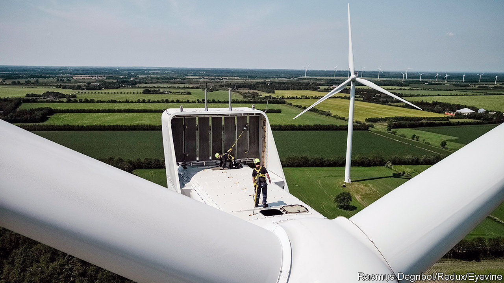
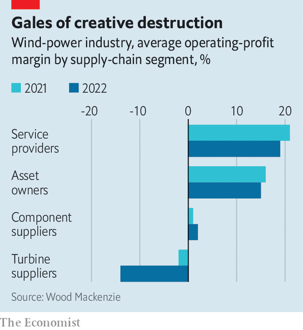

###### Awaiting a second wind

# The wind-turbine industry should be booming. Why isn’t it? 

##### Stiff competition has combined with rising costs and other burdens 

 

> May 18th 2023 

Given the political weather, Western makers of wind turbines should be flying high. America’s Inflation Reduction Act is stuffed with goodies for all sorts of renewable energy. In late April European leaders pledged to increase the North Sea’s offshore-wind capacity to 300 gigawatts by 2050, from about 100 gigawatts today and double a previous commitment. That looks like an awful lot of future business for turbine manufacturers. If only shorter-term forecasts were as clement.

The four biggest Western makers of wind turbines—GE Renewable Energy, Nordex, Siemens Gamesa and Vestas—supply about 90% of the market outside China. Together they made revenues of €42bn ($46bn) in 2022. But whereas wind-farm operators benefited handsomely from high electricity rates after Russia invaded Ukraine in February last year, the turbine-makers sank into the red and their suppliers barely made money (see chart). 

 


Last year the big four racked up combined net losses of nearly €5bn. In recent weeks GE Renewable Energy, Nordex and, on May 15th, Siemens Gamesa, reported more losses in the first three months of the year. Although Vestas, the biggest of the lot, eked out a slim net profit of €16m on sales of €2.8bn, its chief executive, Henrik Andersen, nevertheless conceded that conditions were still “challenging”.

The struggle of wind-turbine companies to make money is the result of market forces blowing in opposite directions. On the one hand, prices that turbines can fetch have been coming down. In the past few years Vestas and its competitors rushed to outdo each other by building ever-bigger turbines that offer ever-cheaper capacity to wind-farm developers, a group that includes big utilities and private infrastructure investors. On the other hand, those buyers’ appetite for new kit has been cooled somewhat by the difficulty of securing the permits necessary to install it. The average selling price per megawatt, the industry’s preferred measure, fell from nearly €1m in the mid-2010s to about €700,000 in 2020.

The time between signing a contract with wind-farm developers to actually erecting the turbines and getting paid is as much as three years on average for onshore projects and five for offshore ones, estimates Endri Lico of Wood Mackenzie, a consultancy. Because terms are mostly locked in during that time, that exposes turbine-makers to any market vagaries. Lately these have combined into a “perfect storm”, in the words of Mr Lico: supply-chain disruptions, lack of raw materials and components, inflation, higher interest rates and geopolitical tensions. 

The race to develop bigger turbines may come to haunt the industry for a longer period, says Thomas Cobet of AlixPartners, another consultancy. The largest machines are not yet a mature technology. They could also prove costly for turbine-makers to maintain. This, in turn, would hurt the margins of the manufacturers’ biggest moneymaker: service contracts in which operators pay them a predetermined fee for everything from spare parts to full operations programmes.

The industry would also love to avoid the fate that befell Europe’s solar-panel industry, which lost an early lead to cheaper state-subsidised Chinese rivals. China’s turbine-makers are growing quickly—and profitably. The world’s biggest such firm is now Goldwind, which installed 12.5 gigawatts of capacity in 2022, for the first time edging ahead of Vestas, while generating an annual net profit of around $340m. Although the Chinese firms mostly cater to their home market, in which Western companies are not allowed to compete, they are also eyeing foreign customers, notably in countries along China’s Belt and Road Initiative of infrastructure projects. 

Amid rising Sino-Western tensions, and a broader protectionist mood gripping Washington and European capitals alike, Chinese manufacturers are increasingly unwelcome in America and Europe. Europeans in particular, having been burned by a dependence on cheap Russian gas as war broke out on their doorstep, do not want to rely on cheap Chinese turbines, says Harriet Fox of Ember, one more consultancy. But if Vestas and other Western turbine companies are to do their part in the continent’s decarbonisation, they must first return to profitability. 

In today’s adverse market conditions, this may necessitate government action. In April the EU agreed to make permissions for new wind farms and related infrastructure easier to obtain, for instance by allowing the creation of “renewable acceleration areas”, where projects may be approved in one year or less. That is a start. Still, argues Phuc-Vinh Nguyen of the Jacques Delors Institute, a think-tank in Paris, the EU needs to do more to reduce the uncertainty for turbine-makers and wind-farm developers—something that the Inflation Reduction Act does much better than Europe’s current rules do. This does not necessarily mean more public money. Europe is actually held back by a lack of concrete timelines for investments and clear regulations. Without them, the forecast for Western turbine-makers will remain choppy. ■


