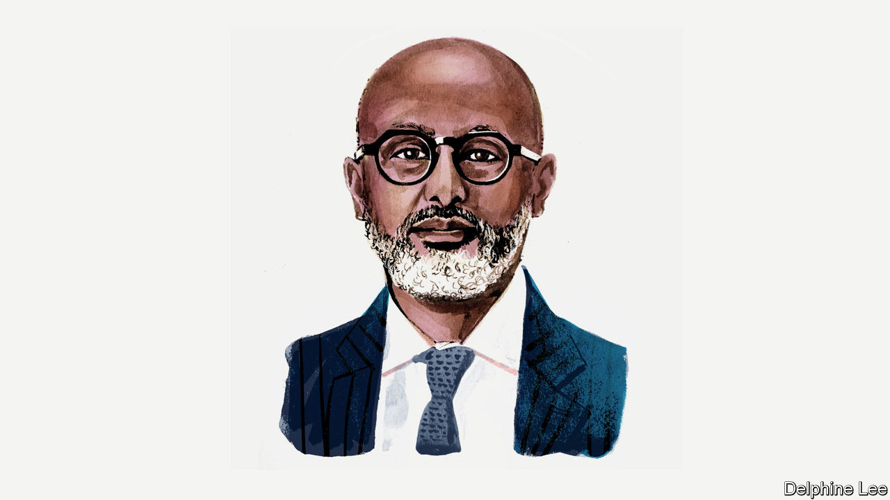

###### Sovereign debt

# Abebe Aemro Selassie on Africa’s brutal funding squeeze 

##### Increased support would be an investment in global resilience, says the IMF’s Africa head 

 

> May 18th 2023 

IN RECENT weeks, as I have been travelling around Africa meeting ministers and central-bank governors, I was reminded of the teacher who taught his students about inequality by laying a $100 bill at the end of a running track. He told them to take two steps forward if they had access to education, another two steps if their mobile phone would not run out of credit, you get the picture. Some students found themselves with just a few feet to sprint to the bill. Others remained near the start line through no fault of their own.

A slowing global economy and tighter financing conditions have exacerbated the already challenging situation facing most developing countries—the running track is now longer and access to financing much more difficult. Better-off economies can rely on their hefty foreign-exchange reserves and deeper capital markets. But most African countries are being left on the starting blocks, shut off from finance in what the IMF is calling “the big funding squeeze”—by far the most acute such situation in decades.

Since the onset of covid-19 and Russia’s invasion of Ukraine, the cost of borrowing for African countries has shot up. Exchange rates across the region have depreciated markedly against the dollar. This has sharply raised the cost of debt servicing and access to new finance, squeezing spending on health, education and infrastructure.

The proximate reasons for the current difficulties are two-fold. 

First, most countries have been doing a decent job of directing development spending to the right areas but have been less successful in collecting the returns on this investment through their tax systems. Starting around the early 2000s, countries in the region had more fiscal space, reflecting higher economic growth, robust commodity prices and debt relief from the “official” sector (multilaterals and governments). This facilitated much-needed investments in health, education and infrastructure, spurring development progress that is evident across Africa: not just superficial change like taller skylines, but fundamental progress that shifts generational opportunity—increased life expectancy, improved living standards and education. But with tax collection not having improved commensurately, debt-servicing costs relative to revenues were rising even before the recent shocks.

Second, this higher development spending was financed on much pricier terms. As aid flows declined over the years, the only alternative financing was borrowing from international capital markets and new sovereign creditors such as China. This not only raised the cost of debt but has also made the region more vulnerable to shifts in global sentiment.

Today, almost three-quarters of the debt of sub-Saharan African countries is commercial financing issued either domestically or as Eurobonds. A further six percent is owed to China. In normal times the added cost of servicing this mostly non-concessional borrowing might be manageable. But these are not normal times.

Here I would like to question the narrative that African countries’ main challenge is too much debt, notably to China. Yes, public debt is clearly unsustainable in several cases. In most countries, however, debt is elevated but still manageable. And while China is an important creditor to several countries, in most cases debt to China is modest.

Rather, the main worry is the current funding squeeze. If it persists, this will turn the liquidity problem many countries are facing into a solvency problem, even for those with otherwise manageable debt levels.

Three things can help. 

First, there is an urgent need for more countercyclical public financial support to offset procyclical private capital flows. The IMF is doing its part. Since the pandemic we have provided the region with more than $50bn to support essential spending and reforms. But the impact of this would be greater still if help from other development partners wasn’t waning. OECD countries, for instance, now provide a fraction of the budget support they did a decade ago, with the hole created being filled by more expensive borrowing. Moreover, the fund used by the IMF to provide concessional financing to most African countries urgently needs replenishing.

Second, richer countries need to step up their support. As one British mandarin put it to me recently, the “authorising environment” for this is difficult. But when countries closer to home have been hit by severe liquidity challenges in the past, the international community has provided extensive financing, even in the face of significant risks to economic recovery. That was certainly the case during the euro-zone debt crisis of the early 2010s. Much the same calculated risk-taking is needed for developing countries that are suffering liquidity problems caused by external factors and are vigorously addressing their domestic challenges, for instance with costly but necessary reforms. Without it, there is a risk that outcomes will be far worse—economically, socially and even geopolitically.

Third, countries with unsustainable debt need a faster and more efficient resolution process. The Common Framework—a multilateral mechanism for restructuring sovereign debt—is a crucial step forward, but is moving too slowly, with mounting costs for both debtors and, ultimately, creditors Such delays in debt restructurings are not uncommon—it always takes creditors time to internalise their losses. In the current context of heightened economic uncertainty and a more complex set of creditors, restructurings are taking longer still. That’s why the IMF is spearheading the Global Sovereign Debt Roundtable to aid discussion on how to speed up debt relief. By providing a forum where overarching concerns can be considered, this should expedite individual cases. Just this week our board approved a programme for Ghana after the Official Creditor Committee provided financing assurances.

Over the next decade the number of new workers in Africa will exceed that of the rest of the world combined; the continent’s young people could become the engine of the global economy. Unless we address the funding squeeze now, the investments in education and health needed to make these workers more productive won’t materialise. Resources are currently needed to deal with the more immediate challenges presented by spillovers from exogenous developments—the pandemic, fallout from Russia’s invasion of Ukraine and, increasingly, the effects of climate change. 

It would be extremely short-sighted of the international community not to help African countries reach their potential. I strongly believe that, one way or another, this will be the African Century. Demographic trends will ensure this. The more we help the region make development progress now, the more resilient the global economy will be. The pandemic showed how connected we are: no one is safe unless all are. And that’s why Africa’s funding challenges should concern us all and inspire us to help.■

_______________


