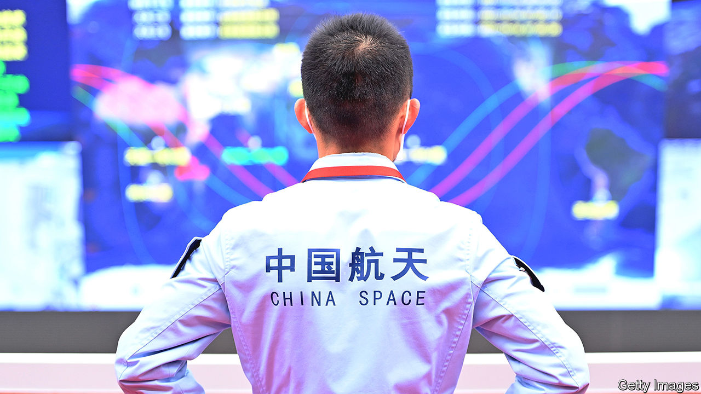

###### Don’t look up

# China is unusually secretive about its space programme 

##### What is it doing up there? 

 

> May 18th 2023 

Nine months after being secretly launched into orbit, an uncrewed Chinese spacecraft touched down at a spaceport in the Gobi desert on May 8th. Not much is known about the mission. A terse report from state media called it an “important breakthrough”.

The Chinese spacecraft may be similar to one developed by the US air force, called the X-37B, which has spent over 900 days in space in one stretch. Both were launched by rockets, but can land like a normal plane. Reusing spacecraft saves money. Such vessels can also help conduct scientific experiments or release satellites. While in orbit, China’s spacecraft discharged a small object.

The secrecy surrounding the mission is partly understandable. Many governments are coy about their space activities—especially ones with potential military purposes. America has limited the release of information surrounding the X-37B. But China is more secretive than most when it comes to space.

Take the country’s Tiangong space station, which has an ostensibly scientific purpose. Since its completion in October, China hasn’t been very forthcoming about its astronauts’ activities there. When two of them went for a spacewalk on March 30th, it was announced after the fact. No details were given. The International Space Station, by contrast, flags all spacewalks in advance, then live-streams them.

Given the prestige at stake, officials may be inclined to hide failures. In 2021 China landed a rover called Zhurong on Mars. In May of last year it went into a planned hibernation for the Martian winter, when there is less sunlight to power it. Zhurong should have woken up in December. It was not until April that Chinese scientists explained that a build-up of dust had stopped the sun’s rays from restarting the rover.

Sometimes China’s secrecy is more alarming. The modules that make up the Tiangong were brought into orbit by a series of rockets. Pieces of these rockets then fell back to Earth. While much of the debris burned up on re-entry, some hit the Earth’s surface. No one was hurt. But America’s space agency, NASA, complained that China did not share data about the falling material to help other countries assess the risks.

Part of the problem is that the People’s Liberation Army runs China’s spaceports and its crewed space missions. So it is difficult to distinguish between China’s civilian space activities and its military ones. (Space technologies themselves are often dual-use.) China’s rivals tend to assume the worst. In January the head of NASA, Bill Nelson, warned that China might start claiming lunar territory “under the guise of scientific research”. 

Around the same time, the European Space Agency said it would not be sending astronauts to the Tiangong, as previously planned. That is probably a result of tensions back on Earth. Has the notion of decoupling extended to space, too?■


