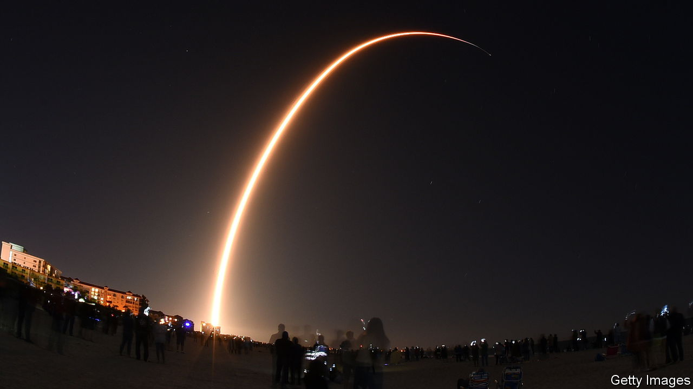

###### A new mandate in the heavens

# Why China fears Starlink 

##### And why it wants to build its own satellite constellation in low-Earth orbit 

 

> May 18th 2023 

Beware of Starlink, says the People’s Liberation Army (PLA). The mega-constellation of satellites, designed to provide off-grid high-bandwidth internet access, is run by SpaceX, a private American firm. But officials in Washington are surely taking advantage of it, warns the . When Starlink was made available to Ukraine last year, after Russia’s invasion of the country, the army’s newspaper called it an “accomplice” of the “hegemony-obsessed US”. Never mind that it was Ukraine that asked SpaceX for help.

Starlink has been vital to Ukraine’s war effort. The satellite links have allowed soldiers to communicate, identify targets and upload videos for the world to see. The system is hard to jam. From the perspective of China, this not only puts its friend Russia at a disadvantage, it also raises concerns about Taiwan, the self-governing island that China claims. If Taiwan were given access to Starlink, it would make a Chinese invasion that much more difficult. 

But China’s concerns go beyond that. It fears that America, through Starlink, is gobbling up territory in low-Earth orbit. China, too, wants to be a power in this domain. And it wants the capabilities offered by systems like Starlink. So it is working on a version of its own.

Cutting the cord

When it comes to Taiwan, analysts think China, were it to invade, might start by severing the 14 undersea internet cables that keep the island connected to the world. Taiwan is adding cables and planning how to defend their landing points. But it is also testing antennae in 700 locations, including some outside Taiwan. These would be able to send and receive signals by means of satellites in low orbit, like the ones Starlink uses. The goal is to make the antennae “as mobile as possible” to survive an attack, says Tzeng Yisuo of the Institute for National Defence and Security Research, a think-tank in Taiwan.

China has the capability to shoot down satellites. But Starlink is made up of over 4,000 of them and aims eventually to have tens of thousands. China might have more success leaning on SpaceX’s founder, Elon Musk, to deny Taiwan access to Starlink. Mr Musk’s other big firm, Tesla, has a large factory in Shanghai. Last year he suggested giving China some control over Taiwan in order to resolve their dispute. (SpaceX lists Taiwan as a place where Starlink is “coming soon”, but the firm has not applied to operate there on a commercial basis.)

Unsurprisingly, Taiwan is looking to reduce its dependence on others. Its space agency is developing its own low-orbit communication satellites. The first is expected to be launched in 2025. 

China’s low-orbit ambitions are much larger. In 2020 the government filed papers with the International Telecommunication Union, a UN body, for a 12,992-satellite constellation. A year later the government established China Satellite Networks Group Limited and tasked it with developing satellite internet. At least seven state-owned and private Chinese companies are building satellite factories, with the expectation that they will soon be able to produce several hundred small communications satellites per year. 

Officials in Beijing have developed a space-race mentality. Specific orbits and radio frequencies are “rare strategic resources” that Starlink wants to “monopolise”, warned the  in 2022. Last year Wu Yansheng, the chairman of China’s main space contractor, said his country needed to move faster in becoming a “space power”. In April the prime minister, Li Qiang, toured three startups in order to highlight the importance of their industries. One was Galaxy Space, a maker of satellites, six of which were launched into low orbit last year.

Much of the recent activity stems from the desire of Xi Jinping, China’s supreme leader, to modernise the PLA. His generals have long studied how America uses communications and information tools to move faster and see more clearly on the battlefield. Mr Xi wants to create a highly “informatised” force, one that is able to use information technology to conduct joint operations across the ground, air and sea—not to mention space and cyberspace.

The crowded sky

China will have plenty of neighbours in low orbit beyond SpaceX. The British government owns a stake in OneWeb, which is about to finish a constellation involving 650 satellites. Kuiper, a planned constellation bankrolled by Jeff Bezos, the founder of Amazon, is due to launch its first test satellites soon. The EU is planning its own system, as is Russia. For the world’s powers, satellite internet may come to be seen as a strategic capability, much like satellite navigation, necessitating some level of sovereign control.

SpaceX has an important advantage. Satellites in low orbit don’t last very long, so the company replaces them on a regular basis. That entails a large number of rocket launches (one is pictured here). SpaceX has the world’s best system for that, the partially reusable Falcon 9 rocket. Now it is working on a much larger, fully reusable spacecraft called Starship which could launch hundreds of satellites at a time. Some Chinese companies appear to be trying to build knock-offs. 

All of the activity worries China. The  complains that there is only room for 50,000 satellites in low-Earth orbit and that Starlink may eventually take up more than 80% of that space. But the calculation is not that straightforward, says Juliana Suess of the Royal United Services Institute, a think-tank in Britain. Imagine low orbit as a highway, she says. What needs to be calculated is how many moving cars that highway can safely accommodate. Much will depend on the size of satellites and their trajectories.

In 2021 two satellites from Starlink were on a collision course with a Chinese space station, forcing it to move. So says China, at least. America denies the allegation. It is possible that the two powers use different methods to calculate orbits, says Benjamin Silverstein of the Carnegie Endowment for International Peace, a think-tank in America. They might also have different views on what is too close for comfort. What is clear is that a lack of communication exacerbated the problem, as did a lack of norms surrounding traffic in low orbit. America and China used to talk about these things, but there have been no such meetings since 2017. That’s dangerous. As low orbit gets more crowded, the chance of a nasty collision is growing. ■


