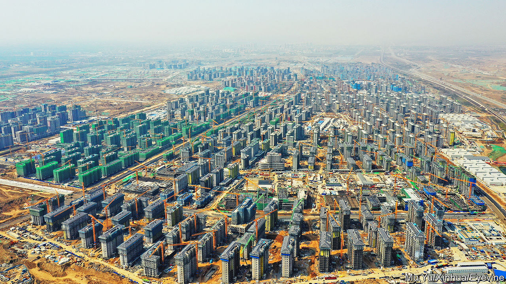
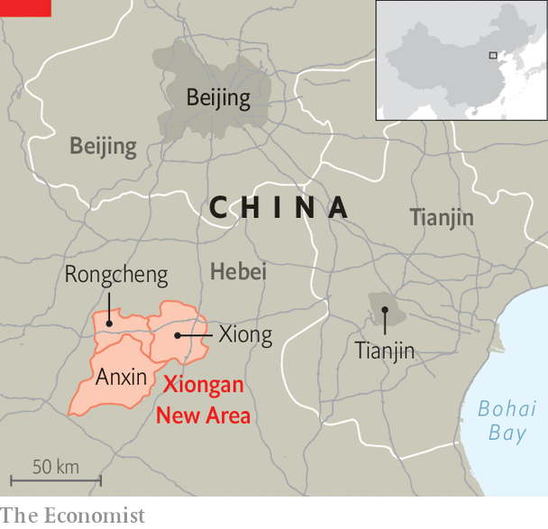

###### The city of Xi

# Xiongan is Xi Jinping’s pet project 

##### But it is taking a long time to build 

 

> May 18th 2023 

Six years ago, when China unveiled its grandiose plan to build a new metropolis 100km south of Beijing, it was hard to envisage the finished product. Ambitious planners promised a “first-class international city” covering 2,000 square kilometres, nearly three times the size of New York City. The “Xiongan New Area”, as it is called, would be a green, ultra-modern annexe to Beijing, easing pressure on the congested capital, where more than 21m people live. But at the time Xiongan was just a sprawling expanse of scrubby lowlands and shabby villages. 

 


When your correspondent visited recently, it was still quite difficult to discern the city’s future outlines. A handful of projects, including a gleaming high-speed rail station, are complete. The horizon is dotted with construction cranes working to finish other buildings. Proper highways now connect Xiongan to Beijing and Tianjin (see map). But good roads between the three counties that make up Xiongan—Anxin, Rongcheng and Xiong—have yet to be built. The place looks more like a construction site than a city on a par with Shenzhen, the built-from-scratch business hub to which it is often compared.

China’s supreme leader, Xi Jinping, appears a little defensive of his pet project. During a visit to Xiongan on May 10th he insisted that the plan to build it was “entirely correct” and praised the progress made so far as “miraculous”. He also called for officials “to firm up confidence and maintain resolve”. Mr Xi did his own part by dragging along three other members of the Politburo Standing Committee, China’s top leadership body. Reports in state media made it clear that he remained personally involved in the endeavour.

That will help counter a vague sense of flagging momentum. The project’s launch back in 2017 was covered extensively by state media. An official statement hailed the development as a “strategy crucial for the next millennium”. Speculators flocked to the area to buy up whatever property was available, leading to an emergency freeze on sales. More recently, though, Xiongan has drawn far less attention. The pandemic, of course, did not help. An official set of guidelines issued in 2021 described Xiongan as a provincial-level project, leading to speculation that it might even have been downgraded (it had not been).

There has been plenty of scepticism surrounding the plan. Official comparisons to Shenzhen and Pudong, Shanghai’s glittering financial district, make little sense, say critics. Those places were granted much freedom to create a market-oriented environment in order to attract foreign and domestic businesses. Mr Xi has said Xiongan should have similar aspirations. But he also sees it as part of his “common prosperity” agenda, which has spooked entrepreneurs and investors. Many of the entities being pushed to move from Beijing to Xiongan, such as “non-essential” government departments and state-owned enterprises, are not exactly sources of dynamism. 

A number of institutions have resisted moving. At a top university in Beijing, a professor recounts the efforts undertaken by different departments to remain in the capital. But during his visit to Xiongan, Mr Xi signalled that he wants the relocation process to speed up. He talked vaguely of improving incentives. (Promises of a 30-minute train journey between Xiongan and Beijing seem to have little effect.) New inducements could include tax breaks, bonuses or guarantees of educational opportunities for the children of people who move from Beijing or Tianjin, says Ming Gu, an economist at Duke Kunshan University. But these risk creating inequalities between the migrants from those cities and newcomers from less privileged areas.

On troubled water

As people move to Xiongan, another problem might arise. Like much of northern China, the city has scarce and often polluted groundwater. Experts worry that there will be shortages of clean water once Xiongan is developed and populated. Yet flooding is also a threat to the low-lying region. One such disaster, in 1963, is thought to have killed thousands in the area.

Mr Xi describes Xiongan as a “city of the future”. The big question is when that future will begin. Construction costs have already exceeded 540bn yuan ($78bn). It is expected to cost about as much to finish the job. The relocation phase of the project is slated to last until 2035. By 2050 Xiongan should have developed into “a modern socialist city”, if all goes to plan. With luck, Mr Xi, who is 69 and probably ruler for life, may just live long enough to see his pet project through to the end. ■


