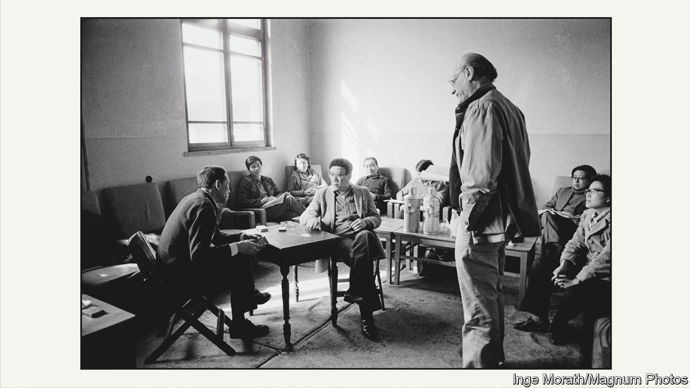

###### “Death of a Salesman” in Beijing

# In 1983 Arthur Miller directed one of his best-known plays in China 

##### Four decades on, the episode still resonates 

 

> May 18th 2023 

Since  death in 1976, China’s cultural history has involved doors cracking open and promptly slamming shut again. Hopes for renewed artistic freedom have been dashed by political caution. This month, some in China have reminisced about an event 40 years ago that came to symbolise the dream of openness: the visit in 1983 of  to direct his play “Death of a Salesman”.

The country Miller visited that spring was still emerging from the wreckage of Mao’s . But it already crackled with the electricity of creative experiments. Though a campaign would soon be launched to control “spiritual pollution”, artists sometimes enjoyed a surprising and exhilarating leeway. Gao Xingjian, a playwright who had translated avant-garde Western work in secret, began staging his own absurdist plays in the early 1980s. (He left China in 1987 and  for literature in 2000.) 

Chen Kaige and Zhang Yimou, two film-makers, would in 1984 release the first of a new wave of Chinese films, “Yellow Earth”, which, as well as being visually rich and beautiful, took a nuanced view of life in China. The new freedoms extended to some foreign artists, too. After arriving with 60 musicians and 15 tonnes of stage kit in 1981, Jean-Michel Jarre dazzled the emerging Chinese music scene—and strained the power grid—with the five concerts he played in Beijing and Shanghai.

Into this ferment stepped America’s greatest living playwright. Long fascinated with China, Miller first visited as a tourist in 1978. This time he had six weeks to direct a Chinese cast, in a language he did not speak, performing his critique of the American dream of 1949. (Beset by failure and frustration, and haunted by his past adultery, Willy Loman, the salesman of the title, retreats into fantasy and ultimately kills himself.) Many Chinese artists look back at the production as a high point of cultural engagement with America.

At its heart was Miller’s partnership with Ying Ruocheng, a celebrated Chinese actor who translated the script and played Willy. “I have never had this kind of relationship with an actor,” Miller said of Ying. Born into a prominent family in Beijing, Ying first read “Salesman” as an undergraduate in 1949, just as Communist China was closing to the world. It stuck with him through the turmoil of the Mao years, during which he was imprisoned. He and Miller discussed working together in 1978. Miller had wanted to stage “The Crucible”, his allegory of the McCarthyite witch-hunts that also echoed the Cultural Revolution. Ying persuaded him that “Salesman” would be “a breath of fresh air”, looking forward, not back. 

Miller kept a diary, published in 1984 as “Salesman in Beijing”. In it he records how, at the first rehearsal, he told the actors that he wanted to discuss “the problem of how to act like Americans”. The answer was simple: “You must not attempt to act like Americans at all.” This meant ditching the Chinese convention of actors donning blond wigs and heavy make-up to try to look like Westerners. As Ying later put it, he and Miller wanted audiences “to know the pulse of [the characters’] hearts, not the colour of their hair”. Slowly, the cast adapted. “It soon turned out that the Moon is the Moon and actors are actors,” Miller wrote; “the same everywhere.”

Some cultural divides were harder to bridge. “There were not many salesmen in Beijing in those days,” recalls Li Shilong, who played Biff, one of Willy’s sons. More fundamentally, Chinese audiences were not used to moral ambiguity. The scene in which Willy’s affair is revealed was a worry. Miller realised that one of the virtues of “Salesman” was its invitation to sympathise with a flawed man—in other words, that it “let the real world into Chinese art”.

Opening night on May 7th, attended by the American ambassador and other dignitaries, was a triumph. “The audience rushed forward to the edge of the stage, shouting and pointing,” Ying would recall. “We have very few dramas like this, and none of this intensity,” a young Chinese man told the . “We are very big on politics, the problems of the society, on history and so forth, but very rarely does one deal with the problems of the person, of the individual in society.” 

What recommended the play to Chinese audiences, agrees Mr Li (now 77), was its focus on relationships. “Chinese are keen on families,” he says. “Everyone has parents. Everyone has siblings.” In cultural terms, the production was “a watershed moment” in Sino-American relations, says Claire Conceison of MIT, who co-wrote “Voices Carry”, Ying’s autobiography. “It brought in a new type of play that blended realism and Expressionism, and also a new approach to depicting foreigners onstage.” Chinese officialdom made surprisingly little use of Miller’s critique of capitalism: the post-Mao urge to re-engage with the world was still strong. 

Miller left straight after the premiere. The play ran for over 50 performances in Beijing, then toured Hong Kong and Singapore. Ying went on to translate and direct other Western plays, such as, in 1986, “Amadeus” by Peter Shaffer. The next year he was cast in Bernardo Bertolucci’s film “The Last Emperor”. By then his skill in navigating tricky political terrain had earned him an appointment as the country’s vice-minister of culture. He helped bring  to Beijing to direct “The Caine Mutiny Court-Martial” in 1988. 

Things changed, though, with the killing of hundreds of protesters in Beijing the next year. Ying resigned from the government in 1990 (he did not stop acting and directing). For years, experimentation became rarer and riskier. 

Yet the episode continues to resonate. Ying died in 2003, Miller in 2005, but the collaboration between the two artistic giants is an enduring source of fascination for Western Sinophiles. The story of “Salesman” in Beijing is the focus of two separate plays currently in development, one in New York, the other in Canada. 

Theatre professionals in China have had to battle with a difficult system. “China is not lacking in good writers,” says Mr Li, the actor, but “writers cannot write what they want.” Nevertheless, the influence of “Salesman” lingers. Western shows (if only the uncontroversial kind) draw crowds today. In Shanghai “The Woman in Black”, a ghost story adapted from London’s West End, recently played to packed houses. 

Attention must finally be paid

And as China’s economy and society have evolved, some art forms have been reinvigorated (even if political themes remain off-limits). Critics in Beijing praised a recent production of “Sunrise”, a penetrating drama set in the 1930s by Cao Yu, who met Miller on both his visits. New experimental work is emerging too, says Professor Conceison. She points to Meng Jinghui, a director who mixes “playfulness with social commentary and dystopian elements” and whose shows have toured America, Europe and Australia. “There is a vibrant theatre scene in China,” she says, “and it is gaining traction globally.” 

Flawed heroes are now familiar on the Chinese stage. Another well-known director, Li Liuyi, put on a revival of “Salesman” in 2012 and says it felt much more relevant in 21st-century China than it did in 1983. These days middle-class audiences can sympathise with the struggles and fears Miller depicts. Four decades ago, Willy Loman was an ambassador from an alien world; today he is no longer a stranger. ■


