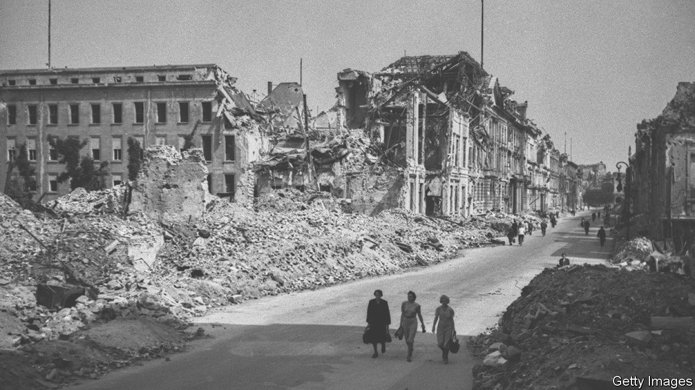

###### Exorcising German history

# In “Fatherland”, an author reckons with his Nazi grandfather 

##### Burkhard Bilger’s book asks just how guilty his forebear was 

 

> May 18th 2023 

 By Burkhard Bilger. 

Germans born in the 1940s came of age in a shattered world. The, or children of the war, inherited a country of ruins and silence. Cities were choked by rubble; millions of people were displaced.

Yet the recent  was rarely discussed. The breakneck post-war German recovery rested on a shame that, for many people, was too deep for acknowledgment. It emerged in subtle and unspoken ways nevertheless. One  ascribed his lifelong fear of swimming to a memory of being strafed by Allied planes as he played in the River Weser. During the first Gulf war of 1990-91, some elderly Germans hoarded food and water, instinctively bracing for a conflict that was happening thousands of miles away.

Burkhard Bilger’s parents were part of that silent generation. In “Fatherland”, Mr Bilger, a German-American writer for the , reckons with the weight of Germany’s Nazi past—and his own troubling genealogy. His book tells the story of his maternal grandfather, Karl Gönner, a soldier, teacher and Nazi administrator in the small village of Bartenheim in occupied Alsace. Mr Bilger’s search was prompted in part by the realisation that, as his mother and her siblings aged, he would soon lose his last living links to the war. 

“Fatherland” evokes Gönner’s upbringing in the Black Forest with aplomb. This, in Mr Bilger’s telling, was a spectral landscape, almost medieval in its grinding, candlelit poverty. Gönner’s family, in particular, seems haunted. His father, a drunken gambler, died by suicide; his mother saw spirits. One of their homes had been owned by a conjuror who studied the occult in a secret annexe. Gönner himself wanted to be a priest, but was drafted to the Western Front during the deadly final spasms of the first world war. A landmine killed his best friend in autumn 1918; Gönner himself went home “hobbled and half-blind”. He carried that war inside him as Europe lurched towards the next.

Mr Bilger’s central concern is the . To what extent was his grandfather a willing participant in the Nazi war machine? The evidence appears damning. Gönner joined the National Socialists well after Hitler’s expansionist ambitions and noxious anti-Semitism were obvious. As a teacher in occupied France, he was on the front line of the Nazi propaganda push: “Every lesson was an indoctrination, every field trip a political rally.” As his grandson puts it, he served in “a war fought with erasers and chalk”.

As he digs deeper, though, Mr Bilger unearths a more complex picture. Like the Alsace region, which changed hands four times between 1862 and 1945, Gönner’s biography splinters into a “spider’s web” of conflicting loyalties. As a local party boss, he turned a blind eye to draft-dodgers, even as thousands of Alsatian men were sent to the Eastern Front; many perished in Soviet prisoner-of-war camps in appalling conditions. Tracked down during Mr Bilger’s dogged reporting, Gönner’s French students remember him as firm but fair. None was among the estimated 5,000 Alsatian children who died in Nazi facilities after being torn from their parents.

On balance, Mr Bilger exculpates his grandfather—and, by emotional if irrational extension, himself. “His story belies the idea of irredeemable sin,” he concludes. Though history often preserves the imprint of horror, he notes, the eddies of individual consciences are generally lost. Compared with this moral inquiry, the analogies Mr Bilger tries to draw with right-wing politics and  in contemporary America seem flimsy. The gulf between his grandfather’s tale and today is too wide.

This is still a wonderful book. In a powerful passage, Mr Bilger takes part in a . Part-séance, part-therapy, these ceremonies encourage Germans to revisit moments from the past, so exorcising their . “Fatherland” achieves a catharsis of its own. ■


