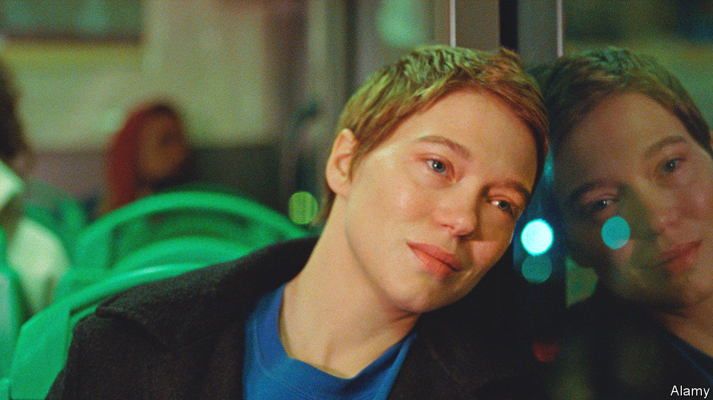

###### Back Story

# Quiet artworks sometimes make the deepest impressions 

##### In a sensationalist age, they are too often shouted down 

 

> May 18th 2023 

“Quiet” is a harmless word that, in the cultural world, can be a euphemism, even a slur. Often it refers to tales of humdrum lives that lack the hoopla of seismic themes, exotic settings, twists and gore. A quiet book, in literary-speak, is one that doesn’t sell. More than ever, a quietly humane film is likely to be shouted down . That is a shame, as quiet art can be moving and profound.

“Western Lane”, a debut novel by Chetna Maroo, is audacious in its quietness. Gopi, its 11-year-old narrator, is the youngest of three Gujarati sisters in southern England whose mother has died. Their bereft father gets them to take up ; Gopi aims to play in a tournament. She befriends a boy called Ged, visits relatives, goes to a funfair.

This restrained plot is related in a boldly understated style. Tune into its wavelength, though, and you hear a symphony of emotion. Through the half-understood exchanges and scenes her narrator recounts, Ms Maroo beautifully conveys the eddies of guilt and recrimination in a bereaved home, and the way feelings can be experienced as physical sensations (proximity to Ged “made my heart stand up”). She shows how thoughts can be expressed without words: Gopi reads her father’s despair in “his shoulders, his throat, the white bones visible under his skin”. Squash embodies her struggle to contain the turmoil of grief and growing up.

 made the case for a similar approach to art in 1800. His poetry would describe “situations from common life”, he avowed, and employ “language really used by men”; feelings would take precedence over action. In a lament that is eerily apposite in the lurid age of social media, Wordsworth decried the “craving for extraordinary incident, which the rapid communication of intelligence hourly gratifies”. He was sure “the human mind is capable of being excited without the application of gross and violent stimulants”.

“One Fine Morning”, a new film by Mia Hansen-Love, is exciting in the way Wordsworth meant. Its opening sequence is screamingly quiet. Sandra, a widowed mother played by Léa Seydoux, goes to see her father in his Paris flat. He is losing his memory and sight and has trouble letting her in. Next she picks up her daughter from school and takes her to a park. Her job as a translator, including at a ceremony on Omaha Beach, offers fleeting glimpses of wider issues. But her own quiet dramas are defiantly the main event.

“You must show you’re there,” another infirm relative tells Sandra, explaining why she still ventures outside. “That you’re a living person.” This is the film’s philosophy: depicting a quiet-seeming life, it insists that lives are rarely quiet for the people who are living them. Sandra’s commitments pile up and collide, as they often can. Her father has to be institutionalised, her child develops phantom aches, she begins an affair with a married friend. In a quietly exquisite moment, she is taking a bus back from a harrowing old-people’s home when a text from her lover arrives; she looks over her shoulder, abashed in her joy, then starts to cry. Her happy-sad tears are reflected in the bus’s darkening window.

Your reflection is everywhere in ’s immersive “Infinity Mirror Rooms” at Tate Modern in London. But the crowds drawn by the feted Japanese artist mean that, even if you manage to get a ticket, you can’t loiter for long in her flashy installation. Two floors down, a show devoted to Magdalena Abakanowicz is quieter and deeper.

Though she eventually made some grand public sculptures, the Polish artist worked principally with textiles, a medium liable to be dismissed as antiquated or (chauvinistically) as feminine and domestic—in other words, quiet. Abakanowicz declared that she was “interested in the path of a single thread”. In the late 1960s, that path veered off the walls on which textiles traditionally hung, and her sisal, burlap and horsehair threads took on three dimensions. 

Encountering what became known as her “Abakans”, woven artworks suspended hugely from the ceiling in black, ochre and blood red, your instinct is both to climb inside them and run away. They look as if they could cradle or entomb you. Rope spills like entrails from one; another resembles a heart, with openings that might be arteries. In a piece called “Pregnant”, a tear in the rumpled fabric could be a way out or a wound.

Light filters through the slits in these sculptures, which cast their shadows over you like trees or shaggy giants. The art is silent but magically alive. ■


