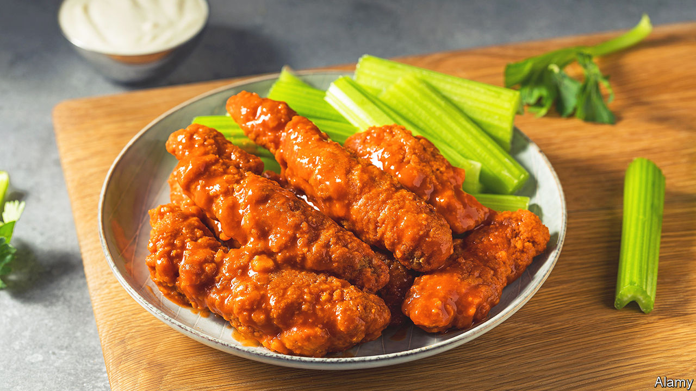

###### World in a dish

# Wings v tenders: the choice says more about you than you think 

##### Should food be a challenge or a comfort? 

 

> May 18th 2023 

Picture the scene. You are perched on a stool at a bar. A sport—basketball, say, or baseball—is playing on a screen above. A beer sits in front of you, its icy base adhering to the paper mat. And then a basket appears, lined with some kind of grease-resistant paper, celery sticks sprouting from one end next to a pot of blue-cheese dip. The main event will be one of two things, buffalo chicken wings or buffalo chicken tenders. Which you choose says more about you than you might think: do you want to fight your food or inhale it?

Cheap, salty and popular, chicken wings and tenders are now the quintessential bar snacks. But poultry’s popularity in America is relatively recent.  during the second world war. In the 1940s the us Department of Agriculture launched the “Chicken of Tomorrow”, a contest to develop fatter and faster-growing birds. Production became more industrialised and efficient. By the 1950s what had been one of the most expensive meats was the . 

For years Americans preferred white meat and sent their chicken wings to China. The invention of buffalo chicken wings in upstate New York in the 1960s single-handedly changed the structure of the , argues Emelyn Rude in “Tastes Like Chicken: A History of America’s Favourite Bird”. America began keeping its wings and sent China only the feet.

But those home-grown bosomy birds also left America with lots of white meat. One result was chicken tenders. Unlike nuggets—which, says the original recipe, are 85% “mechanically deboned spent layer meat”—tenders are a single piece of meat. They are formed from tenderloin, the pectoralis minor muscle, found beneath the breast but smaller and thinner.

Chicken tenders satisfy a common desire, perhaps most acute in America, for consistency and convenience. Cooking chicken wings is tricky. The drumette and the wingette may cook unevenly. Getting the skin crispy is a skill, leaving it flabby—a crime. Eating them is no simpler. Smears of sauce wind up slicked around your mouth and stuck under your fingernails. The meat has to be prised from the bones. The texture varies; there is cartilage and gristle to contend with. (Elsewhere that is a bonus: knobbly chicken feet and tense little gizzards are relished  precisely because of their texture.) Finally, wings have a certain discomforting realness. Like legs, they are recognisably part of an animal in name and appearance.

Tenders—battered or breaded—are a more straightforward proposition for both chef and eater. There is no skin with which to battle. Each bite is identical, the texture unvarying. Many people value uniformity in what they eat: the appeal of fast-food chains lies in large part in customers’ appreciation of the fact that, wherever they are, they know they will be served the same items, cooked in the same way.

For some, comfort food means not having to think too much about what they are eating. For others, it means food that requires enough concentration to avoid thinking about anything else. ■


