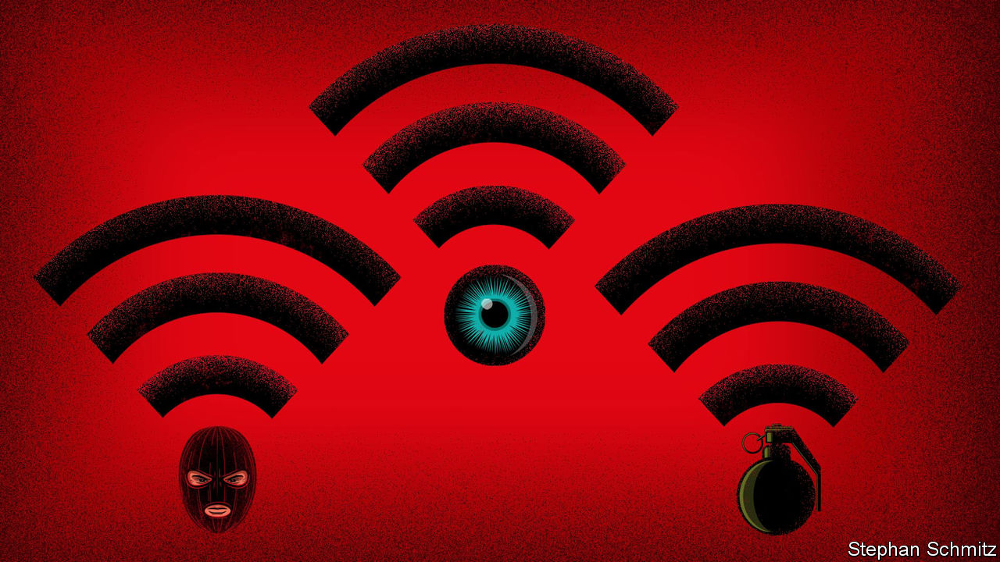

###### Cybercrime

# “Fancy Bear Goes Phishing” charts the evolution of hacking 

##### Scott Shapiro offers some ideas on how to combat it 

 

> May 17th 2023 

By Scott Shapiro. 

In 1928 many countries signed the Kellogg-Briand pact, which outlawed war. Though often derided as hopelessly idealistic, it had important consequences. Until then, war had been a lawful way for states to settle their differences; by contrast, economic sanctions were illegal. After the second world war, the document served as the legal basis for the Nuremberg trials. A draft of the  included its terms almost verbatim.

The status of computer hacking in international law is now similarly irrational. Espionage is basically legal; interfering in the internal affairs of another state is not. Yet when does cyber-espionage tip into ? If definitions are slippery, preventing cyber-attacks is even harder. They can be ordered by one country, perpetrated by a civilian in a second, using computers in a third to disable those in a fourth, with tracks hidden along the way. To some, the prefix “cyber” suggests the associated wrongs are as resistant to regulation as old-fashioned war can seem to be.

Scott Shapiro, a professor at Yale Law School and erstwhile computer programmer, is well-placed to tackle these quandaries. He is also the co-author of  published in 2017. His new book chronicles the internet’s vulnerability to intrusion and attack by forensically examining five hacks that typify different kinds of threat.

Russia, if you’re listening

It begins with the Morris Worm, the internet’s first worm (ie, a self-replicating piece of code that slithers from computer to computer). It came about in 1988 through an experiment-gone-wrong by an American graduate student, which exploited the openness of networked computers. Next comes Dark Avenger, a virus that destroyed computer data in the 1990s. Third is the hack in 2005 of Paris Hilton’s mobile-phone data, which revealed nude photos of the celebrity. The hacker didn’t compromise the phone but rather servers in the cloud on which the images were stored.

The book’s most outrageous and troubling attacks are its last two, both in 2016. First, the hack of the Democratic National Committee and Hillary Clinton’s presidential campaign, through which tens of thousands of private emails were leaked. That was traced to Fancy Bear, the name security researchers gave to a . It stole passwords using “phishing” emails, which lure people into clicking links or divulging passwords. Seven years ago this took authorities by surprise; now it might be seen as a hostile act.

Professor Shapiro’s final example is the Mirai botnet (a botnet is a network of robots, or compromised computers). At one point its code commandeered more than 300,000 computers, mainly in online devices such as security cameras. Most networks can handle an attack of 1 gigabit-per-second of traffic; Mirai’s army amassed over 600 gigabits. 

The three young men who were responsible had been offering to take down websites for as little as $100. They were caught by an enterprising FBI agent who realised they weren’t evil criminals but socially awkward teenagers. Under his mentorship, they confessed and avoided prison by helping the FBI fight cybercrime—notably the new botnets based on their code.

The author masterfully blends consideration of two sorts of code, software and legal. “Downcode” is his name for the computer programs that run the attacks; what he calls “upcode” includes the laws, social norms and psychology that let the raids happen. Combating hacks means dealing with both, he notes. His narrative zips between technical explanations, legal reasoning and the ideas of thinkers including René Descartes and Alan Turing.

The hacks have common features, it transpires. Insular young men are often responsible (using meagre resources, not state bureaucracies). The  is disproportionate to the effort the perpetrators expend. And the attacks are  or prosecute.

A solution to hacking is not available, alas. But Professor Shapiro at least succeeds in making the subject intelligible to non-specialist readers. And in the spirit of the Kellogg-Briand pact, he offers suggestions to help make systems secure, such as doing away with default passwords on networked devices. He aims, in other words, to strengthen the “upcode” and so weaken malicious “downcode”. ■


