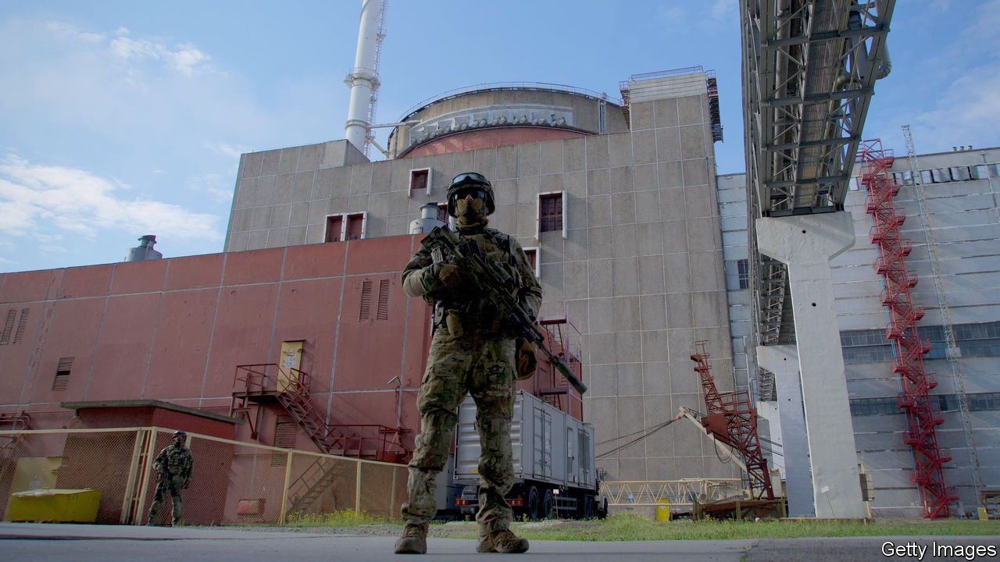

###### Nuclear nightmares

# Fears about the reactors at Zaporizhia continue to mount 

##### Russia is not looking after Europe’s largest nuclear-energy site very well 

 

> May 18th 2023 


SIGNS OF change abound at the Zaporizhia Nuclear Power Plant in occupied southern Ukraine. Workspaces house Russian troops. Soldiers cook barbecue and jog shirtless. Military vehicles dot the area. Some sit, along with ammunition, inside buildings. Animals periodically detonate landmines. Fewer employees are around. Before Russia seized the plant in March 2022, the staff numbered about 11,000. Today’s figure is roughly 4,000. How troubling is all this?

Zaporizhia’s six reactors are in shutdown mode and no longer generate electricity. But this has not ruled out a possible meltdown. The reactors are loaded with fuel that must be continuously cooled using electric power. But all but one of the facility’s grid connections have been knocked out, and grid power has failed on six occasions. Each blackout left the operators around 90 minutes to prevent “six Chernobyls” by starting diesel generators to pump the water for cooling, as Rostyslav, a former plant engineer who asked his name to be changed, puts it. After a recent ultimatum to swear allegiance to Russia, he fled to Kyiv, Ukraine’s capital.

Tasks now take longer. Even moving supplies, Rostyslav says, often requires lengthy negotiations with Russian commanders. More to the point, the bosses are in uniform and make decisions “from the point of view of military tactics”, says Vadym (not his real name), a recently fired Ukrainian reactor engineer who lives in nearby Enerhodar, which is also occupied. Artillery has been positioned near reactors and cooling systems, he says. “If you take a photo, you will probably be shot.” 

Fire is a hazard. Soldiers smoke near lubricants and other flammables, reports Alina (also not her real name). Before losing her job at the plant for refusing to sign a contract with Rosatom, the Russian outfit that usurped Ukraine’s Energoatom, she witnessed careless welding and wide use of portable stoves. Fire alarms regularly went off. Gunshots are another fire risk. Rostyslav recounts how soldiers once ran out of a building and began shooting at a drone. It turned out to be Russian.

Russia has blocked deliveries of spare parts from Ukraine since November. Alternatives from Russia are often inferior. That is not the only reason for the “huge deterioration” of equipment, says Petro Kotin, the president of Energoatom, which is based in Kyiv. With voltage transformers and many electronic systems shut off, moisture that would be kept out by heat is corroding components.

Maintenance is also behind schedule. Mr Kotin rattles off some problems. Plans have slipped for “passivation”, the coating of metals to prevent corrosion. At a facility that holds 174 casks of nuclear waste, data analysis for safety is inadequate. So is training. The experts who used to train staff on three simulators have mostly gone or been redeployed. Even the 90 or so diesel generators need maintenance. They must be operated carefully, a source says.

Morale is low. “It feels like you’re working in a concentration camp,” says Rostyslav, who describes being tortured twice. Vadym declines to discuss the abuse he underwent, but estimates that perhaps 1,000 employees have spent up to a week in basement cells or pits in the dirt. 

On May 12th the UN’s nuclear watchdog, the IAEA, decried a dangerous lack of maintenance at the plant and an additional fall in staff numbers that appears due to evacuations this month from Enerhodar. Alina, who remains there, says Russia, preparing for a “hard attack” from Ukraine, is sending more troops and weapons to the plant. She hears artillery. One question on many minds, she says, is if Russian soldiers were forced to retreat from the nuclear plant, might they sabotage it first? ■

