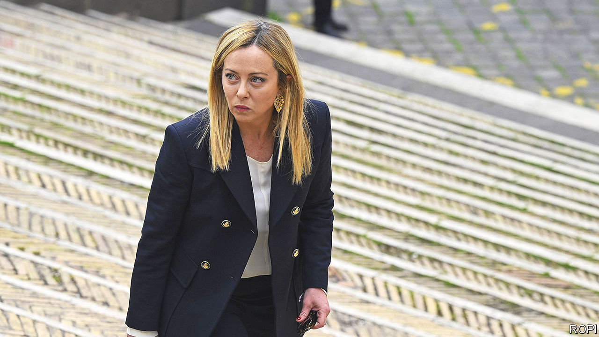

###### Calculated effort

# For Giorgia Meloni, supporting Ukraine has some useful benefits 

##### It helps blunt criticism of her domestic agenda 

 

> May 18th 2023 

Passengers waiting last month at Udine railway station in north-eastern Italy were astonished to see a slow-moving train rumble past carrying M109 howitzers, bound for Ukraine. A widely shared video gave Italians a glimpse of the reality behind their politicians’ expressions of support for Volodymyr Zelensky’s government. The shipment had in fact been authorised by the previous government of Mario Draghi. But Giorgia Meloni has maintained Italy’s Ukraine policy since replacing him as prime minister last year.

Mr Zelensky’s decision to begin his latest European tour in Rome on May 13th may thus have been an expression of gratitude to Ms Meloni. But it was also perhaps an attempt to shift Italian attitudes: a recent poll found more Italians (45%) opposing the arming of Ukraine than supporting it (34%). Ms Meloni’s war policy is not without risk. But nor is it devoid of benefit on the wider stage. Ms Meloni, whose party traces its origins to neo-fascism, has had a mixed reception from her European counterparts. 

France has been especially hostile, criticising in particular Italy’s tough policy on illegal migrants. That in part reflects French domestic politics: denigrating Ms Meloni implicitly discredits her fellow radical nationalist, Marine Le Pen. France’s interior minister, Gérald Darmanin, clashed bitterly with Ms Meloni after her government sent an NGO vessel carrying rescued migrants onwards to France last year. He renewed his attack this month, saying her “far right” government was incapable of solving its migration problems. However, President Emmanuel Macron has since tried to dial things down, saying this week that Italy needs help in dealing with the latest wave of migration.

Support for Ukraine offers Ms Meloni an opportunity not only to limit Italy’s marginalisation in the EU but to offset it with the approval of governments outside, notably in Britain and America. But it also gives her more room to adopt uncompromisingly conservative policies at home. Her main target has been Italy’s LGBT community: the government plans to remove non-biological gay parents from birth certificates and make surrogacy abroad criminally liable in Italy. Ms Meloni has adapted to circumstances. But there is little sign that she has changed her core beliefs.■

