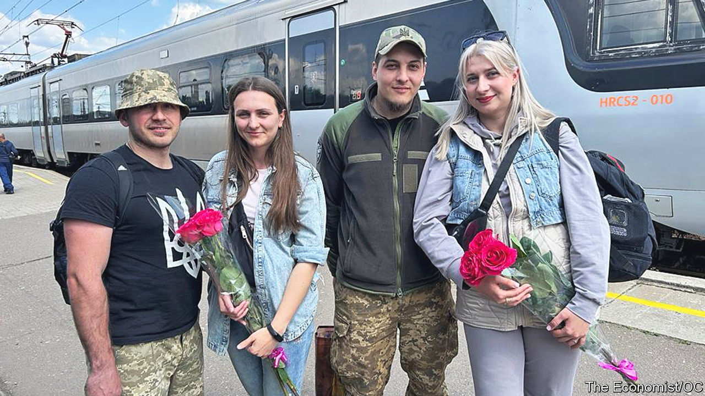
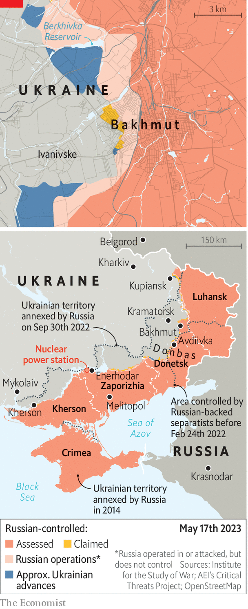

###### City of love and war

# How a front-line city became Ukraine’s romantic capital 

##### Just 30km from the fierce fighting in Bakhmut, Kramatorsk is adapting to wartime 

 

> May 17th 2023 


THE 13:38 EXPRESS from Kyiv pulls into Kramatorsk, welcomed by a sea of flowers and outstretched arms. Of the passengers who aren’t soldiers on their way to nearby Bakhmut, almost all on board are the wives and girlfriends of those already fighting. Viktoria, 27, and Karolina, 29, have travelled to see their men Alexander, 32, and Vladimir, 33, who are waiting for them on the platform. A day before, Alexander and Vladimir were fighting . Now they have swapped their rifles for roses. The couples embrace silently, and depart for rented apartments on the outskirts. 

Kramatorsk, an industrial city of 150,000 before the latest invasion, is reinventing itself as a romantic destination. On the front line since 2014, Russia’s renewed onslaught in February 2022 brought its very existence into question. Within a few weeks, Kramatorsk’s factories shut down and most of its civilian population fled. Now the city is profoundly militarised. But it exudes a new kind of energy as a romantic hub for soldiers who aren’t allowed to travel far from fighting in Bakhmut and Avdiivka. There may be no hotels—they closed after one was bombed last summer—but a network of apartments, rentable by the day or hour, fills the gap. The city’s tourist infrastructure—flower shops, gift shops, restaurants and cafés—has prospered. 

 


Artyom, an estate agent, says he has done good trade ever since the Kyiv train started running again in October. Some 80% of his business is now short-term lets to soldiers and their partners; the rest is long-term accommodation for refugees. At 1,000 hryvnia ($27) for 24 hours, Artyom’s going rate is twice the pre-war level, and as expensive as in parts of Kyiv. But demand is strong, fuelled by good military salaries. The women usually arrive on the express train on Saturday, he says, and stay for a day or two. “The town comes to life at weekends, with couples walking arm-in-arm through the park, even with the booms and sirens of war.” The nearest Russian positions to Kramatorsk are 20km away, putting the city within easy range of multiple-rocket systems and S-300 missiles. 

There is a lively market for commercial love, too. Two brothels have opened since the fighting began last year. One, tucked away in the city’s industrial district, operates under the close watch of the army. On May 14th four soldiers waited in a queue outside the building. The madam was initially reluctant to admit them all—one was obviously drunk—but eventually did. This reporter was invited to sign up for a 4,000-hryvnia slot on the next day. Business is obviously thriving. “Now is not the time to tackle morality,” says a military official. “The only thing we are concerned about is that the soldiers don’t say things they shouldn’t, and the girls don’t pass on things to the enemy.”

The source need not be too concerned. A conversation with the sex workers later reveals that they see themselves as integral parts of the war effort. “We are here to lift our wonderful boys’ spirits,” says Natalie, a blonde in her mid-20s. “They are defending us, and we want to help them in any way we can.” Natalie says her collective works 24/7, through air raids, and has even done outcalls to positions nearer the front lines. Before Kramatorsk the women were based in Mykolaiv, another front-line city in southern Ukraine, but they moved when they heard that their regular customers deployed to Bakhmut: “We knew that many of them wouldn’t return alive, and we wanted to be near them.” The women say they frequently hear about clients who have been killed or severely injured. 

Maniasha says her 18-year-old son is fighting in the army. She tried to stop him from enlisting, but is proud he did. Now, even the appearance of a young soldier at the brothel makes her cry. “You can’t stop yourself thinking this lad will head to the front lines and never return,” she says. “You do whatever you can to give him confidence, to caress him. You tell him he is a fighter, a hero.” The encounters are not always about sex, says Natalie. “Sometimes the soldiers simply want the warmth of another human being.” Bakhmut has  many of them. “The psychological condition of those coming out of there is dreadful, just dreadful.” 

For the first time in months the news coming from the blackened town down the road is encouraging. An unexpected surge from Ukraine is turning the tide of the battle, a full 11 months after it began. Much of the high ground on the town’s northern and southern flanks is now back under Ukrainian control. The , the most aggressive of Russian forces, is much diminished; the Russians have been suffering staggering losses. Yet the Ukrainian soldiers returning after their weekends in Kramatorsk are guarded about any possible success. “It’s a constant danger,” says Alexander, who will be back at his position within two days. His wife, Viktoria, says the pair made many plans during their weekend together. “Love is a powerful weapon. It’s the little fire that will keep my man alive.” ■


