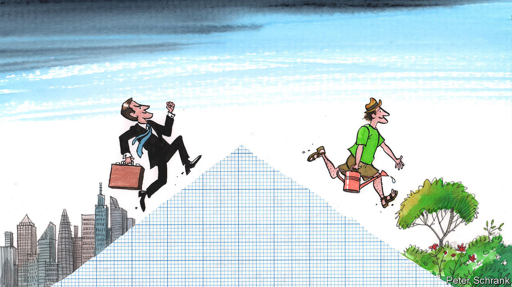

###### Charlemagne

# Meet the lefty Europeans who want to deliberately shrink the economy 

##### De-growers of the world, unite! 

 

> May 18th 2023 

In 1972 a collective of grandees known as the Club of Rome set out to establish the limits to economic growth. Worried about the state of the planet, they fed a computer all they knew about farming yields, natural resources, population trends and so on. The rudimentary machine crunched the data and spouted a grim answer: given ecological constraints, the highest standard of living possible was one stagnating at half the American level of the time. Anything beyond that risked imminent disaster, a “sudden and uncontrollable decline in both population and industrial capacity”. 

Half a century later, the global population has doubled and GDP more than quadrupled: the limits to growth turned out to be as surmountable in the 20th century as they had been when first posited in the 18th. But anyone thinking that another 50 years of evidence might have settled the debate has not met the European left. At a three-day “Beyond Growth” conference held at the European Parliament in Brussels this week (and organised by 20 mainly left-leaning MEPs), an audience of youngsters whooped and cheered as speakers proclaimed that, this time, the limits of growth really  been reached. Driven by ecological concerns and riled by social injustice, to them the question is no longer how to mitigate the effects of human activity, for example by investing in green technologies. Rather, some form of “de-growth”—, in the original French—is necessary today to avoid societal collapse. 

Human beings are born small and stop growing as adults, says Philippe Lamberts, co-head of the Green group in the parliament and the conference’s leading light. Similarly, “when your economy is mature, well, it doesn’t need to grow any longer.” The metaphor falls short of what most economists would think of as convincing evidence. But it has clearly struck a chord. A similar growth-as-the-root-of-all-problems jamboree five years ago was sparsely attended and confined to the parliament’s committee rooms. This time, thousands packed into the EU’s vast hemicycle and beyond. The big beasts of Brussels came to pay homage, led by Ursula von der Leyen, president of the European Commission.

One participant gushed at being there at the “Woodstock for system-changers”. That may be to overstate the impact that can be wrought by a cast of minor academics, trade unionists, green lobbyists and fellow-travellers on stage. Still, many a progressive idea has germinated in Europe, and Brussels is where some of them get turned into policy. So when those roaming its halls, even if only for a few days, discuss moving “from the welfare state to the social-ecological state”, it is worth paying attention.

It turns out that the animus against economic growth comes in 50 shades of red. Some merely decry the use of GDP as the primary gauge of a society’s success, pointing to how it fails to measure ills ranging from environmental degradation to slumping mental health. Fair enough. A bit further from the mainstream are the “post-growth” advocates, who think people can be just as happy with economies going up or down. If policymakers stop caring about ever-higher output, they can throttle bits of societal activity campaigners don’t like, for example big cars, private jets and so on. Instead of trying to grow the pie, the idea is to take what there now is and share it more equally. One panel decried the “addiction of labour to growth” by advocating a four-day week. In the very seats where MEPs crafted rules for minimum wages, campaigners were discussing  allowable wages.

There is an even more exalted tier—the actual de-growers. By far the majority at the conference, their aim is to shrink the pie deliberately. Growth damages the planet, and only benefits the rich anyway, they maintain. The idea that emissions can be cut enough while economies keep growing is “a fairy tale” designed to prolong the neo-liberal world order. It is better—necessary, even—to force a diet now, and get rid of any aspirations for growth later. How, exactly? “We need to determine democratically what kind of production we need to be doing,” and nix the rest, one participant advocated. Panels of citizens can advise what is wasteful and what is socially desirable. Any resemblance to some of the more stringent policies of the early Soviet era are presumably not intended.

A spectre is haunting economics

Sometimes utopians fail to notice that they have already reached the promised land. For what is Europe, if not a post-growth continent already? Parts of it, like Italy, are scarcely bigger than they were 20 years ago. Yet, somehow, that has not prompted the contemplative contentment that the de-growers expect. It turns out voters do not much like stagnation; the newish premier, Giorgia Meloni, rails against “Greta Thunberg’s ideology” killing jobs. 

Where the growth-sceptics are right is that the environment has suffered as GDP has soared. But they too readily dismiss the obvious solution, which is to green the economy, not throttle it. As Mrs von der Leyen explained to the sceptical crowd, her political breed already accept that the old economic model centred on fossil fuels is “simply obsolete”. Europe wants to cut the carbon it spews into the atmosphere by over half by 2030 compared with 1990—it is busily enacting law after law to reach the target—and to reach net-zero carbon emissions by 2050. Already, its emissions are coming down even as the economy is growing. That is a remarkable pivot for a continent whose prosperity was built through burning coal, oil and gas. To dismiss such efforts as “greenwashing”, as de-growers do, is an over-statement. 

Beyond the confines of the conference, Europe is grappling with near-intractable problems. How much can it spend to assist Ukraine as it fends off Russian aggression? How will Europe’s welfare state be financed as society ages? How can the best ideas to continue decarbonising the economy be turned into reality? Finding suitable solutions will require hard graft and much human ingenuity. That is the very stuff that economic growth is made of. The more of it, the better. ■


