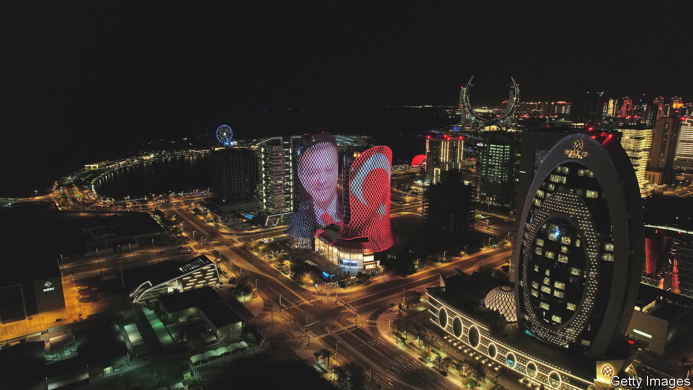
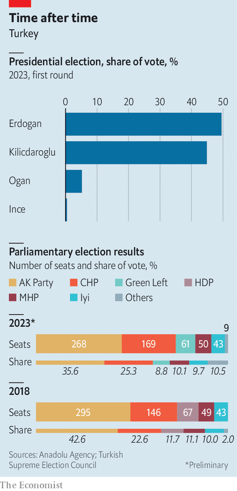

###### Round one, Erdogan

# Recep Tayyip Erdogan beats his challenger as Turkey votes 

##### But there will be a run-off in two weeks 

 

> May 14th 2023 

THE air seemed to go out of the 16-storey building in eastern Ankara, the headquarters of the Republican People’s Party (CHP), Turkey’s main opposition party, late on May 14th. Opinion polls had given , the party’s leader and the opposition’s joint candidate for the , a decent lead over Turkey’s longtime leader, Recep Tayyip Erdogan, in the first round of the contest. Some even saw him winning an outright majority of the vote, enough to claim immediate victory. Nothing of the sort happened. By the time dawn broke over the city, Mr Kilicdaroglu had secured only 44.9%, compared to 49.5% for Mr Erdogan. That was enough to force the Turkish strongman into a run-off on May 28th, but not enough to prevent a sense of despair from spreading through the halls of the CHP building. Mr Erdogan now has a clear path to re-election. Mr Kilicdaroglu’s chances of pulling off a historic upset are thin. 

The elections to parliament, held in tandem with the ones for the top office, compounded the damage. The Nation Alliance, a coalition of six opposition parties headed by the CHP and the centre-right Good Party (Iyi), won 35% of the vote, also well below expectations, which will give it 212 out of 600 seats. Mr Erdogan’s bloc, which includes his Justice and Development (AK) party and the far-right Nationalist Movement Party (MHP), took 49.5%, enough to retain a comfortable majority with 323 seats. A smaller opposition alliance headed by Turkey’s main Kurdish party, the Peoples’ Democratic Party (HDP), won 10.6% (65 seats). 


The crowds outside the CHP building thinned out after midnight. A small group of young people remained, chanting opposition slogans and singing. Some embraced. The mood was markedly more upbeat a couple of kilometres away, where thousands of government supporters, escorted by cars blaring music and honking their horns, had turned out to see Mr Erdogan speak. Turkey’s leader walked out onto the balcony of his own party’s headquarters, where he has delivered scores of victory speeches, and gloated. “Somebody’s in the kitchen,” he said, referring to Mr Kilicdaroglu, known for recording social-media videos from his modestly furnished kitchen. “And we’re on the balcony.” 

Mr Kilicdaroglu is down, but not out. Still, to have any chance of winning the run-off, the opposition leader would have to woo some 3m voters to his cause in two weeks. His best hope may be an endorsement from Sinan Ogan, the nationalist candidate who received 5.2% of the vote, a surprisingly strong showing. In recent interviews, Mr Ogan suggested he could back either Mr Erdogan or Mr Kilicdaroglu, in exchange for one or more cabinet posts for him and his party. 

 


But so underwhelming was Mr Kilicdaroglu’s performance in the first round that even such an endorsement would not be enough, since many of Mr Ogan’s voters may gravitate to Mr Erdogan anyway. The opposition will have to refocus the entire debate on the economy, says Ahmet Han, an international-relations professor at Beykoz University. “That is their only chance,” he says. 

Mr Erdogan confounded almost all of the pollsters. He did so, says Mr Han, by deflecting attention from the state of the economy, warped by 44% inflation and the lowest real interest rates anywhere in the world, and focusing instead on identity politics, national pride and security. The opposition, he claimed in one speech after another, was beholden to the Kurdistan Workers’ Party (PKK), an outlawed separatist group, and to the Gulen community, a religious sect Turkey blames for a violent coup attempt in 2016. Such rhetoric appears to have resonated with millions of voters, thanks also to Turkey’s captive media, which went to new lengths to ensure Mr Erdogan could be heard in every living room in the country. Two days ahead of the vote, 24 channels broadcast a live interview with the Turkish leader. Mr Kilicdaroglu appeared on one channel. 

Mr Erdogan also promised new handouts, including a 45% salary increase for hundreds of thousands of public-sector workers, and unveiled scores of new projects, including Turkey’s biggest warship, its first electric car, and a Russian-built nuclear plant. Despite hiccups, the economy was safe in Mr Erdogan’s hands, such projects were meant to suggest. He also appeared unscathed by the earthquakes that killed more than 50,000 people in the south of the country at the start of the year, and by his government’s botched response to the tragedy. Mr Erdogan came out on top in eight of the 11 provinces, home to some 14m people, affected by the quake. His parliamentary alliance lost in just one. 

But the economy may nonetheless come back to haunt Mr Erdogan even before May 28th. Foreign investors, who had been frozen or driven out of Turkish markets by Mr Erdogan’s loony economic policies, creeping capital controls, and his control over the central bank, had seemed to be pricing in a possible opposition victory before May 14th. Now that the opposite scenario is more likely, a backlash seems to be brewing, compounded by fears that Mr Erdogan, who has refused to raise interest rates, has no viable plan to bring down inflation. In the three days since the election on May 14th, the Turkish lira has fallen by 1%. The annual cost of insuring Turkish government debt against default climbed by 1.7 percentage points during the same period. A fresh currency crisis is possible unless Mr Erdogan changes course. Turkey’s leader will do his best to keep it at bay over the next couple of weeks. His victory in round two may depend on whether he can succeed. 

The economy is by no means all that is at stake. Away from the noise and the celebrations, in a prison cell on Istanbul’s eastern outskirts, Mucella Yapici, an architect, and two filmmakers, Cigdem Mater and Mine Ozerden, followed the election on a small television. The three women had been sentenced last year to 18 years behind bars for taking part in protests against Mr Erdogan’s government a decade ago. For them, and for scores of other political prisoners, a victory for Mr Kilicdaroglu would have offered a chance of freedom. A victory for Mr Erdogan would crush any such hopes. “We looked at each other when the results came,” Ms Yapici told her daughter Burcu, who visited a few days after the vote. “We feared this was coming but we weren’t surprised.” Her mother had always told her not to be too optimistic, Burcu said. But she had not given up hope. “You never know what will happen in Turkey.” ■

