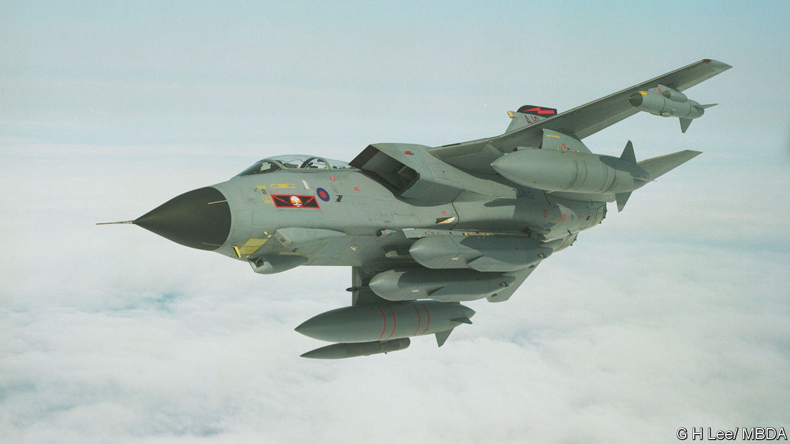

###### A message from Europe

# Volodymyr Zelensky’s European trip secures a lot more military backing 

##### An impressive demonstration of collective commitment to Ukraine 

 

> May 18th 2023 


Ukraine’s president, Volodymyr Zelensky, hurtled round Europe last weekend, and came away with plenty to show for it. He started out in Rome, where the Italian prime minister, Giorgia Meloni, promised to continue to supply his country with weapons to fight Russia for as long as necessary. From there, a Luftwaffe Airbus, escorted by Typhoon fighter jets, flew Mr Zelensky to Berlin, where Germany’s chancellor, Olaf Scholz, surprised critics of his previous reticence about the supply of war-winning weapons to Ukraine by announcing a new support package which is worth €2.7bn ($2.9bn)

The package includes four Iris-T air-defence systems, 18 wheeled howitzers with ammunition, 30 Leopard 1 tanks, 20 Marder infantry fighting vehicles and more than 200 surveillance drones. A deal was also announced whereby Germany’s largest arms manufacturer, Rheinmetall, will form a joint venture with Ukraine’s Ukroboronprom to service and repair tanks, and ultimately manufacture them.

Mr Zelensky then travelled with Mr Scholz to Aachen, where he was presented with the Charlemagne Prize, an award for bringing Europeans together. Ursula von der Leyen, president of the European Commission, gushed: “Ukraine incarnates everything the European idea is living for: the courage of convictions, the fight for values and freedom, the commitment to peace and unity.”

Next stop was the Élysée, where President Emmanuel Macron promised in the coming weeks to train and equip several battalions with armoured vehicles, such as the six-wheeled AMX-10RC light tank, and to boost Ukraine’s air defences. Finally, an RAF Chinook helicopter took Mr Zelensky to Chequers, the British prime minister’s retreat, for hugs with Rishi Sunak and confirmation that as well as the supply of Storm Shadow air-launched cruise missiles that was announced last week, Britain would be sending hundreds of air-defence missiles, as well as armed drones with a range of more than 200km.

The biggest game-changer for Ukraine, at least as far as its coming offensive is concerned, is the Storm Shadow. The Anglo-French missile has a range of at least 250km. It also has stealth features that make it hard for air-defence systems to spot, and carries a bunker-busting dual-charge warhead. Amid reports that Ukrainian Su-24 aircraft have already fired the missile, Russian logistics hubs and command posts that sit beyond the 80km range of the American HIMARS rocket system are now in jeopardy, as are bridges and air bases in Crimea.

The messaging from Mr Zelensky’s trip may be almost as important as the weapons themselves. At this week’s G7 summit in Hiroshima, there will be further pressure on the Americans to provide Ukraine with longer-range missiles and allow an emerging coalition of countries to give Mr Zelensky the F-16 fighter jets he needs. All this will convey to Vladimir Putin that after this Ukrainian offensive there may be even better-equipped ones to come. ■


