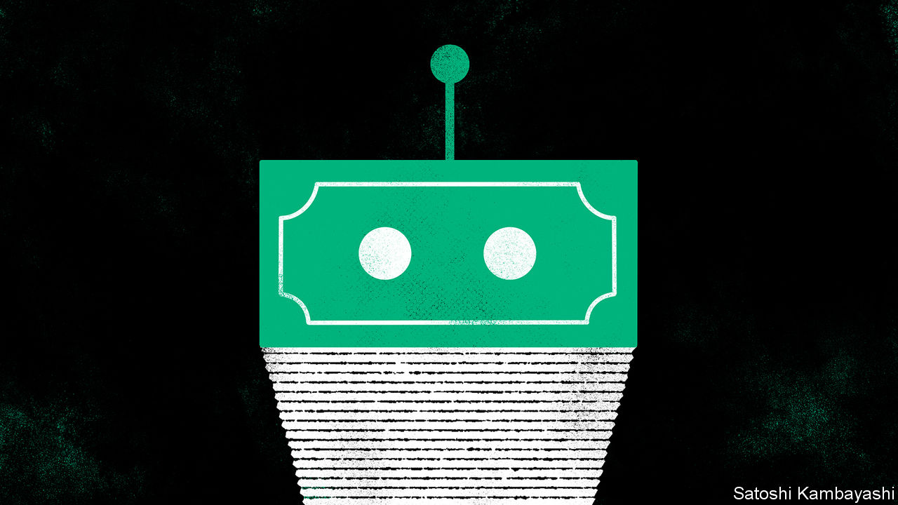

###### Buttonwood

# How to invest in artificial intelligence 

##### Private startups or public markets? 

 

> May 17th 2023 

It has been a torrid 18 months for investors who bet on tech. SoftBank, a Japanese investment firm that epitomised the 2010s boom in venture capital for companies with rapid-growth ambitions, is still smarting from the shift to a world of higher interest rates and lower corporate valuations. But there is one area in which the firm, run by Son Masayoshi, its charismatic founder, wants to peek above the parapet: investments in artificial intelligence (ai).

The advances of , such as Chatgpt, have left just about every investor discussing what to make of the incipient industry, and which firms it might upturn. Mr Son sees parallels with the early period of the internet. Generative ai could provide a new pipeline of initial public offerings—and the foundation for the next generation of mega-cap tech firms. 

Investors face two questions. The first is which frontier technologies will make market leaders a fortune. That is difficult enough. The second, establishing whether the value will accrue to upstarts backed by venture capital or existing technology giants, is at least as tricky. Nobody knows if it is better to have the best chatbot or plenty of customers—having a head start in a whizzy new tech is not the same as being able to make money from it. Indeed, lots of the value of revolutionary innovation is often captured by existing giants. 

Alphabet, Amazon and Meta are three of the seven largest listed companies in America, worth a combined $3.4trn. They were founded between 1994 and 2004, emerging at a time when internet technology was new and people were spending an increasing amount of time online. Alibaba, a Chinese e-commerce giant, is another similar example (SoftBank’s early $20m stake in the company helped cement Mr Son’s reputation as an investor). Spotting tech trends, and developing the best platforms, generated a gargantuan amount of value for early and even not-so-early investors. Legacy firms struggled to jump on the bandwagon. 

Will the story be the same this time around? The insights of Clayton Christensen, a management guru who pioneered a theory of innovation just as the internet giants were bursting onto the scene, can provide a useful guide. Christensen noted that smaller companies often gain traction in low-end markets and entirely new ones, which the largest incumbents eschew. The incumbents focus on deploying new technology for their existing customers and lines of business. They are not incompetent or ignorant of technological progress. Instead, they follow the seemingly correct path from a profit-maximising perspective—until it is too late and they are fatally undermined. 

Investors like Mr Son, excited about the future of startups that focus on ai, are implicitly presuming that a period of disruptive innovation is under way. But most of the recent excitement about generative-ai platforms has focused on their potential as a new technology to be deployed, not as companies which could open up brand new markets. In the case of other recent technological innovations, incumbents have won the day. Elad Gil, a venture capitalist, has noted that the value of previous advances in machine learning, the broader category of which generative ai is a part, have accrued almost entirely to incumbents. The early internet startups have benefited, as have Microsoft and chip firms like Nvidia and Micron. The earlier stages of machine learning produced no listed firms that might be considered the Amazon or Google of their niche. 

Christensen’s insights make clear that revolutionary innovation does not always end up being revolutionary in business terms. Yet existing tech firms are now  on ai, suggesting they should be well-placed if the tech does turn out to revolutionise business. It is possible an investment in a broad index fund tracking existing listed tech firms will end up outperforming the equivalent investment in private, strictly ai-focused startups. 

Theories about why innovation is sometimes disruptive and sometimes not are more often discussed by students of business and management than stockpickers. But the difference between the two possibilities is crucial in assessing whether the next generation of listed tech companies, with market capitalisations in the hundreds of billions of dollars, is to be found among private ai firms. As things stand, it looks more likely that the market value of the technology will end up as a new string to the bow of already giant tech firms.■


