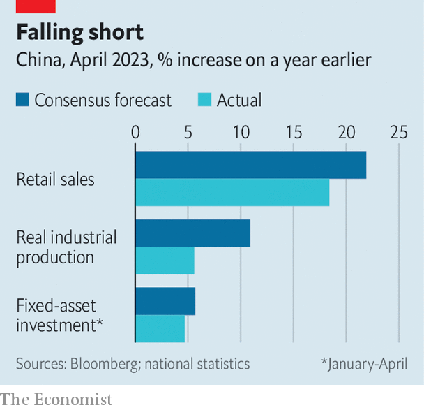

###### Shanghai sighs

# Is China’s recovery about to stall? 

##### The country appears to be stuck in a confidence trap 

 

> May 18th 2023 

China’s youth represent just a sliver of the country’s working-age population and an even narrower share of its workforce. Many of those aged 16 to 24, after all, are still in school or university and therefore not seeking employment. In recent years, their job prospects have nonetheless compelled attention and raised alarm. Last month, overall unemployment in China fell from 5.3% to 5.2%, according to figures released on May 16th. This improvement was overshadowed by a rise in youth unemployment to 20.4%, the highest recorded since the data began 2018.

The enormous attention paid to issues like youth unemployment is a symptom of China’s emerging “confidence trap”, argue Xiangrong Yu of Citigroup, a bank, and his colleagues. Even as the country’s economic recovery largely surpassed expectations in the first three months of the year, investors seemed to focus on its “weak links”. These included lacklustre imports, soft inflation, the failure of manufacturing to match the strength in services—and jobless youngsters. Foreign investors have soured on China as geopolitical tensions have risen: on May 17th the yuan slid past seven to the dollar. But “pessimism is also significantly prevalent and persistent on the domestic side”, the Citigroup economists note.

It is evident in China’s stockmarkets, which have given up many of their gains from the initial reopening rally. And pleasant surprises in the economic data have barely registered in eeyorish fixed-income markets: government bond yields are only a bit higher than they were in the depths of the covid-19 pandemic. Although consumer confidence looks healthier than last year, it remains far below levels in 2019.

 


China’s uneven recovery has so far failed to lift the mood. The danger now is that the mood will sink China’s recovery. In April, for example, credit grew surprisingly slowly. Retail sales, though strong compared with April last year, when Shanghai and other big cities entered lockdowns, were weak compared with professional forecasts (see chart). Industrial production also fell short of analysts’ expectations.

Investment by state-owned enterprises was reasonably strong, but spending by private enterprises was only 0.4% higher in April than a year earlier, according to Oxford Economics, a research firm. Part of the explanation for this disappointing growth can be found in China’s property market, where a nascent recovery now appears to be in doubt. At the urging of the government, developers have prioritised completing unfinished building projects, rather than investing in new ones. Housing starts fell by more than 20%, even as completed floorspace grew by almost 19%.

The weakness in the property market has prompted some economists to reduce their growth forecasts for the year. Ting Lu of Nomura, a bank, cut his figure from 5.9% to 5.5%, for example. “The recovery has stalled,” he explained, “due partly to Beijing’s inability to boost confidence among consumers and business investors. As disappointment kicks in, we see a rising risk of a downward spiral.”

China could seek to revive the recovery and confidence by easing monetary policy more forcefully. Inflation fell to only 0.1% in April, leaving plenty of room for stimulus. But since China’s official growth target for this year is only 5%, the government may not rush to the rescue. Foreign investors and Chinese consumers do not have great faith in China’s recovery this year. The government’s unambitious growth target, set in March, suggests it does not have great confidence either. ■


