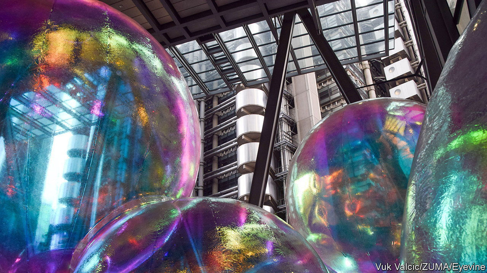

###### Laid to rest

# LIBOR will at last be switched off in June 

##### The scandal-ridden benchmark is a relic of a previous era 

 

> May 18th 2023 

Like slide rules and martini lunches, the London interbank offered rate (libor) was once a fine idea. In 1969 Iran’s central bank was looking for an $80m loan—at the time a hefty ticket for a high-risk country without the foreign-exchange reserves to cover it. So Minos Zombanakis, their banker, clubbed together a syndicate of banks which would each lend some of the money. But what interest rate to charge? Inflation was rising and rates were volatile; no bank wanted to lend at a fixed rate in case that left them out of pocket.

Zombanakis’s solution was libor. Every interest period, each bank would report its cost of borrowing. The average of these, plus a spread for profit, would be the loan’s interest rate. If the lenders’ costs rose from period to period, so would their income. The idea took off—and with it, the market for syndicated loans. By 1982 this market was worth $46bn and mostly pegged to libor. Derivatives, home loans and credit cards followed. By 2012 libor set the rates for contracts governing some $550trn, more than seven times global gdp. Yet ever since then libor has been on the decline. Next month its final few fixings, for dollar lending, will be switched off for good. 

Its downfall was triggered by scandal: in 2012, it emerged that banks, brokers and traders had spent years manipulating the benchmark for profits. This prompted record-breaking fines, arrests and a loss of faith in the world’s most important number. But a deeper reason for libor’s demise is that today’s financial system makes the benchmark look as dated as the cigar smoke and mahogany panels that attended its birth. During the global financial crisis of 2007-09 the interbank-lending market that libor was meant to measure all but evaporated. It never returned to anything like its former depth as banks looked to more reliable funding sources. And so in 2017 regulators finally called time, warning firms to prepare for libor’s cessation.

The benchmarks replacing libor are more suited to 21st-century finance. With one for each of libor’s five currencies, they are something of an alphabet soup. There is the secured overnight financing rate (sofr) for the dollar, the sterling overnight index average (sonia) for the pound, the Tokyo overnight average rate (tonar) for the yen, the Swiss average rate overnight (saron) for the Swiss franc and the euro short-term rate (€str) for the euro.

What they all have in common is that they measure borrowing costs on large numbers of actual transactions, rather than trusting conflicted bankers to reply honestly to a subjective survey. Two of them—sofr and saron—report rates in the repo market (for secured loans collateralised by government bonds) rather than for bank deposits. This reflects the financial system’s shift from bank lending to disintermediated, market-based finance.

In theory, then, libor’s alternatives make more sense. In practice, adopting them has been a long and rather tortuous slog. Dixit Joshi, formerly treasurer at Deutsche Bank, a German institution, compared its complexity unfavourably to that of Britain’s exit from the European Union. Contracts on hundreds of trillions of dollars, plus the computing infrastructure used to trade and monitor them, had to be renegotiated for a situation many had never envisaged. For dollar-libor, this meant extending the original cut-off date from the end of 2021 (when fixings for other currencies ceased) to this coming June.

Even now, some $74trn of contracts use dollar-libor and expire after the deadline. There will be no more extensions. America’s Congress has passed a bill allowing the Federal Reserve to intervene in contracts and switch them from libor to sofr if they lack alternatives. (The contracts’ counterparties can prevent this if they agree.) Zombanakis himself, now dead, would have been unlikely to object. “We took it for granted that gentlemen wouldn’t try to manipulate things like that,” he told Bloomberg journalists in 2016, referring to the libor scandal. “But as the market was getting bigger, you couldn’t trust it…There’s just too much money involved.” ■


