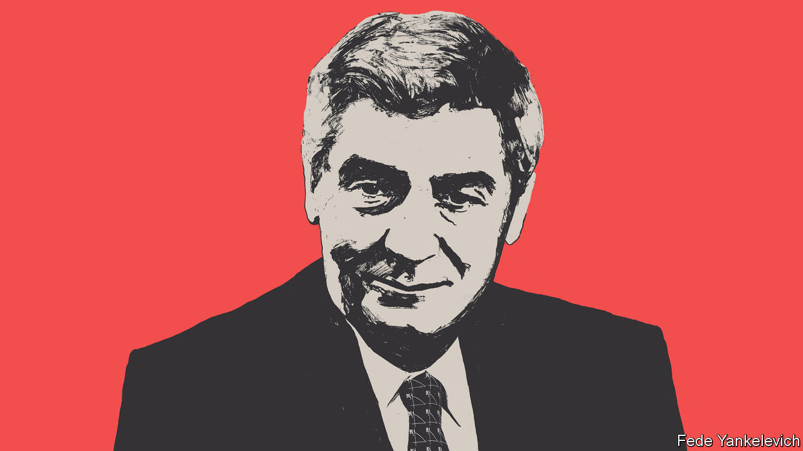

###### Free exchange

# Robert Lucas was a giant of macroeconomics 

##### The discipline, willingly or not, has inhaled his influence 

 

> May 18th 2023 

Economics is full of equations named after their inventor. Robert Lucas, who died on May 15th aged 85, was different. His name graces something edgier: a “critique”. When he presented an early version, a young economist despaired: “You just explained why everything I’ve done in the last few years is worthless.”

The Lucas critique can be explained with the help of an analogy—one he offered to students graduating from the University of Chicago, where he spent many years as both a student and professor. Imagine a fairground that sells tokens at the entrance for the rides inside, all of which are independently run. Suppose the cashier abruptly doubles the number of tokens per dollar. Fairgoers, flush with tokens, will flock to the rollercoaster, fun house and other attractions. Some ride operators will assume their rides are more popular than they thought. They might even extend workers’ hours in order to handle the additional custom.

A statistically minded economist looking at the park’s data might conclude that an increase in the token supply leads to heightened activity and employment. They might even advise other fairgrounds to try the same trick. But of course this “policy” only works because ride-operators do not anticipate it. As they realise what is going on, they will raise the number of tokens they require per ride. Prices will rise and activity will return to normal.

Lucas had been one of those statistically minded economists, busy documenting relationships between higher inflation and stronger employment in the giant fairground that is the American economy. Yet his critique showed that these relationships would crumble if policymakers acted on them. They were based on behaviour that would change if policy sought to exploit them. They could be tested but not tried. It was his most influential paper.

He was not particularly proud of it. A critique by definition does not “fully engage the vanity of its author”, he noted. He and his intellectual comrades worked hard to give economists something more positive: less crumbly foundations to build on. Economists, he believed, “are basically storytellers, creators of make-believe economic systems”. So he and his colleagues built a fantastical new world for wonks to explore.

Lucas had been thinking hard about “dynamics”, or how something like work effort evolves over time, and how views of the future affect it today. He thought of his parents: his father welding in Seattle shipyards; his mother painting adverts in “pure white, glossy black and elegant greys”. Both worked extra hard during the war, because they expected wages to be lower when it was over.

How do people arrive at these views of the future? In early work, Lucas assumed firms would expect prices to stay much the same. That assumption allowed him to predict industry’s capital spending. But investments would predictably change future prices. The price expectations in the model were at odds with the price predictions of the model. To Lucas this seemed inconsistent. 

Instead, Lucas adopted the “rational expectations hypothesis”. He assumed the actors in his models would expect what the model itself predicted. If an economist can foresee that extra tokens will raise ride prices, then operators should expect the same.

“Rational expectations” were not the same as flawless foresight. The future was uncertain. Thus Lucas assumed markets existed for present, future and merely possible goods, allowing people to strike deals over contingencies. He borrowed the framework from other theorists. But his own life provided the best example. His ex-wife had planned for the contingency that he might one day win the Nobel prize. Their divorce agreement in 1989 promised her half of the potential $1m award. When he won six years later, that contingent claim was fulfilled. “A deal’s a deal,” Lucas remarked.

With the assumption of rational expectations, Lucas felt he had “eliminated the main intellectual basis” for fiscal and monetary fine-tuning of demand. After all, cashiers could not systematically fool ride operators. “Keynesian economics is dead,” he reported in 1979. That report proved exaggerated. Keynesians made a comeback, rejecting his policy presumptions, but embracing many of his methodological choices. These Keynesians provided a new intellectual basis for active macroeconomic policy in a recognisably Lucasian world, albeit one painted in greys, not pure white and glossy black. Later in life Lucas acknowledged that economists of all stripes, Keynesians included, had contributed to the successful stabilisation of spending flows in the post-war period. 

Yet to him, the gains to any further taming of the business cycle—stabilising growth even more tightly around its trend—seemed trivial compared with the gains to increasing that trend. His mind turned to the mechanics of growth. “The consequences for human welfare involved in questions like these are simply staggering”, he wrote in 1987. “Once one starts to think about them, it is hard to think about anything else”. 

To think hard about something, for Lucas, was to model it. Abstraction was a necessary prelude to clarity. He once received a laconic note from one of his co-authors, Ed Prescott. “This is the way labour markets work,” it said, followed by a single, cryptic equation that Lucas could not immediately understand. He could have asked Ed. He did not. Theorists, he said, do not ask for words to explain equations; they ask for equations to explain words.

Never a drag

Maybe so. But his own sparkling words represented a counter-example to this notion. Other economists were keen to hear as many of them as possible. In his work on human capital, Lucas had pointed out that apprentices pay their mentors indirectly, by accepting a lower wage to hang around them. Some of his colleagues paid a different sort of price. Robert Barro once hung a sign in his office that said: “No smoking, except for Bob Lucas”. It was worth inhaling his smoke to ingest his ideas. The Lucas critique bears his name; the whole of macroeconomics bears his mark. ■


