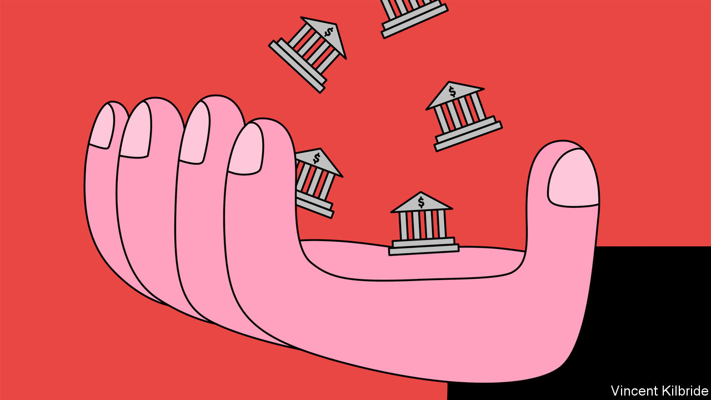
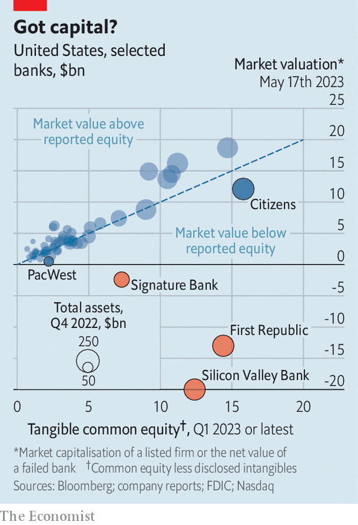

###### Leviathan swells

# The financial system is slipping into state control 

##### What will it look like after the next spell of instability? 

 

> May 18th 2023 

There exists a centuries-old and fathoms-deep relationship between finance and the state. The great banking houses, such as the Medicis of Florence, were lenders of last resort to rulers at risk of being overthrown. Financiers had to avoid backing losers, who would be unable to repay debts. Now it is banks that threaten to bring down the state; a switch that has led to more and more oversight from official organs. Things shifted sharply a century ago, with intervention in the Depression. The global financial crisis of 2007-09 reinforced the trend. Recent turmoil has pushed the banking system further along the path to state control. 

On May 11th the Federal Deposit Insurance Corporation, an American regulator, revealed that the country’s big banks face a bill of $16bn for losses associated with the failures of Silicon Valley Bank (svb) and Signature Bank. They will probably have to kick in even more to cover the fall of First Republic, another lender. In America, Britain and Europe, officials are debating if they should offer more generous protection for bank deposits. Such moves are just the latest evidence of the diminution of banks’ power and the increase in that of the state. Over the past few months, in areas from deposit insurance to emergency lending to regulation of asset quality, Leviathan has grown ever more dominant. 

Bankers and regulators are well aware that changes introduced in a time of turmoil have a habit of sticking around. Andrew Haldane, formerly of the Bank of England, has compared the safety-net provided to banks to “over-stretched elastic”. Once inflated, it never quite shrinks back to size. Moreover, potential future expansions in the state’s remit—possibly including much tighter rules on collateral or an unintended shift to a so-called narrow-banking system—can now be glimpsed. How much further will the state expand?

To understand the dynamic at play, start with deposit insurance—which President Franklin Roosevelt is often credited with inventing. In fact, he resisted the measure’s introduction in 1934, fearing it would “lead to laxity in bank management”, since an insured depositor need not worry about safety. Although other countries, fearing the same, were slow to introduce such insurance, it nevertheless spread, typically introduced at times of crisis. This spring American regulators went further than ever: retrospectively protecting depositors in svb, Signature Bank and, in effect, First Republic. The president, treasury secretary and chairman of the Federal Reserve have all more or less said that all deposits in banks are safe.

Emergency lending is the next area where the state’s role is growing. Banks need a lender of last resort because they are inherently unstable. Deposits are redeemable on demand; loans are long-term. Thus no institution will have money to hand when depositors clamour for it en masse. Walter Bagehot, a former editor of , is credited with advising that, to avoid a crisis, central bankers should lend freely to solvent institutions, secured by good collateral and at a penalty rate of interest. The Fed’s recently introduced “bank term funding programme” discards this dictum. It values long-term securities at par even when the market has heavily discounted them, and imposes hardly any penalty above the market rate of interest. 

The bigger the backstop, the more reason the government has to dictate what risks banks may take. Therein lies the third source of creeping state control: regulation of asset quality. Banks everywhere are subject to rules that restrict the riskiness of their assets and govern how much capital they must hold. The real risk comes when policy preferences interfere with lending rules. In America this already happens in the mortgage market, which is dominated by two government-backed enterprises: Fannie Mae and Freddie Mac. Together the two institutions now underwrite credit risk for more than half of mortgages. Their guarantees enable the 30-year fixed-rate, prepayable mortgages Americans have come to expect. They also help explain why America’s financial system bears more interest-rate risk than Europe’s, where floating-rate mortgages are common.

On the house

Since Fannie and Freddie take on credit risk themselves, they charge mortgage originators “points” (as in percentage points), which vary with a borrower’s credit score and the loan-to-value ratio on a property. The system is arbitrary for borrowers, with those on the wrong side of dividing lines hammered. And sometimes the arbitrariness is fiddled with for reasons other than perceived risk. On May 1st new rules were put in place by the Federal Housing Finance Agency, raising the cost for high-score borrowers and cutting it for their low-score peers. The ambition was to make it easier for poor people to buy a home. Quite apart from the fact that easier credit does little, in aggregate, to make housing affordable, the government has in effect mandated that these institutions should not be properly compensated for the risk they take on. 

More of the banking system is coming to look like housing finance. After the global financial crisis, regulators hugely increased the stringency of rules governing bank balance-sheets. Different assets attract different risk-weights, meaning that what a bank chooses to invest in affects its overall minimum-capital requirements. Like any attempt to categorise complex things, these risk-weights will often be wrong. The loanbook of First Republic, which collapsed on May 1st, carried mortgages for the rich that had little credit risk, yet the rules assigned them a high risk-weight. Probably for this reason, regulators promised to share credit losses with JPMorgan Chase as part of its purchase of the loans, resulting in a lower risk-weight. It is not that anyone expects large losses. The government just had to circumvent its own misfiring rule.

Where next for state intervention? In addition to expanding deposit insurance, the likely response of regulators to the recent turmoil will be to tighten rules on interest-rate risk. Today’s regulations allow banks to count the par value of government bonds of any duration as top-quality liquidity (ie, funds that are accessible in a crisis). As so many banks have learned in recent months, these bonds fall sharply in value when rates rise. The safest assets are both government-issued and short-term. Yet the more super-safe short-term government securities banks are instructed to hold, the more the industry would move away from its basic principle: that the point of banking is to transform short-term deposits into long-term assets.

 


To some, this would be a good thing. Narrow banking, in which institutions are required to hold sufficient liquid assets to back all their deposits, was first proposed in 1933 as the “Chicago Plan”, after the devastation of the Depression. Already some parts of the system look narrowish. In 2013 money-market funds were given access to the Federal Reserve’s reverse-repo facility, in which they receive securities overnight in exchange for cash—a facility that was expanded during the covid-19 pandemic. In effect, Americans can park cash in money-market funds, which in turn park it directly at the Fed, circumventing the banking system altogether. Money-market funds have been on the receiving end of some $435bn in inflows since svb failed, a cash-flow that is helping destabilise banks. Another way in which the system could become more narrow is if the Fed or other important central banks launch central bank digital currencies, which operate as alternatives to bank accounts.

Such a world would bring its own problems. Deposits are not useful sitting idle. The benefits of linking savers, who prefer safety and liquidity, with borrowers, who like flexibility and security, are big. Joseph Schumpeter, an economist, wrote in the 1930s that it was “one of the most characteristic features of the financial side of the capitalist evolution to ‘mobilise’ all, even the longest maturities”, so that they are financed by short-term borrowing. “This is not mere technique. This is part of the core of the capitalist process.” Banks liberate investment—an engine of Schumpeter’s creative destruction—from the “voluntary abstinence routine of the savers”.

An alternative path might be to conclude that in a world of superfast bank runs, like the scramble that brought down svb, emergency support from central banks needs to become more common. Sir Paul Tucker, formerly of the Bank of England, who helped write rules introduced after the financial crisis, recently told the  that banks should stand ready to offer the central bank enough collateral to fund emergency loans covering all their deposits, such that they could survive a total run. This would bring into sharp relief another method by which the state controls banks: the list of assets it deems to be eligible as collateral for emergency loans. Banks would be able to use deposit financing only to hold assets that carried a government stamp of approval. 

Whichever path is chosen, the world is moving towards a bigger role for the government and a smaller one for private actors—a fact that should alarm anyone who values the role of the private sector in judging risk. In China and Vietnam state sanctioning of credit creation is explicit. The largest banks are majority-owned by the government, and state lenders are bound to prop up sclerotic state enterprises or turbocharge growth when governments deem fit. It is getting harder to spot the differences between the Chinese system of explicit direction of lending and the “social contract” of the Western system, in which there is massive state underwriting of risks and a mass of regulation foisted on banks in return, so that they do not abuse the insurance they have been granted. 

What is more, the seeds of many banking crises have been laid by misguided government intervention in banking, particularly by those moves that skew incentives or the pricing of risk, warns Gary Cohn, formerly second-in-command at Goldman Sachs, a bank. It might be easier to sleep at night knowing that, at present, the government has all but promised to protect all deposits, has lent generously to banks clinging on and has infused the system with funds through its wind-up operations. But this is precisely the kind of action that will cause sleepless nights in future. ■


