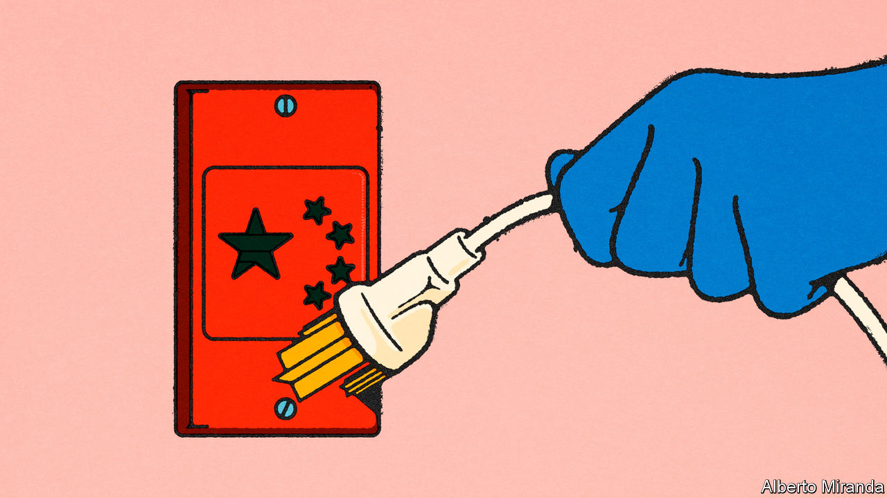
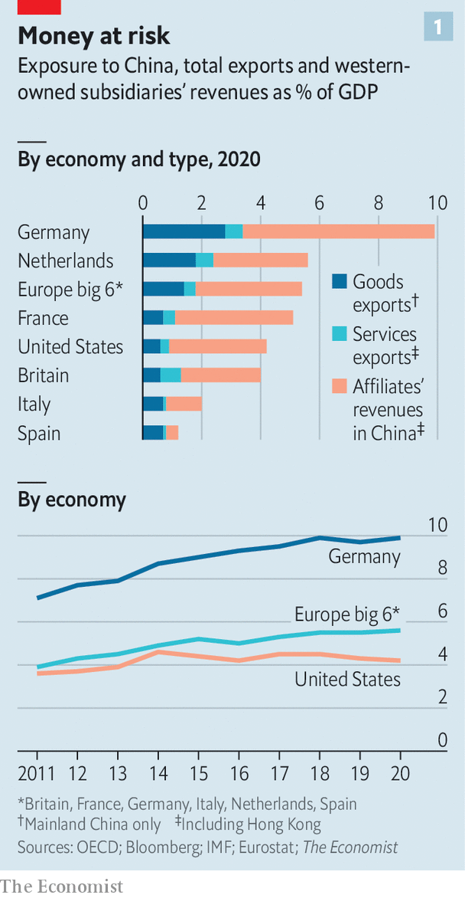
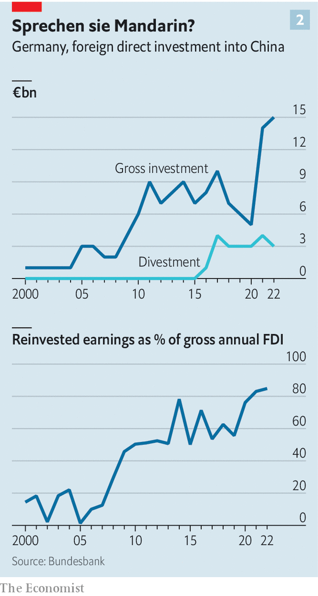
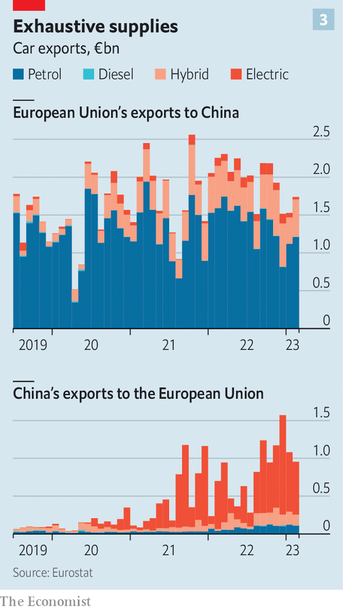

###### From Macron to Mercedes

# Europe can’t decide how to unplug from China 

##### We calculate the continent’s exposure to the Asian power 

 

> May 15th 2023 

How should Europe handle China? The continent is trying to decide. After decades of pursuing trade, Europeans are pondering how much to decouple. Their closest ally, America, wavers between China-bashing and war talk on the one hand, and de-escalation and partial detente on the other. Individual European countries struggle to agree with each other. 

Last week Josep Borrell, the eu’s chief diplomat, urged Europe’s foreign ministers in a letter to find “a coherent strategy” in the face of “a hardening of the us-China competition”. But it is far from clear what that strategy might be, or whether Europe would remain so closely aligned with America in the event of a war over Taiwan. 

An awkward procession of Europe’s leaders to Beijing in the past few months points to the lack of a plan. Germany’s  paid a visit accompanied by business leaders in November; his foreign minister, who is from a different political party, went last month and struck a tough tone. Spain’s prime minister, Pedro Sánchez, went to open doors to his country’s trade.  ostentatiously sought to strike a partnership with Xi Jinping. The French president took 53 corporate bosses with him, and insisted that Europe distance itself from Sino-American tensions and from a conflict over Taiwan. His clumsy comments caused an uproar in Europe and America. 

The war in Ukraine has complicated matters further as the mood has turned against autocracies. Most countries on the eu’s eastern flank—which once opened their arms to Chinese investors—have become hawkish. “Russia’s invasion of Ukraine had a sorting effect in Europe when it comes to China,” says Janka Oertel of the European Council on Foreign Relations, a think-tank. It seems that those in the east are as leery of the “no-limits” friendship between Moscow and Beijing as they are of Mr Macron’s talk of “strategic autonomy” from America. Meanwhile, everyone knows that China remains keen to exploit transatlantic differences. 

Finding common cause is onerous because it is hard to tell what America wants. Jake Sullivan, President Joe Biden’s national security adviser, and Janet Yellen, the treasury secretary, have each recently distanced the Biden administration from hard talk of “decoupling”, in favour of “de-risking”—a term also used in the past few months by Ursula von der Leyen, the head of the European Commission. (She had intended to distinguish Europe’s policy of managing risk from what seemed to be a tougher American approach akin to economic divorce.) Yet it is not long since the , when us-China relations hit a 30-year low. Congress and public opinion in America are hostile to China. Tensions may rise during the election campaign in 2024, and a pugnacious Republican, perhaps Donald Trump, may win.

Attachment styles

All this makes it urgent for Europe to devise a coherent China policy. Its leaders need to work out how far they want to reduce its dependency on China, and in so doing also respond to the hundreds of billions of dollars in green-industry subsidies unveiled last year in America’s Inflation Reduction Act. They also need to decide what they would do if America became more demanding. In an extreme case, in the event of a war over Taiwan, Europe might be expected to impose sanctions on China like those it has slapped on Russia, and to back a military campaign. Some hope that the new doctrine of de-risking is a compromise that solves the dilemma. Others fear that it will prove meagre and inflexible in the face of changing technological and geopolitical realities. 

Europe is more economically exposed to China than America is. Some 8% of publicly listed European firms’ revenues are from China, compared with 4% for American ones, according to Morgan Stanley, an American bank. Europe and America send a similar share of goods exports to China (7-9%), but because Europe is a more trade-intensive economy its sensitivity is higher. Multinational investments in China are worth 2% of Europe’s gdp compared with 1% for America. 

 


To form a holistic view we have come up with a yardstick of “total China exposure” (see chart 1). This has three elements: exports of goods, exports of services and the sales of Western-owned subsidiaries in China. These figures are for 2020, the last year for which data are available. The services and subsidiaries data include Hong Kong. We define Europe as its six largest economies, including Britain. We measure each country’s exposure as a share of its own economy. 

The European big six’s total China exposure has hit 5.6% of their combined gdp, up from 3.9% in 2011. That is higher than America’s at 4.2%. There is a big range: Italy and Spain are at just 1-2%, France and Britain are at 4-5%. Germany is a huge outlier at 9.9%. Two-thirds of the European big six’s exposure is from the sales of subsidiaries in China rather than from exports from Europe. Often these are the Chinese arms of industrial giants such as Volkswagen and basf.

In the event of a “rigid” fragmentation of supply chains, the eurozone’s gross national expenditure would drop by over 2%; roughly double the amount America’s would, according to the European Central Bank. Germany’s fall would presumably be higher. Similarly, an imf study in April found that in the event of an investment split between the West and China, European gdp would fall by 2%, more than twice the hit to America. In addition, a separation would cause a crisis at some leading European firms that rely on China, including Germany’s carmakers, France’s luxury empires and two British banks.

The emerging policy of de-risking refers to a calibrated reduction in links with China, rather than a wholesale economic decoupling. Even this is a big departure from how things were a decade ago. Back then European businesses were still stuffing their order books with Chinese contracts, suppressing their doubts about rising industrial competition. Overall trade between China and the eu grew 428% between 2002 and 2019. 

An eu strategic paper four years ago marked the first stage of the pivot. It argued that China was not just a partner and an economic competitor, but a systemic rival. The effects were swift. Capitals across Europe, which flogged ports and other infrastructure to Chinese investors, started to have second thoughts.

To America’s delight, many countries in Europe began to  from their 5g networks (though Germany still let the Chinese telecoms firm in). Remonstrations over human-rights abuses, particularly of Uyghurs in Xinjiang, grew louder. Supply-chain glitches during the pandemic showed the perils of relying too much on Chinese industry. The Sino-eu “Comprehensive Agreement on Investment”, struck in December 2020, was put to one side by Europe. And China’s declaration of a “no-limits” friendship with Russia just weeks before the invasion of Ukraine soured the mood further. 

Mrs von der Leyen thinks that de-risking is the next step, and one that Europeans can agree on. But what it means in practice has yet to be clearly defined. It does not mean shutting the door to China altogether. It is partly about diversification, bolstering economic security and eradicating forced labour from supply chains. It is also focused on security concerns: hampering China’s ability to get its hands on security-relevant technology such as quantum computing, which threatens encryption, or semiconductors for military purposes.

Like America, Europe is most strategically vulnerable when it comes to its critical dependence on China for certain supplies. In 2022 China mined nearly three-fifths of global , used as components in electronic equipment. It also refined 60% of the world’s lithium and 80% of its cobalt, two core inputs for the production of high-capacity electric batteries. Europe imports 98% of its rare earths from China, even more than America, which imports 80% from the Asian power. According to a study by merics, a German think-tank, the eu relies on China for 97% of its chloramphenicol, used to manufacture antibiotics. For America, the figure is 93%.

Just friends

European firms have already been diversifying suppliers since the pandemic, “friend-shoring” to allies, and “near-shoring” closer to home. America’s energy secretary also declared in March that the Biden administration wanted supply chains in countries “whose values we share.” “All of us learned from covid-19 that we have to double- and triple-source, and not only from China,” says a French corporate titan. Firms are looking to India, Mexico, Morocco, Norway and Turkey, among others. Policymakers are pushing in the same direction. The eu has unveiled a Critical Raw Materials Act, designed to ensure that no more than 65% of annual consumption of any listed material should be sourced from any single country by 2030. 

 


In the realm of technology European firms that are embedded into America’s technology industry are mirroring American export controls. asml, a Dutch firm which makes equipment used to build semiconductors, has limited the sale of its cutting-edge machines to China. Europe’s multinational companies are adjusting how they operate in China, too. In some cases they are divesting. In others they are making subsidiaries in China more self-sufficient, with a higher share of inputs and sales made locally. One measure of this is the share of investment by subsidiaries in China financed from their own profits, rather than from capital sent from Europe. For German subsidiaries in China this has risen from 2% in 2002 and 52% in 2012 to a new high of 85% in 2022 (see chart 2). 

If these Chinese subsidiaries were perfectly self-sufficient they could in an extreme scenario be separated from the European parent, with both arms able to continue to operate: think of vw Germany and vw China. The result would be huge wealth destruction for shareholders in big European firms (many of whom are not actually European) but less damage to Europe’s economy. In practice this shift to “one company, two systems” is only just beginning and for many large firms decoupling would be severely disruptive. 

A final element of de-risking is stricter screening of Chinese investment coming into Europe. Strategic infrastructure is increasingly off-limits for Chinese investors, as inward investment in Europe is screened for security risks. Overall Chinese investment in Europe last year fell to its lowest point since 2013, according to a study by merics and Rhodium Group, a consultancy based in New York. China’s foreign direct investment peaked in Europe back in 2016, Rhodium estimates. 

The emergence of de-risking is understandable, but Europe’s middle way is riddled with potholes. Big companies, still keen on the China dream, may refuse to go along for the ride. “There are certain no-go areas on tech in China,” says one senior European industrialist, “but on the rest we are not decoupling; it is business as usual, and the more the better.” When Mr Macron was in Beijing, Airbus, a European aircraft manufacturer, agreed to expand an assembly line in Tianjin, and confirmed an order to sell China 160 planes. 

 


De-risking may also struggle to adapt to technological change and its commercial effects, which can create new links even as old ones are dismantled. Cars are a good example. The eu exports almost no electric vehicles to China. Yet almost all of China’s car exports to the eu, many of which are made for European brands, are battery-powered (see chart 3). Exports have shot up from less than €100m ($112m) a month before the pandemic to around €1bn a month now. As Europe’s motorists seek greener transport, China is both eager and well positioned to flood the continent with cheaper electric models. 

The greatest weakness of de-risking in its current guise is that it little prepares Europe for the shock that would follow an attempt by China to seize Taiwan. Europe’s armed forces and its defence industry are already stretched, and the continent would struggle to find the capacity to provide much military support to America and Taiwan. Its leaders have little appetite for involvement in another war. But America would probably expect Europe to enforce the kind of embargo put in place on Russia. That would hurt American firms: despite Apple’s efforts to diversify its production to India, the tech giant still relies on China. But it would harm Europe more, causing a bigger economic hit and destabilising more companies.

Mr Macron’s recent suggestion that Europe should not follow America’s lead on Taiwan, in case it is dragged “into crises that are not [its] own”, delighted Beijing and . Gabrielius Landsbergis, Lithuania’s foreign minister, retorted tartly that, at a time when Europeans depend on America’s backing of Ukraine, they should be trying to preserve transatlantic unity rather than “begging for dictators to help secure peace in Europe”.

Officials in Paris note, as Mr Macron eventually did, that it is official French policy to support the status quo over Taiwan. With naval bases and territories in the Indo-Pacific, France has direct interests in the region. “The problem isn’t French policy but the disconnect between what we do and what Macron says, which creates unnecessary doubts among our partners,” notes Antoine Bondaz, at the Foundation for Strategic Research, a French think-tank.

One virtue of Mr Macron’s comments, notes a Scandinavian minister, is that they have prompted Europeans to talk more about China. Many on the continent fret about escalatory American rhetoric. On May 12th the eu’s foreign ministers managed to agree to a set of principles for future dealings with the country. It will be discussed at the eu’s next summit in June. 

The bloc’s deliberations in the coming months will depend heavily on France and Germany, which are its two biggest economies, and among the most exposed to China, and some of the least keen on cutting commercial ties. Mr Macron has long pushed Europe to become more self-reliant. Mr Scholz, faced with divergent views in his coalition government and a strong industry lobby, is still working on a national strategy that will shape Germany’s approach to China (which keeps on being delayed). He is expected to host a bilateral summit with the country next month.

Much of eastern Europe seems wary of Chinese influence. The country’s  in recent years over a Taiwanese diplomatic office in the country disgusted many. That is in spite of the fact that central and eastern Europe received some €3.8bn through China’s clubby “16+1” initiative between 2000 and 2017. Comments made last month by Lu Shaye, the Chinese ambassador to France, helped focus minds. He appeared to dispute the legal status of all former Soviet countries (even if China later corrected his remarks).

The end of the affair?

Europe needs a measured debate about what to do next. France and Germany both have reservations about Mrs von der Leyen’s de-risking measures, but they back the principle. Outward investment screening is under discussion, though will be difficult to put into practice. Inward investment screening is up and running, although Europeans disagree on how much to tighten the rules.

Beyond de-risking, collective eu policy has not been thought through. That is in spite of the fact that de-risking doesn’t provide an answer to a scenario in which relations between America and China were to rupture. Since Russia invaded Ukraine, the transatlantic alliance has stood remarkably firm. A Chinese move on Taiwan would prove an even more dangerous, and far more difficult, test. ■

