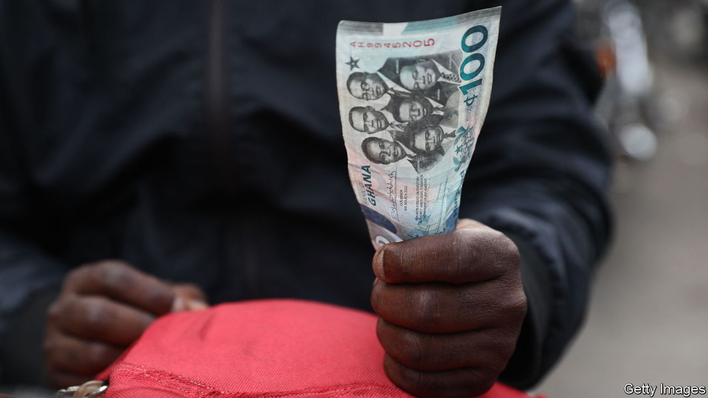
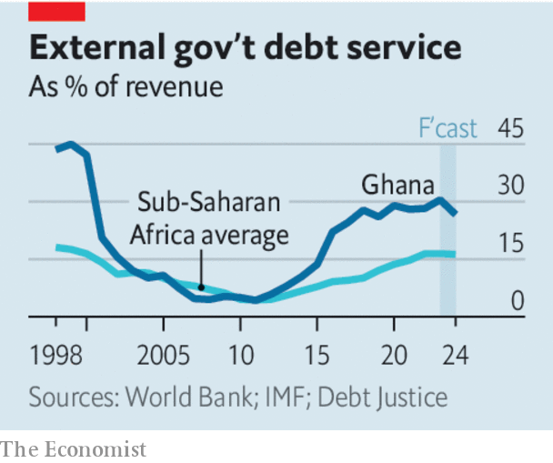

###### The debt-relief duet

# China and the West take a step to ease Africa’s debt crisis 

##### A deal for Ghana is the first test case for a new approach 

 

> May 18th 2023 

GHANA MADE history when it led the wave of sub-Saharan African countries that won independence more than six decades ago. It may now be making history again, as the first test case for a new approach to debt relief. China and Western governments may have overcome one barrier to restructuring the billions of dollars owed by countries with unsustainable debts.

On May 17th the IMF’s board signed off on a $3bn bail-out for Ghana and immediately released an urgently needed first tranche of $600m. This was made possible only by assurances from Ghana’s bilateral creditors—in , but also the Paris Club, an informal group of mainly rich Western countries—that they would take losses on their loans to Ghana. This is a welcome first step. But assurances need to become reality if countries in debt distress are to get the write-downs they need. And many other African countries require more help from everyone. The danger is that the  will force African governments to cut back on essential investments in education and health, undermining the progress of recent years. 

Western governments have long grumbled about China’s lending in Africa, accusing it of pushing African countries into a debt trap to control their politics or seize their assets. Though some loans were indeed reckless or burdensome, this criticism is largely unfair. China has financed roads, ports, railways and other needed infrastructure, when private lenders and other countries were often unwilling to do so. 

 


Yet China can be fairly accused of not pulling its oar more recently when the IMF and Western creditors have tried to arrange lifeboats for countries such as Zambia and Malawi, which have found themselves drowning in debt. China has argued that it should not take losses in debt restructurings because its loans were often tied to specific projects such as roads, railways or ports that were generating positive returns for the borrowing country. It has also bridled at having to take a hit on its loans (alongside all other bilateral and private creditors) while the World Bank would have its loans repaid in full. This put China at odds with Western countries, which rightly say the multilateral banks need to keep their preferred status to preserve the high credit ratings that allow them to borrow and lend cheaply.

China and the Paris Club appear to have resolved this impasse with a fudge. In exchange for China agreeing to take losses, the World Bank is expected to provide additional grants and new low-interest concessional loans. Ghana is the first test of this compromise, though also a relatively easy one. It owes China about $1.9bn, or less than a third of the $6bn owed to China by Zambia, which defaulted more than two years ago. Since then Zambia has been stuck in limbo while China and its other creditors have wrangled over how to share out the losses. It now hopes to reach a deal within a month or so. 

Public debt to GDP across Africa has climbed to its highest level in two decades. The average cost of servicing external debt now consumes 17% of government revenues, the most since 1999. Debt and interest payments are crowding out spending on schools, clinics and the infrastructure needed for growth. In the 1980s and 1990s, when African countries last had to tighten their belts because of crushing debt, austerity left lasting scars. Young Africans, especially girls, grew up sicker and less literate, and therefore permanently poorer. 

To avert a repeat, African countries should first look to their own resources. In most cases government revenues are pitifully low as a share of GDP; tax collection needs to be less haphazard. But donors will sometimes need to chip in with concessional loans and grants. And where debts are unsustainable, they must be restructured, which means China must co-operate with the IMF and take losses. The progress in Ghana shows this may be possible in principle. The plan must now be put into practice.■

