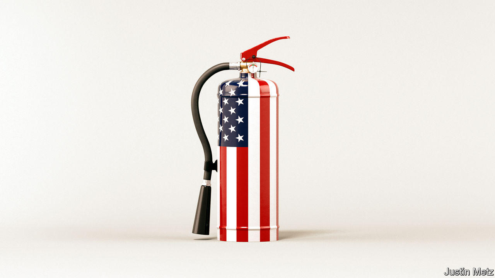

###### A new world order

# Joe Biden’s global vision is too timid and pessimistic 

##### The president underestimates America’s strengths and misunderstands how it acquired them 

 

> May 18th 2023 

In the 1940s and early 1950s America built a new world order out of the chaos of war. For all its shortcomings, it kept the peace between superpowers and underpinned decades of growth that lifted billions out of poverty. Today that order, based on global rules, free markets and an American promise to uphold both, is fraying. Toxic partisanship at home has corroded confidence in America’s government. The financial crisis of 2007-09 dented faith in markets. America’s failures in Iraq and Afghanistan undermined its claim to spread democracy. Today most countries refuse to heed its call to enforce sanctions on Russia. And China’s rise has spurred American politicians to take a more selfish, zero-sum approach to geopolitics.

China’s rise has also increased the threat of war. In a conversation with , , who will be 100 this month, warns that China and America are “on the path” to confrontation. “Both sides have convinced themselves that the other represents a strategic danger,” he says. The stakes could not be higher: both are nuclear-armed. Both are also dabbling with unpredictable artificial intelligence (ai). The elder statesmen’s eldest statesman worries that, just as before the first world war, the superpowers will stumble into catastrophe.

Since arriving in the Oval Office in 2021, Joe Biden has developed a new strategy to preserve American pre-eminence and reduce the risk of conflict. Jake Sullivan, the latest of Mr Kissinger’s successors as national security adviser, recently gave the fullest account yet of this Biden doctrine. His narrative weaves together middle-class prosperity, defence and climate change. He repudiates the free-market “Washington consensus” and calls for the government to play a muscular role in society, with a strong emphasis on national security.

This means hyperactive industrial policy. Big subsidies will catalyse private investment in semiconductors and clean energy. Export controls will create “a small yard and high fence” to keep selected technology with potential military uses out of unfriendly hands. At the same time, the administration is softening its rhetoric. Instead of “decoupling” from China’s economy, it talks of “”. It wants to find common ground on climate change, African debt and even Ukraine. On May 10th and 11th Mr Sullivan spent eight hours with his Chinese counterpart, the first high-level contact for months.

Behind the doctrine is a belief that a virtuous circle can make America and the world safer. State intervention and protectionism will boost industry, helping the middle class and cooling America’s populist fevers. Less erratic leadership (after Donald Trump’s) will restore America’s authority abroad, even if the Biden team breaks a few global economic rules. The relationship with China will be managed with “strategic maturity”. As a precaution America will keep spending large sums on its military forces to deter China from aggression. 

Will the new doctrine work? After the chaos of the Trump years, Mr Biden’s commitment to diplomacy is welcome. It will be on display at the  this week. He is right that American foreign policy must deal with new challenges, from Chinese coercion to climate change. However, especially when compared with the post-1945 order, the Biden doctrine is flawed. Its diagnosis of America’s problems is too pessimistic, and some of its prescriptions would make America weaker. 

Start with the economy. Despite what many believe, America’s economic power is not declining. With 4% of the world’s people, it generates 25% of global output, a share unchanged since 1980. No other big country is as prosperous or innovative. As we noted last week, the size of China’s economy is unlikely ever to surpass America’s by much. The main source of America’s strength is creative destruction and open markets in a rules-based global economy. So although Mr Biden is right to reinforce the social safety-net, his state-led, insular economic vision may ultimately erode living standards and American clout. 

The Biden doctrine seeks to stabilise relations with an autocratic and paranoid China. In this task it is hampered by a second flaw: it muddles legitimate policies with America-first rule-bending. Mr Sullivan wants to combine export controls with co-operative trade, and an arms race with collaboration. But China’s leaders think this strategy is meant to keep China down. America’s case would be stronger if export controls didn’t keep expanding, if Trump-era tariffs were not still in place and if its politicians were not vying to outhawk each other on China. The lack of agreement on trade makes everything harder. Never mind rules on ai, America and China have no system for nuclear-arms control: China’s arsenal will almost quadruple by 2035. 

The final flaw concerns allies. Mr Biden has backed Ukraine and revived nato and alliances in Asia. Yet America’s unpredictable economic nationalism and unwillingness to offer access to its markets undermines its influence. Europe fears a subsidy race and worries  will cause it severe damage: our calculations show Germany’s economy is twice as exposed to China as America’s is. The decay of global rules is accelerating the embrace of a transactional approach to foreign policy by emerging economies. The post-1945 order rested on American constancy: each administration was guided by predictable interests. Today allies and enemies know chaos may follow the election in 2024. Trumpian dysfunction is not Mr Biden’s fault, but it makes it vital to be predictable and open now.

Free, open and predictable

Americans need to be persuaded that a more optimistic, positive-sum approach is in their interests. This is the key that will keep their country strong and unlock a better foreign policy, by allowing it to help forge new global rules on trade, climate, ai and more that old allies and new ones can rely on. Such a revived global order would be the best defence against an autocratic one led by China. Unfortunately the Biden doctrine fails to rebut the narrative of American decline and so has not resolved the tension between the country’s toxic politics and its role as the linchpin of a liberal order. Unless America looks out at the world with self-confidence, it will struggle to lead it.■


