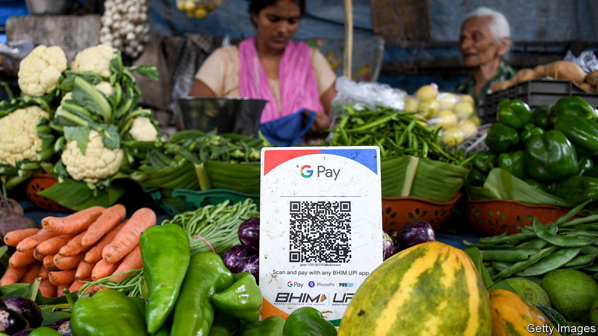
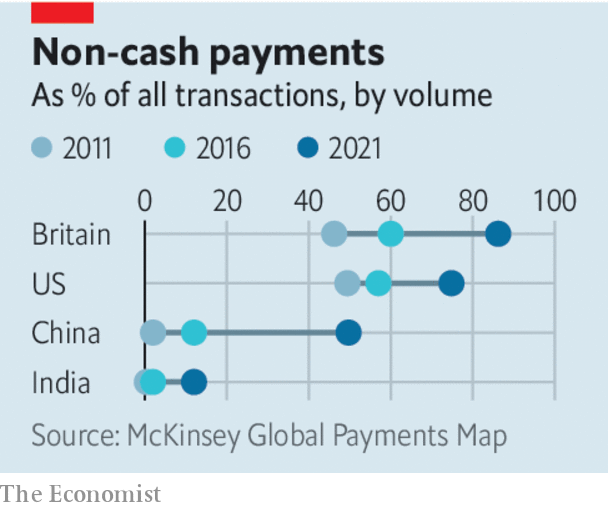

###### Payment parity

# The fight over the future of global payments 

##### Digital payments have transformed domestic finance. Now competition is going global 

 

> May 18th 2023 

OVER THE past two decades the ways people pay, receive and transfer money have changed beyond recognition. The revolution began in 2007 when m-pesa made it possible for Kenyans to make payments with a text message. In 2011 Alipay launched payment-by-qr-code in China, a system that has all but replaced cash in cities. Since then India’s state-led Unified Payments Interface (upi) and Brazil’s Pix have vastly widened access to the financial system among the poor. As our  explains, globally the use of notes and coins has been cut by a third, e-commerce has boomed and life without digital payments has become unimaginable.

Having transformed how people use money at home, the race to transform payments is now going global. Cross-border retail spending (including tourism) and remittances will hit $5trn this year; business-to-business payments are worth eight times that. Three big players are duking it out to process these vast flows of funds. The West’s legacy system, including the Visa-Mastercard duopoly and SWIFT, a messaging system for bank payments, is the dominant incumbent. China is the most advanced challenger, with its payment apps, its card network, UnionPay, and CIPS, its more expansive alternative to SWIFT. In third place is India, whose ambition to deploy upi globally has grown.

 


The competition among the three blocs is heating up fast. Alipay is now accepted by 2.5m merchants overseas. UnionPay, which is already the world’s largest card network by transaction volume, is accepted by 65m merchants globally, compared with Visa’s 100m. Most are outside China. India’s UPI has been linked with Singapore’s fast payment system, allowing consumers in both countries to pay in the other using their domestic platform. India is in talks with more than 30 other countries to export its payments kit, which would link their systems too. In November four central banks, including China’s, successfully tested a cross-border system for settling transactions using central-bank digital currencies.

The Asian giants have several motives for spreading their wings. The most important is to become less dependent on the West. Russia’s card network, Mir, launched after Vladimir Putin’s illegal annexation of Crimea in 2014, has limited the damage done by the withdrawal of Visa and Mastercard from Russia after its full-scale invasion of Ukraine. Volumes on CIPS have surged since 2020, helped by Russia being mostly cut out of swift. But building a sanctions-workaround is not the only goal. Countries also crave for themselves the clout that comes with control over the world’s financial infrastructure, as well as seeking more convenience for their people when they transact internationally.


The West might fear a fragmentation of the global financial infrastructure that allows wrongdoers to escape future sanctions. Yet a more open landscape for global payments will benefit its consumers and businesses. Under competitive pressure SWIFT has already upgraded its once-clunky system and has nearly halved the cost of messaging. The average cost of a remittance has been cut by a third in the past decade partly because of new fintechs. The Western card networks are overdue a shake-up. The typical 1% cross-border fee they charge (on top of a 1-3% levy on merchants) supports company-wide net margins of around 50%, among the highest in the world for listed firms. The spread of Alipay, UPI and even other newcomers like GrabPay in South-East Asia or WhatsApp Pay, which just launched in Singapore and Brazil, will give consumers other options.

Domestic payments markets have tended to be winner-takes-most because people like using a big network with lots of other users. For cross-border payments, consumers and businesses will tend to favour the payments system they use in their respective home countries. Since it is increasingly easy for merchants to accept many different payment options, change seems likely. A system where people can use their domestic networks to pay abroad promises to be more convenient as well as cheaper.

Diverse, not divided

The countries that benefit most will be those that stay open to all platforms and let them overlap, rather than forcing people to use national champions. And though the West will lose some power as a result of the proliferation of alternatives to its payments systems, it will maintain the ability to levy the most effective forms of sanctions: on flows of trade and technology. The digitisation of finance has already made billions of lives better. The new global race promises to enhance those gains. ■

