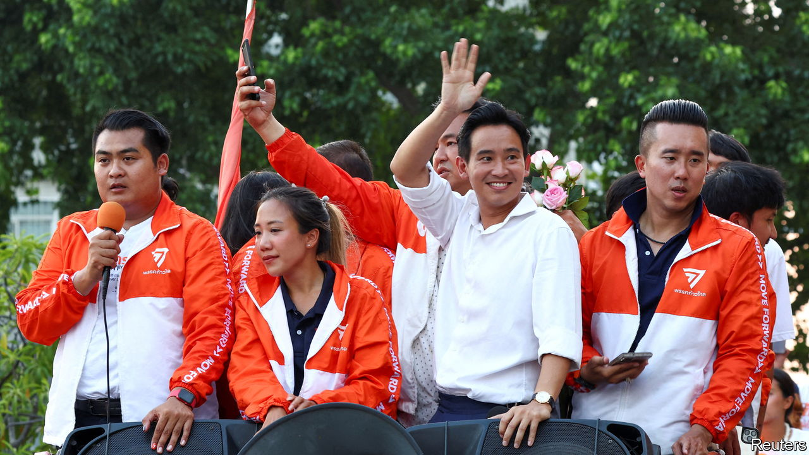

###### Thailand’s election

# The humiliation of Thailand’s regime is a boost for Asian democracy 

##### The monarcho-military establishment must give Thai voters the change they demand 

 

> May 18th 2023 

Rigging Thai ballots keeps getting harder. The first time the country’s army-backed regime deigned to hold an election, in 2019, it took an outrageous gerrymander, a stacked electoral system and the mass disqualification of its democratic opponents to prevent them, narrowly, from winning a majority. On May 14th, despite facing many of the same obstacles, Thailand’s pro-democracy parties could not be denied. They  of Prayuth Chan-ocha, a former army chief who seized power in 2014, winning 313 of the 500 seats available. Pro-military parties—despite their unfair advantages—won only 76.

Worse for the generals and the royalist establishment in cahoots with them, their attempts to suppress Thailand’s democracy are radicalising it. The big winner was not, as predicted, the party of Thaksin Shinawatra, an exiled former prime minister, whose supporters had come first in every Thai election since 2001. It was a newer and more uncompromising liberal force. Pushing back against years of democratic retreat in Asia, Move Forward, as it is called, looks like the generals’ nemesis.

Led by a 42-year-old former tech executive and Harvard graduate, Pita Limjaroenrat, the party vows to shrink the army and curb  laws that make it a serious offence merely to retweet an objective critique of Thailand’s overweening royals. Drawing huge support from educated urbanites, Move Forward almost swept the capital, Bangkok, as it surged to victory. Not bad for a party that was relaunched in 2020 after its former iteration (Future Forward) was disbanded by the regime for having done surprisingly well in the previous poll.

Whether the generals will permit Mr Pita to form the democratic coalition government that Thais have so loudly demanded remains unclear. The regime has stacked the senate with its stooges and given them, in effect, a veto on government formation. Yet exercising it, after this thumping electoral verdict, would be reckless as well as wrong. Sooner or later, a democratic revival in Thailand  Blocking it might spark a disorderly transition, as the fury Thais expressed at the ballot box found more violent expression on the streets.

Thailand’s vulnerability to coups (it has had 13 since its democracy was founded in 1932) has long seemed anomalous. With a thriving tourism industry and some decent universities, it is no Myanmar. It is the second-biggest economy in South-East Asia and the world’s only upper-middle-income country under de facto army control. This embarrassment mainly reflects the hubris of the monarcho-military elite. But it has also been for want of a satisfactory alternative. Mr Thaksin’s populism, partiality to his rural base and ambiguous attitude to the monarchy have made him an imperfect democratic champion. Move Forward, which surged on the back of pro-reform protests in 2020 and 2021, appears more attuned to the 72m Thais’ frustrations.

Its success is a rebuke not only to the principle of army rule, but also to the regime’s ineptitude. Hobbled by cronyism and graft, Thailand’s economy is creating fewer opportunities and attracting less foreign direct investment than its regional rivals, including Indonesia and Vietnam. Its post-pandemic recovery is the slowest of any major economy in South-East Asia. Thailand would benefit hugely were Mr Pita to fulfil his pledge to break up the monopolies gumming up industries such as agriculture and telecommunications (where Mr Thaksin made his fortune). 

Mr Pita’s electoral success, meanwhile, will inspire embattled democrats elsewhere. Authoritarianism is losing its appeal in many Asian countries, thanks to Chinese coercion, Russia’s brutal blundering in Ukraine and the failure of authoritarian leaders to govern competently. The largely peaceful protests that drove the economy-wrecking Rajapaksa clan from power in Sri Lanka last year were an early illustration of this disenchantment. With elections looming in Bangladesh, Cambodia, India and Indonesia, all of which will to varying degrees test democracy, the triumph of Thai democrats augurs well. 

This is appropriate. Their country’s democracy, the oldest in South-East Asia, was once a source of economic dynamism and regional leadership. The promise of this election result is a restoration of both qualities. The danger, if the regime digs in, is of an accelerating, perhaps violent, decline. New battle-lines have been drawn; Thailand’s fudgy halfway-house democracy no longer looks like an option. That is already progress of a kind. ■

