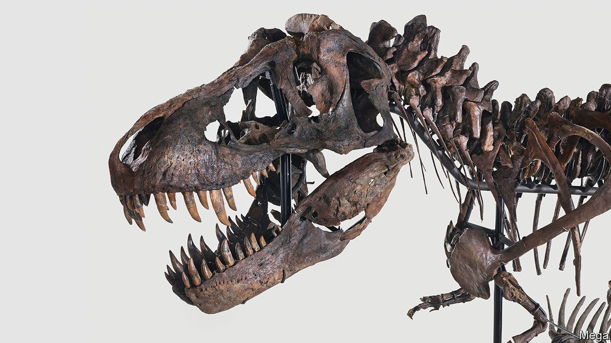

###### Cretaceous capitalism

# Trade in dinosaur fossils is good for science 

##### The market for specimens should be regulated, not banned 

 

> May 18th 2023 

The great auction houses of America and Europe often sell masterpieces by long-dead artists to a grey-haired crowd. They also serve the booming demand for actual fossils. In 2020 Christie’s sold “Stan”—one of the most complete specimens ever discovered—for a record-breaking $31.8m. In April “Trinity”, a composite of three  specimens, fetched $6.1m at the Koller auction house in Zurich—one of six dino-lots to have breached the $6m threshold since “Stan” was sold. At the end of July Sotheby’s is due to auction off another nearly complete specimen.

The buyers are typically  (Leonardo DiCaprio, a Hollywood actor, has an interest in dinosaur skulls). That alarms many palaeontologists, who fear that museums and other scientific institutions are being priced out of the market by individuals who will lock their collections away. Even when scientists are granted access to specimens held privately, many journals have in recent years refused in protest to publish the resulting research.

The antagonism of these scientists towards commerce is misplaced. A thriving market for fossils should lead to more discoveries that—if the trade is appropriately regulated—will benefit science and the public.

Palaeontology has always leaned heavily on prospectors and private collectors. Mary Anning, one of the field’s pioneers, attained celebrity status in Victorian England after she discovered the first fossil specimens of ichthyosaurs and plesiosaurs (marine contemporaries of the dinosaurs) eroding out of the fragile coastal cliffs of Dorset in south-west England, known as the “Jurassic coast”. The tongue-twister “She sells sea shells on the sea shore” is supposedly a reference to Anning’s prolific collection and sale of marine fossils.

Today most fossils sold at auction come from America. Once discovered there, they belong to the landowner and can be legally traded. In many other countries, fossils automatically become the property of the state. The advantage of encouraging the “dinosaur cowboys” of Montana, Wyoming and the Dakotas—which share a big geological deposit—to get digging is that once fossils are exposed, they are as vulnerable to wind, rain and tide as they once were to being munched by a theropod. As Dorset’s cliffs collapse, for example, new fossils constantly appear, but can be lost as erosion continues. Scientists often lack the resources to find, collect and preserve every fossil with scientific value before it is destroyed by nature.

The private sector plugs the gap by responding to price signals. Prospecting first boomed after “Sue”, another famous  specimen, was sold to Chicago’s Field Museum for $8.3m in 1997. The recent spate of sales is prompting another rush for bones today. It is not always true that the resulting hoards end up out of sight. “Stan” was bought by the Abu Dhabi Department of Culture and Tourism and is due to go on display in 2025. From Tampa to Copenhagen, many privately owned fossils are on show at museums or soon will be, much as the world’s best art galleries often hang privately owned pieces on loan.

Fears of crowding out scientists and the public are not entirely without merit. Sometimes specimens do vanish after being bought anonymously. But nationalising the ownership of fossils does not make the desire to buy and sell them disappear. Instead, it pushes the trade underground. The black market is a bigger threat to science than legitimate trade. Smugglers have much lower standards than auction houses, frequently damaging or destroying specimens, and stolen fossils are even less likely to end up in museums.

T. rent

There are ways to preserve the value to the public of privately owned fossils. Governments could write rules insisting that the discovery of fossils and who owns them is catalogued. They could require specimens to be made available for study, or ensure that museums can make casts. And—although auction houses already demand assurances regarding the provenance of fossils—they could set in stone minimum standards for excavation and handling, to allay fears that prospecting might become a Wild West. It is better to regulate the market and let it thrive than to force it towards extinction. ■

